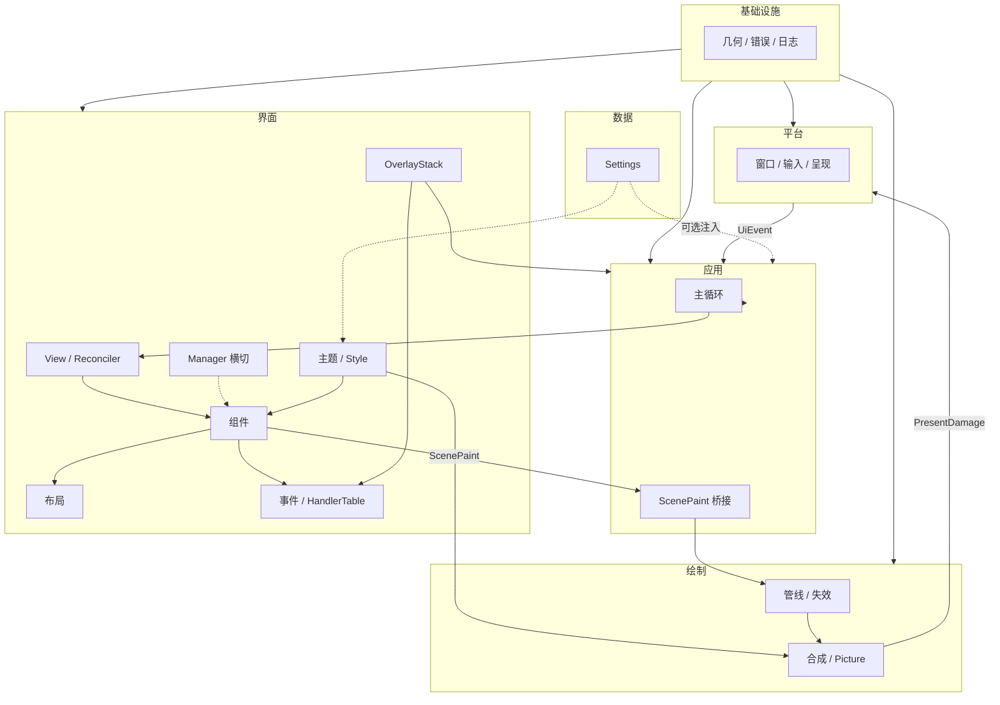

# UIX 设计文档

> **唯一入口**。完整索引在此；正文按需打开链接，不必通读。

## 核心理念（最高规则 #105）

> **用最少资源，做最好效果。**

UIX **最重要的一条规则** — 统领六域依赖、主循环、渲染、事件与一切 API。不是可选优化；与本文冲突时 **以本规则为准**。

| 信条 | 一句话 |
|------|--------|
| 有触发才工作 | 无事件 / 无失效 / 无 register → DeepIdle |
| 无 pending 零开销 | 不无条件 layout · render · present · tick Effect |
| 变化尽量窄 | 最小 rect · Composite scroll · PicturePolicy 自动推断 |
| 效果不妥协 | active 期交互须完整正确 |

L0 零像素 · L1 零帧循环 · L2 最小脏区 · 三态主循环（DeepIdle / RegisteredActive / Active）。

**细则** → [`systems/demand-driven.md`](systems/demand-driven.md) · [`AGENTS.md`](../AGENTS.md) · [#105–#157](decisions.md#d105)

---

## 怎么用

> **AI Agent**：接到任务后，**先**确认改动符合上文 [核心理念](#核心理念最高规则-105)；再走「[实现进度总览](#实现进度总览)」对照设计 vs 当前实现。

1. **查目录** — 在下文「系统索引」或「主题索引」定位目标；读源码或重构前先看「[实现进度总览](#实现进度总览)」对照设计 vs 当前实现。
2. **按需读** — 只打开相关 `systems/*.md`；需要裁决时查 [`decisions.md`](decisions.md)，不懂术语查 [`glossary.md`](glossary.md)。
3. **改设计** — 边界/数据流变更同步 [`AGENTS.md`](../AGENTS.md) 与对应系统文档；新决策追加 #158+。
4. **写代码** — 先查「[术语对照（#101–#104）](#术语对照101104)」、[按需零闲置](systems/demand-driven.md) 与「[落地计划](roadmap.md)」；确认 API 与零闲置审查清单。

```text
Main（索引） ──按需──► systems/*.md（系统正文）
     │                      ▲
     ├── roadmap.md（落地）─┤
     ├── decisions.md（裁决）│ 交叉引用
     └── glossary.md（术语）─┘
```

## 文档分层

| 层 | 文件 | 用途 | 何时读 |
|----|------|------|--------|
| 索引 | **Main.md**（本页） | 导航、域映射、协作图 | 始终从此开始 |
| 落地 | [`roadmap.md`](roadmap.md) | P0–P5 分阶段接线与文件清单 | 写代码、排期时 |
| 系统 | [`systems/*.md`](systems/) | 各子系统设计与行为 | 做该域功能/重构时 |
| 裁决 | [`decisions.md`](decisions.md) | #1–#157 决策台账 | 争议、实现取舍 |
| 术语 | [`glossary.md`](glossary.md) | 名词定义 | 遇到陌生词 |
| 约束 | [`AGENTS.md`](../AGENTS.md) | **核心理念**（最高规则）+ 架构硬约束 | 改边界、写代码前 |

## 按需阅读路径

| 场景 | 阅读顺序 |
|------|----------|
| 首次了解 | glossary → decisions（实现顺序 #50）→ [application](systems/application.md) |
| 写应用 / View | [view-reactive](systems/view-reactive.md) → [theme-style](systems/theme-style.md) → [event](systems/event.md) |
| 做内置组件 | [component](systems/component.md) → theme-style → event → [layout](systems/layout.md) |
| 改渲染 / 省资源 | [demand-driven](systems/demand-driven.md) → [rendering](systems/rendering.md) → [application · 主循环](systems/application.md#主循环) |
| 接平台能力 | [platform](systems/platform.md) → [application](systems/application.md) → event |
| 做 Modal/菜单 | [overlay](systems/overlay.md) → event → component |
| 持久化配置 | [data](systems/data.md) → theme-style → application |
| 写测试 | [testing](systems/testing.md) → [event](systems/event.md#测试) → platform → rendering |

---

## 功能域 ↔ 系统

功能域是**源码**维度（`src/`）；系统是**文档**维度。一对多、多对一均正常。

| 功能域 | 路径 | 主要系统文档 | 说明 |
|--------|------|--------------|------|
| `core` | `src/core/` | [foundation](systems/foundation.md) | 几何、错误、日志、诊断、damage |
| `native` | `src/native/` | [platform](systems/platform.md) | OS 抽象；上层只用 `native::traits` |
| `draw` | `src/draw/` | [rendering](systems/rendering.md) | 引擎、管线、字体、合成、空间 |
| `ui` | `src/ui/` | [view-reactive](systems/view-reactive.md)、[component](systems/component.md)、[theme-style](systems/theme-style.md)、[event](systems/event.md)、[layout](systems/layout.md)、[overlay](systems/overlay.md) | 界面能力拆为多系统 |
| `app` | `src/app/` | [application](systems/application.md) | 启动、主循环、桥接 |
| `data` | `src/data/` | [data](systems/data.md) | Settings 持久化 |
| *(跨域)* | — | [testing](systems/testing.md) | FakePlatform、语义断言、paint snapshot |
| *(跨域)* | — | [demand-driven](systems/demand-driven.md) | **按需零闲置**（核心理念 / 最高规则 #105） |

依赖方向（硬约束，详见 AGENTS.md）：

```text
core ← native ← draw ← ui ← app
  ↑      ↑               ↑
  └──────┴─── data ──────┘
```

---

## 系统索引

| # | 系统 | 文档 | 一句话 | 关键决策 |
|---|------|------|--------|----------|
| 1 | 应用 | [application.md](systems/application.md) | 启动、主循环、平台/View/渲染桥接 | #59 #64 #74 #88 #93 |
| 2 | View 与响应式 | [view-reactive.md](systems/view-reactive.md) | 声明式 UI、State、Reconciler diff | #21 #24 #31 #49 #60 |
| 3 | 组件 | [component.md](systems/component.md) | Widget 结构、trait 能力、生命周期 | #8 #20 #35 #58 #83 |
| 4 | 主题与样式 | [theme-style.md](systems/theme-style.md) | Theme、Style/StyleSet、色板与排版 | #1–#3 #9 #14–#17 |
| 5 | 事件 | [event.md](systems/event.md) | 系统/语义/自定义三层与 HandlerTable | #4–#7 #36 #68 |
| 6 | 布局 | [layout.md](systems/layout.md) | measure、Flex/Grid、Scroll | #29 #38 #45 #53 |
| 7 | 渲染 | [rendering.md](systems/rendering.md) | ScenePaint、合成、局部重绘 | #59 #70 #82 #122 #129 |
| 8 | 平台 | [platform.md](systems/platform.md) | OS 隔离、UiEvent、呈现 | #40 #59 |
| 9 | 浮层 | [overlay.md](systems/overlay.md) | OverlayStack、Modal/Tooltip/菜单 | #96–#98 #100 |
| 10 | 基础设施 | [foundation.md](systems/foundation.md) | 几何、错误、日志、诊断 | #38 #56 #70 |
| 11 | 数据 | [data.md](systems/data.md) | Settings KV 持久化 | #64 |
| 12 | 测试 | [testing.md](systems/testing.md) | FakePlatform、语义断言、paint snapshot | #40 |
| 13 | **按需零闲置** | [demand-driven.md](systems/demand-driven.md) | 核心理念；零维护；Timer / post_to_ui / open_window | #105–#157 |

---

## 主题索引

跨系统话题 → 优先打开的章节（按需深入）。

| 主题 | 主文档 · 章节 | 关联 |
|------|---------------|------|
| **按需零闲置（核心）** | [demand-driven · 开发者契约](systems/demand-driven.md#开发者契约零维护) | application, rendering, event, view-reactive |
| 主循环与帧调度 | [application · 启动→主循环](systems/application.md#主循环) | rendering, event, demand-driven |
| UI 主循环 vs 后台 | [demand-driven · 异步边界](systems/demand-driven.md#ui-主循环-vs-后台) | application, view-reactive |
| App 定时 API | [application · App 定时](systems/application.md#app-定时-api) · [#132](decisions.md#d132) | demand-driven |
| ActiveWorkRegistry / 多窗 | [demand-driven · Registry](systems/demand-driven.md#activeworkregistry) · [多窗单 loop](systems/demand-driven.md#多窗单-loop) | application |
| AppState / 多窗 | [application · AppState](systems/application.md#appstate--多窗--settings) | view-reactive, data |
| View DSL / Reconciler | [view-reactive](systems/view-reactive.md) | component, event |
| Reconcile 热更新 | [view-reactive · 热更新](systems/view-reactive.md#热更新设计) | application |
| State / Computed / Effect | [view-reactive · 响应式](systems/view-reactive.md#响应式) | component |
| Widget trait 能力 | [component · 能力](systems/component.md#能力) | layout, event, rendering |
| Manager 横切 | [component · Manager](systems/component.md#manager-横切) | event, layout |
| 内置 Widget 全表 | [component · 内置 Widget 目录](systems/component.md#内置-widget-目录) | theme-style, overlay |
| 动画 | [component · 动画](systems/component.md#动画) | rendering |
| 色板 / DesignTokens | [theme-style · 色板](systems/theme-style.md#色板架构) | rendering |
| Style / StyleSet 五态 | [theme-style · Style](systems/theme-style.md#style--styleset) | component |
| 事件传播 / Handler | [event · 传播](systems/event.md#传播--handlertable) | view-reactive |
| IME / 剪贴板 / 拖放 | [event](systems/event.md) | platform, overlay |
| measure / Constraints | [layout](systems/layout.md) | component |
| Flex / Grid / Scroll | [layout](systems/layout.md) | view-reactive, theme-style |
| ScenePaint / 合成 | [rendering · 场景与合成](systems/rendering.md#场景与合成) | application |
| 失效队列 / Picture | [rendering · 管线](systems/rendering.md#管线与失效) | foundation |
| 字体 / 图像 | [rendering · 字体与图像](systems/rendering.md#字体与图像) | platform |
| 空间几何 (HiDPI) | [rendering · 空间](systems/rendering.md#空间几何) | foundation |
| Platform traits | [platform · Traits](systems/platform.md#traits-清单) | application |
| 测试设计 | [testing](systems/testing.md) | event, platform, rendering |
| FakePlatform 测试 | [testing · FakePlatform](systems/testing.md#fakeplatform) · [platform · 测试](systems/platform.md#测试平台) | event |
| Modal / Tooltip / 菜单 | [overlay](systems/overlay.md) | event, component |
| 几何 / Damage | [foundation · 几何](systems/foundation.md#几何) | rendering, layout |
| 错误 / 日志 / 诊断 | [foundation](systems/foundation.md) | platform |
| Settings 持久化 | [data](systems/data.md) | application, theme-style |
| CLI / DI | [application · CLI](systems/application.md#cli-与-di) | — |
| 源码目录详表 | [源码目录详表](#源码目录详表) | 各系统文档 |
| 实现进度总览 | [实现进度总览](#实现进度总览) | decisions、各系统 · 实现注记 |
| 落地计划 | [roadmap.md](roadmap.md) | P0–P5 路线图 · P0 文件清单 | #154 #157 · 写代码前 |
| 术语对照 | [术语对照（#101–#104）](#术语对照101104) | decisions #101–#104 |

---

## 参考索引

| 文档 | 内容 | 何时查 |
|------|------|--------|
| `docs/decisions.md` | 决策全表 #1–#157；[按域索引](decisions.md#按域索引)；新决策 #158+ | 实现分歧、API 取舍 |
| [`glossary.md`](glossary.md) | 术语定义（按域分组） | 名词不明 |
| [术语对照（#101–#104）](#术语对照101104) | 设计名 vs 当前源码 API | 读源码、重构命名 |
| [`AGENTS.md`](../AGENTS.md) | 六域依赖、平台隔离、文档维护 | 改架构、AI 协作 |

---

## 术语对照（#101–#104）

设计文档与当前源码命名不一致处；重构时按「设计」列对齐。裁决详情 → [#101–#104](decisions.md#d101)。

| 设计（文档/重构目标） | 当前实现（源码） | 决策 |
|----------------------|------------------|------|
| ComponentId (Generational) | WidgetId = usize | [#101](decisions.md#d101) |
| component! | component! name+struct / define_widget! + impl_widget_component! | [#102](decisions.md#d102) |
| measure(constraints) | preferred_size(engine) | [#103](decisions.md#d103) |
| ScrollView | ScrollView (was ScrollContainer in old docs) | [#104](decisions.md#d104) |
| AppState + ComponentHandle | State closure capture | [#32](decisions.md#d32), [#101](decisions.md#d101) |
| HandlerTable key ComponentId | HandlerTable key WidgetId | [#10](decisions.md#d10), [#101](decisions.md#d101) |

---

## 协作（运行时）



---

## 源码目录详表

`src/` 子路径与系统文档的细粒度映射；功能域总览见上文「功能域 ↔ 系统」。

| 路径 | 系统文档 | 说明 |
|------|----------|------|
| `src/core/*` | [foundation](systems/foundation.md) | geometry, damage, error, log, diagnostic |
| `src/native/traits/*` | [platform](systems/platform.md) | public OS API |
| `src/native/backends/*` | [platform](systems/platform.md) | impl only, no upper use |
| `src/native/test_harness/*` | [platform](systems/platform.md), [testing](systems/testing.md) | FakePlatform |
| `src/draw/pipeline/*` | [rendering](systems/rendering.md) | invalidation, FrameRenderer |
| `src/draw/compositor/*` | [rendering](systems/rendering.md) | ScenePaint, LayerTree |
| `src/app/event_loop/*` | [application](systems/application.md) | run_widget_loop |
| `src/app/bridge/*` | [application](systems/application.md), [rendering](systems/rendering.md) | ScenePaint impl |
| `src/ui/view/*` | [view-reactive](systems/view-reactive.md) | View DSL, adapter |
| `src/ui/core/widget/*` | [component](systems/component.md), [event](systems/event.md) | WidgetTree |
| `src/ui/event.rs` | [event](systems/event.md) | (single file) |
| `src/ui/layout/*` | [layout](systems/layout.md) | |
| `src/ui/theme/*` | [theme-style](systems/theme-style.md) | |
| `src/ui/foundation/style/*` | [theme-style](systems/theme-style.md) | Style, StyleSet |
| `src/ui/widgets/*` | [component](systems/component.md) | built-in widgets |
| `src/ui/managers/*` | [component](systems/component.md) | per-tree manager container |
| `src/ui/overlay.rs` | [overlay](systems/overlay.md) | |
| `src/data/settings/*` | [data](systems/data.md) | |
| `src/tests/**` | [testing](systems/testing.md) | mirror `src/` layout |
| `src/prelude.rs`、`src/lib.rs` | — | 对外入口；见 [AGENTS.md](../AGENTS.md) |

---

## 实现进度总览

设计 ahead of code 的差异汇总；各系统正文以 `> **实现注记**` 标注细节。重构时以「设计」列与 [`decisions.md`](decisions.md) 为准。

| 能力 | 设计 | 当前 | 文档 |
|------|------|------|------|
| ComponentId | Generational 稳定 ID | `WidgetId = usize` + free list | [component · WidgetTree](systems/component.md#widgettree) · [#101](decisions.md#d101) |
| component! | `component!` authoring 宏 | `component! { name: ..., struct ... }` 已接入现有 `define_widget!` 展开；完整独立 DSL 仍待接 | [component · Authoring](systems/component.md#authoring) · [#102](decisions.md#d102) |
| AppState / ComponentHandle | mount 自动 register | `State<T>` 闭包捕获 | [application · AppState](systems/application.md#appstate--多窗--settings) · [#145](decisions.md#d145) |
| StateSlotId | new 时单调 id | `State::new` 已分配稳定 slot id，clone 共享；State capture 指纹基础已用 `TypeId + slot_id` 接入 | [#143](decisions.md#d143) |
| open_window | 副窗 + 新 AppHandle | `WindowConfig` / `AppHandle::open_window` / `.on_window_start` 已导出；运行时可分配新 `window_id`、独立 AppTimer/MainThreadQueue/AppHandle 并暂存副窗创建请求；GUI loop 会在首窗启动后与活动轮次中 drain 请求，创建 native 窗与独立 `WindowSession` bootstrap；副窗 MainThreadQueue / `update_view` reconcile、事件按 `window_id` 路由、运行期 frame drain 与 deadline wait 已接；外部线程投递 wake 已接入通用 `EventLoopWaker` 与 Windows/fake 后端，Linux Wayland 原生 waker 待接 | [#144](decisions.md#d144) [#148](decisions.md#d148) |
| ComponentConfigSnapshot | mount 配置快照 | `ComponentConfigSnapshot` / `SnapshotFields` / `SnapshotSource` 已导出；Button / Label / Input / Container / Grid 静态配置提取已接；`ComponentHandle` 直接 snapshot getter 已接；`AppState` snapshot registry 与 `WidgetTree::set_app_state` mount/unmount 自动注册已接；reconcile patch 会刷新 snapshot；`define_widget!` 自定义组件 pub 字段自动提取与 `#[snapshot(skip)]` 排除已接；`component! { name: ..., struct ... }` 已复用该路径，完整独立 DSL 仍待接 | [#146](decisions.md#d146) [#151](decisions.md#d151) [#152](decisions.md#d152) |
| Handle emit / invalidate / getter | dispatch_semantic + 窄 Paint + 只读配置 | `ComponentHandle::emit` 已导出并走 `WidgetTree::dispatch_semantic`；`invalidate()` 已接 `WidgetTree::invalidate_paint` 窄 Paint；`snapshot()` / `text()` / `placeholder()` / `disabled()` 已接；App 默认持有 `AppState` 并注入单窗 `WindowSession`；`AppState::get_handle` 可查 snapshot handle；跨窗共享与 lookup handle 的 live tree 绑定待接 | [#119](decisions.md#d119) [#147](decisions.md#d147) |
| update_view | AppHandle 按 session reconcile | `AppHandle::update_view` / `set_root` 已导出，经 `AppRuntime` 按 `window_id` 写入目标 MainThreadQueue；单窗 loop 已消费；副窗 session bootstrap、MainThreadQueue / root reconcile 消费、运行期 frame drain 与 deadline wait 已接；外部线程投递 wake 已接入通用 `EventLoopWaker` 与 Windows/fake 后端，Linux Wayland 原生 waker 待接 | [#149](decisions.md#d149) |
| State 跨窗标脏 | paint_sites fan-out | `State` / `Computed` 已支持多个 paint site fan-out；`State` reconcile callback 已支持按 site key fan-out 并原地更新重复绑定；副窗 session 路由与 deadline wait 已接；外部线程投递 wake 已接入通用 `EventLoopWaker` 与 Windows/fake 后端，Linux Wayland 原生 waker 待接 | [#150](decisions.md#d150) |
| reconcile 合并 | pending_root + 帧末一次 | 单窗 `update_view` 路径已接；同帧多次更新取最后一次；State 批次自动置位已接；副窗 MainThreadQueue / root reconcile 消费、运行期 frame drain 与 deadline wait 已接；外部线程投递 wake 已接入通用 `EventLoopWaker` 与 Windows/fake 后端，Linux Wayland 原生 waker 待接 | [#153](decisions.md#d153) |
| 实现路线图 | P0–P5 分阶段 | 见 [roadmap.md](roadmap.md) | [#154](decisions.md#d154) [#157](decisions.md#d157) |
| view_factory | session 固定 Arc factory | 单窗 `App::root(|| ...)` 与副窗 `WindowConfig::new(..., || ...)` 已安装 session factory | [#155](decisions.md#d155) |
| 多窗口 | v1 多窗；共享 AppState + Theme | `run_gui` 仅单窗；native 已支持多窗 | [application · 多窗](systems/application.md#appstate--多窗--settings) · [#93](decisions.md#d93) |
| Reconcile 热更新 | `reconcile` 增量更新 WidgetTree | 单窗主循环与副窗运行期 frame drain 已接帧末 reconcile；稳定 handler signature 与 fingerprint→generation 路径已接；自动 handler capture 收集待接 | [view-reactive · 热更新](systems/view-reactive.md#热更新设计) · [Reconciler](systems/view-reactive.md#reconciler) |
| Manager 横切 | `WidgetManagers` 注入 WidgetTree | `WidgetTree` 已持有 per-tree `WidgetManagers`；`FocusManager` 已记录当前焦点与 Tab 顺序并驱动焦点导航；`InteractionManager` 已记录 hovered / pressed widget 并作为事件目标解析的优先状态源；`DragManager` 已记录拖拽 target / start / last / button / mods / offset 并驱动基础 DragStart / DragMove / DragEnd 热路径；旧字段保留为兼容镜像；`state_for(id)` / `text_for(id)` override 会随节点移除清理 | [component · Manager](systems/component.md#manager-横切) |
| AnimationRegistry | Registry tick + `tree.update(dt)` | `WidgetAnimation` 能力、`tree.update(dt)` 窄 Paint 标脏、单窗下一帧 deadline 与 `Spin` / `ProgressBar` indeterminate / Modal / Drawer 内置动画源已接入；其他过渡动画源待接 | [component · 动画](systems/component.md#动画) · [rendering · 动画帧](systems/rendering.md#动画帧) |
| Composite scroll | `Invalidation::Composite` + scroll_region memmove | Wheel → ScrollView 已写 Composite exposed strip 并接 `scroll_region` memmove；其他滚动来源待逐项接入 | [rendering · 管线与失效](systems/rendering.md#管线与失效) |
| App 内置 Settings load（opt-in） | builder 配置 path 后 `run()` 前代调 `load()` | `App::settings(path)` 已接；`run()` 前加载一次并注册 `SettingsService` 到 App DI；默认不 load/save | [data · App 集成](systems/data.md#app-集成) |
| 主循环 DI | Container 可在运行时 resolve | `AppHandle::resolve<T: Clone>()` 已可读取 builder / settings 注册的单例 clone；组件热路径仍不 resolve | [application · DI](systems/application.md#cli-与-di) |
| 三态主循环 | DeepIdle / RegisteredActive / Active | 单窗 loop 已移除固定 100ms 探活并写回三态；DeepIdle 跳过 `tick_effects`；RegisteredActive deadline wait 与副窗三态写回已接；Windows `dispatch_blocking` 已移除固定 16ms 等待，外部线程投递 wake 已接入通用 `EventLoopWaker` 与 Windows/fake 后端，Linux Wayland 原生 waker 待接 | [demand-driven · 主循环](systems/demand-driven.md#主循环状态机) · [#106](decisions.md#d106) [#117](decisions.md#d117) |
| ActiveWorkRegistry | register / wait_until / drain_due | 内部类型已建并由 WindowSession 持有；event loop 已接 `next_deadline` / `drain_due`、到期 `Timer` / `AppTimer` 消费、Tooltip 内置 timer 托管、Animation 下一帧 deadline 与 IME composition session 无 deadline 托管 | [#115](decisions.md#d115) |
| 多窗单 loop | WindowSession + window_id 路由 | 单窗 run_gui 已构造 WindowSession 并传入 session loop；副窗创建、独立 `WindowSession` bootstrap、事件按 `window_id` 路由、运行期 frame drain 与 deadline wait 已接；外部线程投递 wake 已接入通用 `EventLoopWaker` 与 Windows/fake 后端，Linux Wayland 原生 waker 待接 | [#116](decisions.md#d116) |
| 帧内 reconcile | 帧末一次 + coalesce | 单窗 `update_view` / `pending_root` / State 批次路径已接入；同帧多次更新取最后一次并在 layout 前 reconcile；副窗 MainThreadQueue / root reconcile 消费、运行期 frame drain 与 deadline wait 已接；外部线程投递 wake 已接入通用 `EventLoopWaker` 与 Windows/fake 后端，Linux Wayland 原生 waker 待接 | [#118](decisions.md#d118) |
| 每窗独立零闲置 | 每窗独立三态 | 单窗 WindowSession 与副窗运行期 frame drain 已写回三态；外部线程投递 wake 已接入通用 `EventLoopWaker` 与 Windows/fake 后端，Linux Wayland 原生 waker 待接 | [#110](decisions.md#d110) |
| PicturePolicy 自动推断 | 元数据+信号 → Never/Eligible | `PicturePolicy` 元数据、运行时信号 Never 合并、`node_count≥8 && est_pixels≥65536` 阈值已接；Container/Grid 首批 Eligible，默认 Never | [#122](decisions.md#d122) [#129](decisions.md#d129) |
| Registry 框架托管 | 内置/IME 自动 register | Registry 类型已建；Tooltip 内置 timer、单窗 AppTimer、WidgetAnimation 下一帧 deadline、`Spin` / `ProgressBar` indeterminate / Modal / Drawer 内置动画源与 IME composition session 已托管；其他过渡动画源待接 | [#124](decisions.md#d124) |
| follow_system_theme | opt-in；true 框架全自动 | App builder + ThemeChanged 事件路径已接；默认 false 忽略 ThemeChanged；无后台 poll | [#125](decisions.md#d125) |
| App Timer API | run_after / run_interval | `App` / `AppHandle` 的 `run_after` / `run_interval` / `TimerHandle` 已导出；`AppHandle` 经 `AppRuntime` 按 `window_id` 路由到所属 session Timer；副窗 session bootstrap、运行期 Timer 消费与 deadline wait 已接；外部线程投递 wake 已接入通用 `EventLoopWaker` 与 Windows/fake 后端，Linux Wayland 原生 waker 待接 | [#132](decisions.md#d132) |
| post_to_ui | App / AppHandle 主线程投递 | `App::post_to_ui` + `AppHandle::post_to_ui` + MainThreadQueue 已接；`AppHandle` 经 `AppRuntime` 按 `window_id` 路由；副窗 MainThreadQueue、事件路由、运行期 frame drain 与 deadline wait 已接；外部线程投递 wake 已接入通用 `EventLoopWaker` 与 Windows/fake 后端，Linux Wayland 原生 waker 待接 | [#133](decisions.md#d133) |
| MainThreadQueue | FIFO + 帧内 drain 顺序 | 每 WindowSession 队列已接；单窗 drain 顺序为 UiEvent → due work → post_to_ui；`AppHandle` 多窗队列路由、副窗 bootstrap、MainThreadQueue 消费、运行期 frame drain 与 deadline wait 已接；外部线程投递 wake 已接入通用 `EventLoopWaker` 与 Windows/fake 后端，Linux Wayland 原生 waker 待接 | [#137](decisions.md#d137) |
| TestClock | App drain_due 测试注入 | App 层 `AppClock` / `TestClock` 已接入 AppTimer deadline、RegisteredActive wait_until、drain_due；native `FakeTimer` 仍独立 | [#139](decisions.md#d139) |
| handler_generation | View build 自动 bump | 内部 signature/generation 字段与比较已接；State capture 指纹基础与 fingerprint→generation 解析已接；View build / DSL 自动 capture 收集待接，默认 DSL handler 仍保守重绑 | [#138](decisions.md#d138) [#142](decisions.md#d142) |
| on_start | 每窗注入 AppHandle | 单窗 `.on_start(AppHandle)` 与副窗 `.on_window_start(AppHandle)` 已导出，并在对应 WindowSession 创建后、首帧前调用 | [#140](decisions.md#d140) |
| 多窗 post_to_ui | window_id 路由 | `AppRuntime` 路由表已接；`AppHandle` 投递仅进入自身 `window_id` 的队列，session 销毁后丢弃闭包 | [#141](decisions.md#d141) |
| AppHandle 生命周期 | 窗关闭/run 结束 cancel Timer | `AppRuntime::close_session` 会关闭指定 handle、cancel 该 session AppTimer、清空 MainThreadQueue 并移除待创建副窗请求；主窗 close 退出主循环，副窗真实 close 事件按 `window_id` 关闭对应 session | [#134](decisions.md#d134) |
| AppHandle | cloneable；运行中 Timer / post_to_ui | `AppHandle` / `WindowId` 已导出；运行中 Timer、跨线程 `post_to_ui` 与 `update_view` 已按 `window_id` 路由；`open_window` 请求层与副窗 bootstrap 已接 | [#132](decisions.md#d132) [#133](decisions.md#d133) |
| Handler 智能重绑 | handler 变才重注册 | 已按稳定 signature 跳过重绑；带 fingerprint 的 handler 可自动复用/递增 generation；无 generation/fingerprint 的 handler 保守 clear+register，待 #138/#142 自动作者化 | [#123](decisions.md#d123) [#135](decisions.md#d135) |
| PointerMove 边界窄路径 | 框内不 hit_test | 已接：pointer_down_target/drag 全 dispatch；hover hit frame 内跳过 hit_test 与默认 dispatch；`wants_continuous_pointer_move` opt-in 可连续 dispatch | [#109](decisions.md#d109) [#121](decisions.md#d121) |
| Effect DeepIdle | 不 tick_effects | 单窗 loop 已门控到 Active 帧；动画续帧经 Registry deadline 唤醒，不回退固定探活；`Spin` / `ProgressBar` indeterminate / Modal / Drawer 内置动画源已接，其他动画源待接 | #105 |

落地计划（分阶段路线图、P0 文件清单）→ [`roadmap.md`](roadmap.md)（#154 #157）。

---

## 维护约定

- 新增/重命名**系统** → 先更新本页「系统索引」，再写 `systems/*.md`。
- 新增 `src/` 路径映射 → 更新「[源码目录详表](#源码目录详表)」与对应系统文档「源码模块」。
- 设计落地或产生新差距 → 更新「[实现进度总览](#实现进度总览)」与各系统 `> **实现注记**`；阶段接线变更同步 [`roadmap.md`](roadmap.md)。
- 新增**跨系统主题** → 更新「主题索引」；正文放在最相关系统文档的独立章节。
- 新增**术语** → [`glossary.md`](glossary.md)；若涉及取舍 → [`decisions.md`](decisions.md) #158+。
- 系统文档头部保持统一导航（← Main · 系统 # · 功能域），便于从索引跳回。
- 正文采用 **设计规格 + 实现注记** 格式：设计 ahead of code 处用 `> **实现注记**` 标注，避免索引与源码脱节。
- 协作图中 **虚线（`-.->`）** 表示设计态或尚未完全接入运行时的横切能力（如 Manager 热路径迁移）。
