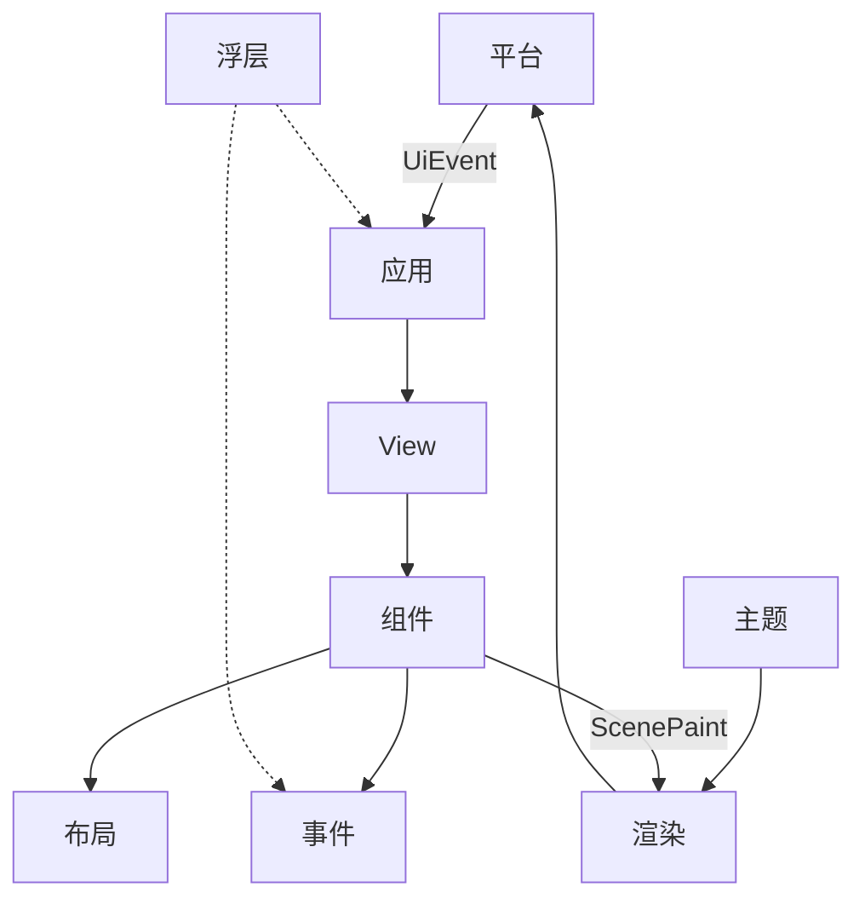

# UIX 设计文档

> 按**系统**组织，不按源码目录。 [`decisions.md`](decisions.md) · [`glossary.md`](glossary.md) · [`AGENTS.md`](../AGENTS.md)

## 系统

| # | 文档 |
|---|------|
| 1 应用 | [application.md](systems/application.md) |
| 2 View 与响应式 | [view-reactive.md](systems/view-reactive.md) |
| 3 组件 | [component.md](systems/component.md) |
| 4 主题与样式 | [theme-style.md](systems/theme-style.md) |
| 5 事件 | [event.md](systems/event.md) |
| 6 布局 | [layout.md](systems/layout.md) |
| 7 渲染 | [rendering.md](systems/rendering.md) |
| 8 平台 | [platform.md](systems/platform.md) |
| 9 浮层 | [overlay.md](systems/overlay.md) |
| 10 基础设施 | [foundation.md](systems/foundation.md) |
| 11 数据 | [data.md](systems/data.md) |

## 协作（运行时）

## 阅读顺序

[`glossary.md`](glossary.md) → [`decisions.md`](decisions.md) → application → view-reactive + component → theme-style + event → layout + rendering + platform → overlay + foundation + data
