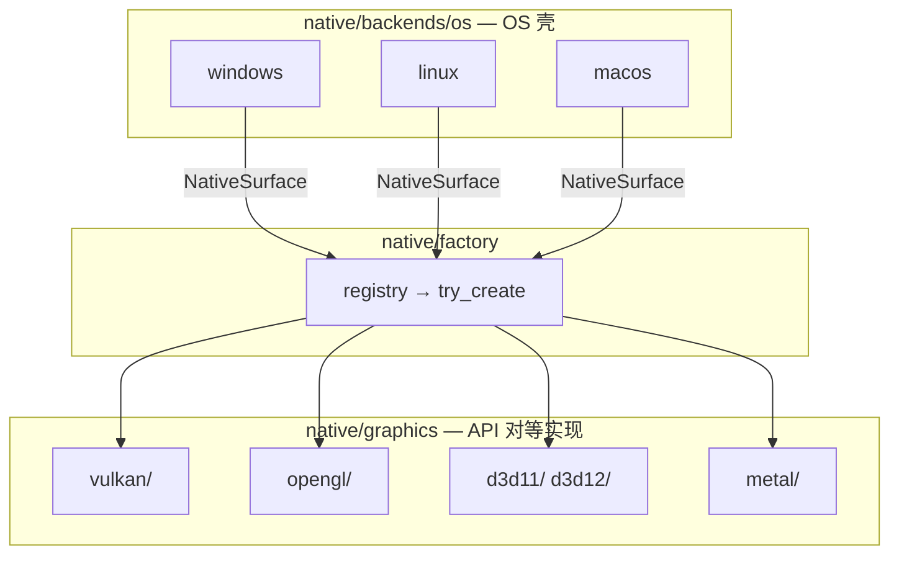

# 可插拔图形后端

← [架构导航](../architecture.md) · 域：`native` · `draw` · `app` · [#162](../../decisions.md#d162) [#163](../../decisions.md#d163) [#164](../../decisions.md#d164) [#168](../../decisions.md#d168) [#169](../../decisions.md#d169) [#172](../../decisions.md#d172)

> **设计**：渲染以 `RasterMode` × `PresentMode` × `GraphicsBackend` 独立描述，并由 caps + registry 选择合法稀疏组合（[#168](../../decisions.md#d168) [#169](../../decisions.md#d169) [#172](../../decisions.md#d172)）。
> **实现状态**：P6.7 registry / probe / 统一 present ✅ · P6.8 正交轴类型与表驱动装配 ✅ · D3D11 `GpuNative` × `Swapchain` ✅（`fill_rect`/`fill_circle`/`stroke_rect`/`stroke_circle` + 轴对齐 `draw_line` + identity solid `blit_glyph` 字形 atlas + identity linear/radial gradient + identity 简单 `fill_path`/`stroke_path`（CPU tessellate → GPU triangles）；嵌套/相交多轮廓、孔洞、自交由拓扑守卫转 soft，非 identity/斜线等走既有 soft + alpha blit）（[#169](../../decisions.md#d169)）→ [P6.8](../implementation.md#p68-可组合渲染轴)。非 P6 任务不必通读。

## 索引

| 读什么 | 章节 |
|--------|------|
| Mental model（先读） | [可组合渲染轴](#可组合渲染轴) |
| API 对等 vs OS 壳 | [图形 API 架构原则](#图形-api-架构原则) · [源码目录](#源码目录) |
| 「任意更换」边界 | [目标与范围](#目标与范围) |
| 初始化数据流 | [架构总览](#架构总览) |
| 类型与分派 | [核心抽象](#核心抽象) |
| 扩展 checklist | [新增图形 API](#新增图形-api) |
| 零闲置 | [#105 对齐](#105-对齐) |
| 已闭合取舍 | [权衡](#权衡与已闭合决策) |

**关联**：[rendering · 多图形 API](rendering.md#多图形-api) · [platform · factory](platform.md#多图形-api-与-factory) · [public-api · native](public-api.md#native) · [glossary · 多图形 API](../../glossary.md#多图形-api)

---

<a id="可组合渲染轴"></a>

## 可组合渲染轴

> **唯一 mental model**（[#168](../../decisions.md#d168) [#169](../../decisions.md#d169) [#172](../../decisions.md#d172)）：渲染 = 受 capability 约束的正交组件组装，不是「固定管线枚举」；“×”不承诺完整笛卡尔积。

| 轴 | 类型 | 职责 | 域 |
|----|------|------|-----|
| 光栅 | `RasterMode` → `CpuBackend` / `RenderBackend` | Canvas2D 绘制；CPU 与 GPU **对等可选** | `draw/backend/` |
| Present | `PresentMode` → swap / pixel upload / `IPresenter` | 像素如何上屏；与光栅 **正交** | `native` traits + engine |
| 图形 API | `GraphicsBackend` + `IGraphicsContext` | surface、swapchain、`present(PresentFrame)` | `native/graphics/<api>/` |

```rust
// native/traits/present.rs — 设计类型（#169；P6.8 落地）
pub enum RasterMode { Cpu, GpuNative }
pub enum PresentMode { Swapchain, PixelUpload, CpuPresenter }
```

**当前合法组合 → Engine**（caps + registry 表驱动装配，非硬编码 API）：

| Raster × Present | Engine |
|------------------|--------|
| `GpuNative` × `Swapchain` | `GpuEngine` |
| `Cpu` × `PixelUpload` | `PresentUploadEngine` |
| `Cpu` × `CpuPresenter` | `SoftwareEngine` |

**实现矩阵**（✅ 已落地 · ❌ 尚未实现）：

| Raster × Present | Engine | OpenGL ES | D3D11 | Vulkan | Metal |
|------------------|--------|:---------:|:-----:|:------:|:-----:|
| `GpuNative` × `Swapchain` | `GpuEngine` | ✅ | ✅¹ | ❌ | ❌ |
| `Cpu` × `PixelUpload` | `PresentUploadEngine` | — | —² | ✅ | ✅ |
| `Cpu` × `CpuPresenter` | `SoftwareEngine` | ✅ | ✅ | ✅ | ✅ |

¹ D3D11：device/swapchain/RTV + 原生 solid/rounded fill + stroke（VS/PS SDF）+ identity solid glyph atlas（CPU coverage → R8 atlas → textured quads）+ identity linear/radial gradient + identity 简单 path（CPU flatten/ear-clip fill + thick-line stroke mesh）+ identity box/ambient shadow（SDF outer glow，匹配 CPU coverage）+ soft 回退 alpha blit + present；复杂 `fill_path` 的嵌套/相交轮廓、孔洞、自交由拓扑守卫保守转 soft，斜线/非 identity 文本等仍 soft。

² D3D11 优先路径已切到 `GpuNative` × `Swapchain`；`present_pixels` / `upload_surface_pixels` 仍保留作低层测试 helper，主路径不再全帧 upload。

**下一代码优先**（[#167](../../decisions.md#d167) [#169](../../decisions.md#d169)）：D3D11 原生路径扩展（复杂 path）；随后 Metal / D3D12 `GpuNative`。

**禁止写成永久约束**：「D3D11 只能 CpuUpload」「只有 GL 能 GPU 光栅」。正确写法：某 API 的 context **当前 caps** 声明了哪些轴组合；架构上任意 API 均可组装任意合法轴组合。

**分派**：`create_graphics_engine` 按 `caps.raster × caps.present` 表驱动装配；`caps.backend` → `RenderBackendRegistry`（仅 `GpuNative`）。

**非法组合与 fallback**（[#172](../../decisions.md#d172)）：

1. registry 先筛选当前二进制已编译候选；显式选择未编译的 API 记录 `NotImplemented`/候选缺失诊断。
2. context 创建成功后以 `GraphicsContextCaps` 声明唯一实际轴组合；engine factory 不猜测、补齐或热切换轴。
3. caps 组合无对应 engine/backend 时返回包含 API identity、raster、present 的错误，关闭 context，再由 bootstrap 尝试下一候选。
4. 所有 GPU 候选失败后才进入 `SoftwareEngine + IPresenter`；显式选择仍遵循同一可诊断 fallback，不跳过资源清理。

---

<a id="图形-api-架构原则"></a>

## 图形 API 架构原则

Vulkan / OpenGL ES / D3D11 / Metal 是 `IGraphicsContext` 的 **对等实现**（peer），地位相同；**不是** `draw` / `ui` / `app` 的分层维度。

| 概念 | 含义 |
|------|------|
| `GraphicsBackend` | API **身份**（`Vulkan` / `D3D11` / …）；配置 opt-in 与诊断 |
| `native/graphics/<api>/` | API 对等实现落点（#164）；同级目录，**非** OS 一级 |
| `native/backends/<os>/` | OS 壳：窗口、事件、CPU presenter、surface 句柄；**不含** API 实现 |
| OS / `PlatformId` | **仅**决定：编进二进制的候选、`Auto` probe 顺序 |
| `IGraphicsContext` / `GraphicsEngine` | 上层 **唯一** 图形抽象 |

框架内部上层只按 trait/caps 工作，禁止 `#[cfg(windows)]` / `match OS` / 散落的 `match GraphicsBackend` 构造 API 专属图形管线。应用配置、环境/Settings、诊断报告、native factory 候选表和 `draw::RenderBackendRegistry` 的表驱动 adapter 配对可以使用 **`GraphicsBackend` API identity**；该例外不允许向普通 pipeline 泄漏 backend 实现类型（[#172](../../decisions.md#d172)）。

<a id="源码目录"></a>

### 源码目录

| 维度 | 落点 |
|------|------|
| API 实现 | `native/graphics/<api>/`（vulkan、opengl、d3d11、metal、d3d12 stub） |
| OS 壳 | `backends/<os>/` — 窗口、presenter、输入、`NativeSurface` |
| Surface 绑定 | `graphics/<api>/platform/<os>.rs` 薄适配，或 backends 委托 |
| Registry | `factory/registry*.rs` → `graphics/<api>::create` |
| 上层 | 禁止 `use native::backends::*` / `native::graphics::*`；`graphics/` **不**向上导出 |

**边界**：

1. **按 API 分树**，不按 OS — `vulkan/`、`d3d11/`、`opengl/`、`metal/` 同级 peer。
2. **平台差异下沉** — WGL vs EGL 同属 `opengl/`；surface 差异进 `platform/`。
3. **`backends/` 收窄** — 窗口生命周期、CPU `IPresenter`、取出 `NativeSurface` 交给 `graphics/<api>::create`。
4. **`#[cfg]`** — 仅 `graphics/**/platform/`、`backends/`、`factory/`；上层域不写平台 cfg。
5. **Trait 契约** — `IGraphicsContext` 在 `native/traits/present.rs`；`graphics/` 只含 impl。



---

<a id="目标与范围"></a>

## 目标与范围

| 在范围内 | 不在范围内 |
|----------|------------|
| 跨平台配置指定 API（builder / env / Settings） | 运行中热切换 API |
| 初始化时从 **已编译** 候选 probe 并回退 | `dlopen` / 外部动态插件 |
| 新增 API = 模块 + registry 条目 | 同进程多窗口 **不同** GPU API |
| Cargo feature 裁剪未用 backend | WebGPU / 浏览器（远期 P6.6） |
| 测试注入 Fake backend | 第三方「插件市场」 |

原则继承 AGENTS + [#105](../../decisions.md#d105) + [#162](../../decisions.md#d162)。

---

<a id="架构总览"></a>

## 架构总览

```text
app
  configured_graphics_backend()
  draw::bootstrap_graphics_engine(surface, w, h, request)
    → Ok(GpuBootstrap) 或 Err → SoftwareEngine + IPresenter
  帧循环：ExternalPresenter 时 platform_window.presenter()

draw
  bootstrap_graphics_engine   // 唯一 GPU probe 循环
  create_graphics_engine(ctx) // caps.raster × caps.present 表驱动装配
  FrameRenderer / ScenePaint / Invalidation — 与具体 API 无关

native
  BackendRegistry: &[GraphicsBackendEntry] → Box<dyn IGraphicsContext>
  graphics/<api>/* — IGraphicsContext 对等实现
  backends/<os>/ — 窗口 / presenter / surface 句柄
```

**Bootstrap（选项 B）**：`draw::bootstrap_graphics_engine` 只走 GPU 路径；`PresentMode::CpuPresenter` / `SoftwareEngine` + `IPresenter` 留在 **app + native 窗口**。Probe **唯一**循环在 draw bootstrap；每次失败保留 candidate、stage、selected 与完整错误，app 按原顺序记录报告；engine 失败须 `ctx.shutdown()` 再试下一候选。

**关闭顺序**：`WindowSession` 幂等 shutdown engine；OpenGL 后端先 make current 并释放 canvas GL 资源，再关闭 WGL/EGL context；最后由 app 显式关闭 native window。engine/backend/context 的 Drop 只作幂等兜底，禁止让 raw GL 资源晚于 context 析构。

---

<a id="核心抽象"></a>

## 核心抽象

| 轴 / 类型 | 域 | 职责 |
|-----------|-----|------|
| `GraphicsBackend` | native | API 身份；probe 候选键；与光栅 / present **正交** |
| `RasterMode` | native/draw | `Cpu` / `GpuNative`；caps 显式字段 |
| `PresentMode` | native/draw | `Swapchain` / `PixelUpload` / `CpuPresenter`；caps 显式字段 |
| `BackendKind` | draw | `Cpu` / `Gpu` / `Auto` / `Null`；与正交轴对齐；`Gpu` = 尝试 GPU 路径，不绑具体 API |
| `GraphicsContextCaps` | native | `backend` + `raster` + `present` + `partial_present` + DPR |
| `GraphicsBackendEntry` | factory | `id` / `priority` / `status` / `raster` / `present` / `create`；表驱动 |
| `RenderBackendRegistry` | draw | `GpuNative` 时按 API 配对；OpenGL ES / D3D11 ✅；随后 Metal / D3D12 |
| `bootstrap_graphics_engine` | draw | 唯一 probe + `create_graphics_engine` |

**分派**：`caps.raster × caps.present` → 表驱动装配 engine；`caps.backend` → `RenderBackendRegistry`（仅 `GpuNative`）。找不到合法组合即返回诊断，bootstrap 关闭 context 后继续候选，不进行隐式轴变换。

**统一 present 契约**：`IGraphicsContext::present(PresentFrame)`（`Swapchain` / `PixelUpload`）；`CpuPresenter` 走 `IPresenter`，无 context。

**Auto 回退链**（registry 数据，非上层维度）：

| 平台 | Auto 链 |
|------|---------|
| Windows | D3D11 → OpenGL ES |
| Linux | Vulkan → OpenGL ES |
| macOS | Metal →（全失败）`SoftwareEngine` |

<a id="实现状态"></a>

### 实现状态

| 项 | 状态 |
|----|------|
| Registry / probe / `IGraphicsContext::present` | ✅ P6.7 |
| `RasterMode` / `PresentMode` 类型与 caps 字段 | ✅ P6.8 |
| `create_graphics_engine` 按轴表驱动 | ✅ P6.8 |
| `BackendKind` 与正交轴对齐 | ✅ P6.8 |
| D3D11 `GpuNative` × `Swapchain` | ✅ 原生 fill/stroke rect + circle + 轴对齐 line + identity solid glyph atlas + identity linear/radial gradient + identity 简单 path mesh + soft blit；复杂 `fill_path` 拓扑守卫保证 fallback，原生扩展与非 identity 文本仍 backlog |

权威分项 → [implementation · P6.8](../implementation.md#p68-可组合渲染轴)。

---

<a id="新增图形-api"></a>
<a id="新增图形-api-清单"></a>

## 新增图形 API

以 **Metal native raster** 为例，按序：

| # | 位置 | 动作 |
|---|------|------|
| 1 | `native/graphics/<api>/context.rs` | 实现 `IGraphicsContext`；caps 声明 `raster` + `present` |
| 2 | `native/factory/registry_*.rs` | 添加 `GraphicsBackendEntry` |
| 3 | `Cargo.toml` | feature gating |
| 4 | `draw/backend/<api>.rs` | `RenderBackend` + `Canvas2D`（仅 `GpuNative`） |
| 5 | `draw/backend/registry.rs` | 登记 API → backend 构造 |
| 6 | docs | 更新 [implementation · P6](../implementation.md#p6-生产级框架) |
| 7 | 测试 | registry + bootstrap 单测；不要求真 GPU CI |

**仅 CPU + PixelUpload**：完成 1–2，声明 `Cpu` × `PixelUpload`，跳过 4–5。

**禁止**：`app`/`ui` 增加 API/`#[cfg]` 分支；`FrameRenderer` backend 特判；`create_graphics_engine` 硬编码 `match` 具体 API；第二套并行 factory。

---

<a id="105-对齐"></a>

## #105 对齐

| 要求 | 本设计 |
|------|--------|
| 无事件无 present | engine 切换不在帧热路径 |
| 初始化一次 | probe **仅** `draw::bootstrap_graphics_engine` |
| 零每帧探测 | resize / surface lost **不** re-probe |
| 最少资源 | feature 裁剪；registry priority 定 Auto 顺序 |
| 单 factory | registry 表驱动 |

`Cpu` × `PixelUpload` 是合法轴组合，不是「这些 API 架构上只能 CPU 光栅」。`GpuNative` + registry：OpenGL ES ✅；D3D11 ✅（原生 solid rect + soft 回退）；随后 Metal / D3D12。

---

<a id="权衡与已闭合决策"></a>

## 权衡与已闭合决策

| 话题 | 决策 |
|------|------|
| 动态插件 / 多窗口异构 API | **不做** |
| Bootstrap CPU 路径 | **选项 B**：app 建 `SoftwareEngine` |
| 渲染分派 | **仅** `RasterMode` × `PresentMode`（× `GraphicsBackend`）；bundled 管线枚举已拒绝（#169） |
| Probe 循环 | **仅** `draw::bootstrap` |
| WebGPU | 远期 P6.6 |
| 交付优先级 | Windows 先行（#167）；D3D11 GPU raster 先于 Metal/D3D12（#169） |

---

## 维护

- 落地 → [P6.7](../implementation.md#p67-图形后端架构)；正交轴 → [P6.8](../implementation.md#p68-可组合渲染轴)
- 实现注记 → [rendering · 多图形 API](rendering.md#多图形-api)
- 术语 → [glossary · 多图形 API](../../glossary.md#多图形-api)
- 决策变更 → [#163](../../decisions.md#d163) [#164](../../decisions.md#d164) [#168](../../decisions.md#d168) [#169](../../decisions.md#d169) [#172](../../decisions.md#d172)；新决策 **#174+**
