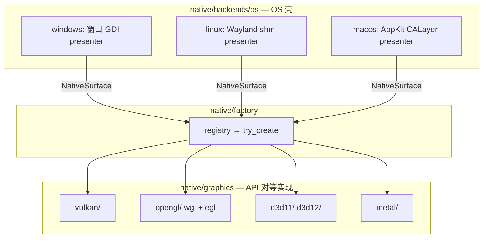

# 可插拔图形后端架构


← [Main](../architecture.md) · 功能域：`native` · `draw` · `app` · 决策 [#162](../../decisions.md#d162) · [#163](../../decisions.md#d163) · [#164](../../decisions.md#d164) · [#168](../../decisions.md#d168) · [#169](../../decisions.md#d169)


> **状态**：可插拔图形后端架构（#163、#164）已落地。**非 P6 任务不必通读本文** — 原则见下节，backlog → [implementation · P6](../implementation.md#p6-生产级框架)。


## 索引


| 章节 | 说明 |

|------|------|

| [图形 API 架构原则](#图形-api-架构原则) | 对等实现 vs OS 目录；上层只见 trait |

| [可组合渲染轴](#可组合渲染轴) | 正交 `RasterMode` × `PresentMode`；Profile **deprecated for removal**（#169） |

| [源码目录](#源码目录) | `native/graphics/` 对等 API 树 |

| [目标与范围](#目标与范围) | 「任意更换」边界 |

| [架构总览](#架构总览) | 分层与初始化数据流 |

| [核心抽象](#核心抽象) | 正交轴、Caps、Registry、Bootstrap；Profile 过渡态 |

| [新增图形 API 清单](#新增图形-api-清单) | 扩展点 checklist |

| [#105 对齐](#105-对齐) | 零闲置与 CpuUploadPresent 设计 |

| [权衡与已闭合决策](#权衡与已闭合决策) | 诚实取舍 |


**关联**：[rendering · 多图形 API](rendering.md#多图形-api) · [platform · factory](platform.md#多图形-api-与-factory) · [public-api · native](public-api.md#native) · [implementation · P6 图形后端](../implementation.md#p67-图形后端架构)


---


## 图形 API 架构原则


> 本节固定 **mental model**。backlog → [implementation · P6](../implementation.md#p67-图形后端架构)。


### 对等实现，非 OS 架构轴


Vulkan、OpenGL ES、D3D11、Metal 等是 **`native` 层 `IGraphicsContext` 的对等实现**（peer implementations），地位相同；**不是** `draw` / `ui` / `app` 的分层维度。


| 概念 | 含义 |

|------|------|

| `GraphicsBackend` | **图形 API 身份**（`Vulkan` / `D3D11` / `OpenGlEs` / `Metal` …）；配置 opt-in 与诊断 |

| `native/graphics/<api>/` | API 对等实现落点（#164）；Vulkan / D3D / GL / Metal 同级目录，**非** OS 一级 |

| `native/backends/<os>/` | **OS 壳**：窗口、事件、CPU presenter、surface 句柄提取；**不含** API 对等实现 |

| OS / `PlatformId` | **仅**决定：哪些实现编进二进制、`Auto` 的 probe 顺序；**非** `draw` / `ui` / `app` 可见维度 |

| `IGraphicsContext` / `GraphicsEngine` | 上层 **唯一** 图形抽象；禁止在上层区分 WGL / EGL / Vulkan / Metal |


上层（`draw` / `ui` / `app`）**只见 trait** 与 factory 返回值；不得以 `#[cfg(windows)]` 或 `match OS` 分支图形管线。配置入口表达的是 **`GraphicsBackend`（API）**，不是「选操作系统」。


<a id="源码目录"></a>


### 源码目录


图形 API 实现位于 **`src/native/graphics/`** 按 API 分树；`backends/<os>/` 仅 OS 壳（#164）。


| 维度 | 落点 |

|------|------|

| API 实现 | `native/graphics/<api>/` 对等目录（vulkan、opengl、d3d11、metal、d3d12 stub） |

| OS 壳 | `backends/<os>/` 窗口、presenter、输入；提供 `NativeSurface` 等句柄 |

| Surface 绑定 | `graphics/<api>/platform/<os>.rs` 薄适配，或 `backends/<os>/` 委托调用 |

| Registry | `factory/registry*.rs` 表项指向 `graphics/<api>::create` |

| 上层依赖 | 禁止 `use native::backends::*` / `native::graphics::*`；`graphics/` **不**向上导出 |


**边界规则**：


1. **按 API 分树，不按 OS 分树** — `vulkan/`、`d3d11/`、`opengl/`、`metal/` 为同级 peer。

2. **平台差异下沉** — WGL vs EGL 同属 `opengl/`；Wayland vs Win32 surface 差异放在 `platform/` 子模块。

3. **`backends/` 职责收窄** — 窗口生命周期、CPU `IPresenter`、事件泵；从 platform 窗口取出 `NativeSurface` 交给 `graphics/<api>::create`。

4. **`#[cfg]` 边界** — API 模块内 `platform/` 可用平台 cfg；`core`/`draw`/`ui`/`app`/`data` 仍不写平台 cfg。

5. **Trait 契约不变** — `IGraphicsContext` 仍在 `native/traits/present.rs`；`graphics/` 只含 impl。





<a id="可组合渲染轴"></a>

### 可组合渲染轴（#168 · #169）

> **Mental model**：渲染 = **正交组件组装**，不是「三条固定管线」。目标分派 **仅** `RasterMode` × `PresentMode`（× `GraphicsBackend`）— 见 [#169](../../decisions.md#d169)。`RenderPipelineProfile`（#163）为 **当前源码过渡预设**（bundled dispatch），**deprecated for removal**；**禁止**新增 Profile 变体或作为别名保留。

| 轴 | 类型 / 组件 | 职责 | 域 |
|----|-------------|------|-----|
| **光栅** | `RasterMode` → `RenderBackend` / `CpuBackend` / `GpuBackend` | `Canvas2D` 绘制；CPU 与 GPU **对等可选** | `draw/backend/` |
| **Present** | `PresentMode` → `swap_buffers` · `present(PixelBuffer)` · `IPresenter` | 像素如何上屏；与光栅 **正交** | `native` traits + engine |
| **图形 API** | `IGraphicsContext` + `GraphicsBackend` | surface、swapchain、统一 `present(PresentFrame)` | `native/graphics/<api>/` |

**目标组合**（任意 API 理论上均可）：

| RasterMode | PresentMode | 典型 Engine | 当前实现 |
|------------|-------------|-------------|----------|
| GPU native | Swapchain | `GpuEngine` | ✅ OpenGL ES |
| GPU native | Pixel upload | （未来） | ❌ backlog |
| CPU | Pixel upload | `PresentUploadEngine` | ✅ D3D11 / Vulkan / Metal |
| CPU | `IPresenter` | `SoftwareEngine` | ✅ 全平台回退 |

**错误表述**：「D3D11 只能 CpuUploadPresent」「只有 GL 能 GPU 光栅」— 应写：**当前** D3D11 context 声明 `CpuUploadPresent` **过渡预设**；**下一代码优先**（[#167](../../decisions.md#d167) [#169](../../decisions.md#d169)）为 D3D11 **GPU native raster**（registry + caps）。

### Profile 预设分派（过渡实现 · deprecated）

> **Deprecated for removal**（[#169](../../decisions.md#d169)）：下列 Profile 映射 **仅** 描述当前源码；重构后由 `RasterMode` × `PresentMode` 表驱动分派替代，**不**保留 Profile 别名。

`create_graphics_engine` 读 `caps().pipeline`，一次 match 选中 bundled engine（**过渡 API**）：

| Profile（过渡 → 正交轴） | Engine | RasterMode | PresentMode |
|-----------------|--------|------------|-------------|
| `NativeGpuRaster` | `GpuEngine` | GPU native | Swapchain |
| `CpuUploadPresent` | `PresentUploadEngine` | CPU | Pixel upload |
| `CpuPresenter` | `SoftwareEngine`（app/bootstrap） | CPU | `IPresenter` |

**当前各 API 默认过渡预设**（初始化时写入 `GraphicsContextCaps`，非永久绑定）：OpenGL ES → `NativeGpuRaster`；D3D11 / Vulkan / Metal → `CpuUploadPresent`；GPU 全失败 → `CpuPresenter`。**下一优先**：D3D11 → `RasterMode::GpuNative` + `PresentMode::Swapchain`（[#169](../../decisions.md#d169)）；Metal / D3D12 **随后**。

---


## 目标与范围


### 「任意更换」指什么


| 在范围内 | 不在范围内 |

|----------|------------|

| 跨平台 **配置** 指定 API（builder / env / Settings） | 运行中 **热切换** API |

| 初始化时从 **已编译** 候选链 probe 并回退 | `dlopen` / 外部 `.dll` **动态插件** |

| 新增 API 时 **只增** backend 模块 + registry 条目 | 同一进程内多窗口 **不同** GPU API |

| 可选 Cargo **feature** 裁剪未用 backend | WebGPU / 浏览器 target（远期） |

| 测试 / CI 注入 Fake backend | 用户态第三方「UIX 插件市场」 |


**设计原则**（继承 AGENTS + #105 + #162）→ [graphics-backend-pluggable · 图形 API 架构原则](#图形-api-架构原则) · [AGENTS.md](../../../AGENTS.md#架构硬约束)。

---


<a id="架构总览"></a>


## 架构总览


```text

app

  configured_graphics_backend()

  draw::bootstrap_graphics_engine(surface, w, h, request)

    → Ok(GpuBootstrap) 或 Err → SoftwareEngine + IPresenter

  帧循环：ExternalPresenter 时 platform_window.presenter()


draw

  bootstrap_graphics_engine  // GPU probe + engine，不含 CPU

  create_graphics_engine(ctx)  // profile + RenderBackendRegistry

  FrameRenderer / ScenePaint / Invalidation — 与 API 无关


native

  BackendRegistry: &[GraphicsBackendEntry]

    try_create → Box<dyn IGraphicsContext>

  graphics/<api>/* — IGraphicsContext 对等实现

  backends/<os>/ — 窗口 / presenter / surface 句柄

```


**Bootstrap 边界（选项 B）**：`draw::bootstrap_graphics_engine` 只负责 GPU 路径；`CpuPresenter` / `SoftwareEngine` 与 `IPresenter` 注入留在 **app + native 窗口**。Probe **唯一循环**在 draw bootstrap；engine 失败 **必须** `ctx.shutdown()` 再试下一候选。


---


## 核心抽象


| 类型 | 域 | 职责 |

|------|-----|------|

| `RenderPipelineProfile` | native | **Deprecated for removal**（#169）：bundled 过渡预设；**目标** `RasterMode` + `PresentMode` 正交 caps / registry 行 |
| `RasterMode` | native / draw | 光栅轴：`Cpu` / `GpuNative`；映射 `CpuBackend` 或 `RenderBackendRegistry` |
| `PresentMode` | native / draw | Present 轴：`Swapchain` / `PixelUpload` / `CpuPresenter` |

| `GraphicsContextCaps` | native | `backend` + `pipeline` + `partial_present` + DPR；**不**重复 draw 侧 caps |

| `GraphicsBackendEntry` | native/factory | registry 行：`id`、`platforms`、`priority`、`status`、`create` |

| `RenderBackendRegistry` | draw | `NativeGpuRaster` 时按 `caps.backend` 配对光栅 backend |

| `bootstrap_graphics_engine` | draw | **唯一** probe 循环 + `create_graphics_engine` |


**分派规则（当前 → 目标）**：**当前** `caps.pipeline`（Profile）→ bundled engine；**目标**（#169）`caps.raster` × `caps.present` → 表驱动 engine 装配；`caps.backend` → `RenderBackendRegistry`（`RasterMode::GpuNative` 时）。`CpuUploadPresent` 过渡预设 = `RasterMode::Cpu` + `PresentMode::PixelUpload` — 实现细节，非永久约束。

**Present 组件**（正交于光栅）：Swapchain · Pixel upload（`PresentFrame::PixelBuffer`）· `IPresenter`（无 `IGraphicsContext`）。统一 GPU 契约：`IGraphicsContext::present(PresentFrame)`。

**BackendKind**（draw）：`Cpu` / `Gpu` / `Auto` / `Null` — **纳入 #169 统一**，与 `RasterMode` / `PresentMode` / `GraphicsBackend` 对齐，消除 Profile bundled 语义。

<a id="能力模型与映射"></a>

### 能力模型与映射

| 设计轴 | 类型 | 与 Profile 关系 |
|--------|------|-----------------|
| API 身份 | `GraphicsBackend` | 与光栅 / present **正交**；probe 候选与 `RenderBackendRegistry` 键 |
| 光栅 | `RasterMode` → `RenderBackend` trait | CPU：`CpuBackend`；GPU：按 backend 注册（当前仅 GL；**下一优先** D3D11） |
| Present | `PresentMode` → `PresentFrame` / `IPresenter` | engine 在 `end_frame` 选择路径；与 API 名 **不**绑定 |
| 过渡预设 | `RenderPipelineProfile` | **Deprecated**（#169）：当前 `pipeline` 一次决定 engine；**breaking 删除** |
| draw 引擎级 | `BackendKind` | **#169 统一**：与正交轴对齐，非 bundled profile 语义 |


**Auto 回退链**（registry 数据，非上层维度）：


| 平台 | Auto 链 |

|------|---------|

| Windows | D3D11 → OpenGL ES |

| Linux | Vulkan → OpenGL ES |

| macOS | Metal → （GPU 全失败）app 建 SoftwareEngine |


**平台矩阵**：Windows/Linux/macOS 均已编进 registry；D3D11/Vulkan/Metal 为 `CpuUploadPresent`；OpenGL ES 为 `NativeGpuRaster`。详见 [implementation · P6](../implementation.md#p6-生产级框架)。


---


## 新增图形 API 清单


新增一种 GPU API（以 **Metal native raster** 为例）时，按序完成：


| 步骤 | 位置 | 动作 |

|------|------|------|

| 1 | `native/graphics/metal/context.rs` | 实现 `IGraphicsContext`；`caps().pipeline = NativeGpuRaster` |

| 2 | `native/factory/registry_macos.rs` | 添加 `GraphicsBackendEntry` |

| 3 | `Cargo.toml` | feature `metal` gating 依赖 |

| 4 | `draw/backend/metal.rs` | 实现 `RenderBackend` + `Canvas2D` |

| 5 | `draw/backend/registry.rs` | 登记 `Metal → MetalRenderBackend::new` |

| 6 | `docs` | 更新 [implementation · P6](../implementation.md#p6-生产级框架) |

| 7 | 测试 | registry + bootstrap 单测；**不**要求真 GPU CI |


**禁止**：在 `app`/`ui` 增加 `#[cfg]` 或 API 分支；在 `FrameRenderer` 增加 backend 特判；在 `create_graphics_engine` 写硬编码 `match`；保留第二套并行 factory。


**CpuUploadPresent 扩展路径**：仅完成步骤 1–2，`pipeline = CpuUploadPresent`，跳过 4–5 — D3D11/Vulkan/Metal 均采用此路径。


---


## #105 对齐


| #105 要求 | 本设计如何满足 |

|-----------|----------------|

| 无事件无 present | engine 切换不在帧热路径 |

| 初始化一次 | probe **仅** `draw::bootstrap_graphics_engine` |

| 零每帧探测 | resize / surface lost **不** re-probe |

| 最少资源 | feature 裁剪；registry priority 控制 Auto 链顺序 |

| 单 factory | registry 表驱动，无双 factory |


**CpuUploadPresent 设计（当前预设）**：D3D11/Vulkan/Metal context **当前**声明 `pipeline = CpuUploadPresent`（CPU 光栅 + pixel upload）；draw 侧 `PresentUploadEngine` + `CpuBackend`。这是 **初始化预设**，非「这些 API 架构上只能 CPU 光栅」（#168）。`NativeGpuRaster` 预设与 `RenderBackendRegistry` 为 GL 及 backlog 中的 Metal/D3D12 GPU 光栅路径。


---


## 权衡与已闭合决策


| 话题 | 决策 |

|------|------|

| 动态插件 | **不做** |

| 多窗口异构 API | **不做** |

| Bootstrap CPU 路径 | **选项 B**：app 建 `SoftwareEngine` |

| Profile vs backend 分派 | **过渡**：profile → engine；**目标**（#169）：`RasterMode` × `PresentMode` 表驱动；backend → `RenderBackendRegistry` |

| Probe 循环 | **仅** `draw::bootstrap` |

| WebGPU | 远期 P6.6 |

| macOS | 架构维度与 Win/Linux 对等；Metal context ✅；native raster **backlog**；**交付优先级**见 [#167](../../decisions.md#d167) |


---


## 维护


- backlog（native raster、WebGPU）→ [implementation · P6](../implementation.md#p67-图形后端架构)。

- 实现落地 → [rendering · 多图形 API](rendering.md#多图形-api) 实现注记。

- 术语 → [glossary · GraphicsBackend](../../glossary.md)。

- 决策变更 → [#163](../../decisions.md#d163) · [#164](../../decisions.md#d164)；后续 #166+。

