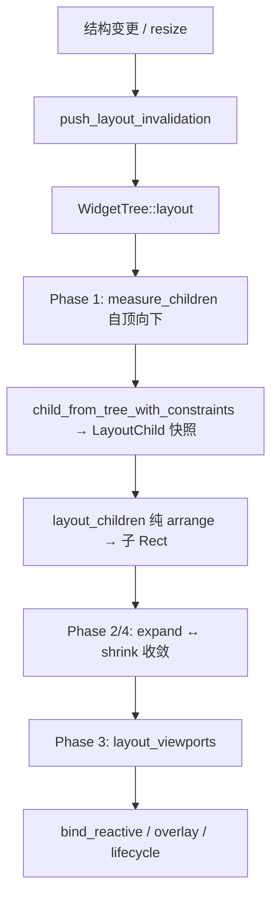

# 布局系统

← [架构导航](../architecture.md) · 系统 **#6** · 功能域：`ui`

> **measure 定尺寸，arrange 定位置**；Flex + Grid 排布；Scroll 消化 Wheel。布局失效不 present（[#105](../../decisions.md#d105)）；Scroll 失效优先 Composite memmove（#107，见 [demand-driven](demand-driven.md#失效与窄标脏)）。

## 索引

| 主题 | 章节 | 决策 |
|------|------|------|
| 总览 | [布局设计总览](#布局设计总览) | #105 #165 |
| 两阶段 | [Measure / Arrange](#measure--arrange-两阶段) | #19 #29 #103 |
| 测量 | [测量](#测量) | #29 #38 #103 |
| Intrinsic | [Intrinsic 尺寸](#intrinsic-尺寸) | #165 |
| 盒模型 | [盒模型](#盒模型) | #38 #56 |
| Flex | [Flex 布局](#flex-布局) | #53 #81 #165 |
| 容器 | [容器层级](#容器层级) | #45 #53 #165 |
| Style 预设 | [Style 预设](#style-预设) | #81 #165 |
| 模式 | [常见模式与反模式](#常见模式与反模式) | #165 |
| CSS 对照 | [与 Web Flexbox 对照](#与-web-css-flexbox-对照) | — |
| Grid | [Grid 布局](#grid-布局) | #53 #67 #84 |
| Scroll | [Scroll](#scroll) · [VirtualScroll](#virtual-scroll) | #45 #73 #107 |
| 布局管线 | [布局管线](#布局管线) | #19 |
| Active | [Active 判定](#active-判定) | #19 |

**关联**：[component](component.md) · [theme-style](theme-style.md) · [view-reactive](view-reactive.md) · [rendering](rendering.md) · [demand-driven](demand-driven.md)

---

<a id="布局设计总览"></a>

## 布局设计总览

### 目标

| 原则 | 说明 |
|------|------|
| **Web 式 Flex** | Column 默认垂直堆叠；未设 `width`/`height` 时子项撑开父级（[#165](../../decisions.md#d165)） |
| **两阶段分离** | `measure_children(frame, ids, tree)` 生成本轮测量快照；`layout_children(frame, &[LayoutChild], tree)` 只回答「放哪里」 |
| **按需收敛** | 结构变更才 `push_layout_invalidation`；layout 不触发 present（[#105](../../decisions.md#d105)） |
| **纯函数引擎** | `compute_flex_layout` / `compute_grid_layout` 无副作用；容器 widget 组装 `LayoutChild` 后委托 |

### 数据流

```text
父级 frame / Constraints
    → child measure（自下而上收集 intrinsic）
    → layout_children（自上而下分配子 frame）
    → expand/shrink 收敛（容器随子项 grow/shrink）
    → layout_viewports（ScrollView content_bounds）
```

几何类型一律来自 `core`（见 [foundation](foundation.md)）。

---

<a id="measure--arrange-两阶段"></a>

## Measure / Arrange 两阶段

### 职责划分

| 阶段 | API | 输入 | 输出 | 时机 |
|------|-----|------|------|------|
| **Intrinsic Measure** | `WidgetLayout::measure` | `Constraints { min, max, definite }` | `Size`（intrinsic，经 clamp） | 父级准备子项输入时 |
| **Child Measure** | `WidgetLayout::measure_children` | 父级 `frame` + 子 id 列表 | pass-local `Vec<LayoutChild>` | 每次父级 arrange 前 |
| **Arrange** | `WidgetLayout::layout_children` | 父级 `frame` + `&[LayoutChild]` | `Vec<(ComponentId, Rect)>` | `WidgetTree::layout()` Phase 1 |

Measure 不读写子 frame；Arrange 不递归 measure。`WidgetTree` 每次调用先 preparation、后 arrange；快照只在单次调用内存活，不跨 convergence pass 缓存，避免 resize、内容变化或 expand/shrink 后复用陈旧测量（[#174](../../decisions.md#d174)）。Container、Grid、ScrollView、Space、Form/FormItem 与 Card 均在 preparation 阶段按各自内容区/滚动轴约束生成 `LayoutChild`；exact-fill 容器沿用默认零测量 preparation。Arrange 仍可读取非测量 tree 状态：ScrollView 对 `measure.h == 0` 的动态后代使用上一轮 arranged height 推进 viewport 收敛，但不修改 `LayoutChild.measured_size`。

### 流程



### Constraints（#38）

```rust
Constraints { min, max, definite }
```

| 概念 | 含义 |
|------|------|
| `min` | 最小尺寸（flex shrink 下限） |
| `max` | 最大尺寸（overflow 前 clamp） |
| `definite` | 主轴有确定长度（stretch 填充；逐步接入） |

工厂方法：`loose(max)`、`unconstrained()`、`clamp(size)`。

> **实现注记**：管线仍多处通过父级 `Rect` 传递可用空间，逐步收敛到显式 Constraints。Container 对**未显式指定**的主轴/交叉轴在 `child_measure_constraints` 中传 `f32::MAX` loose max；ScrollView 滚动轴允许 `f32::MAX`，非滚动轴受 viewport 约束。

---

## 测量

### measure 契约（#29）

每个实现 `WidgetLayout` 的组件提供：

```rust
fn measure(&self, constraints: Constraints) -> Size;
```

在父级分配的约束下计算 intrinsic size。旧 `preferred_size(engine)` 兼容桥已移除（[#103](../../decisions.md#d103)）。

默认实现返回 `constraints.clamp(Size::zero())`。

### LayoutChild

布局引擎输入单元（`layout/engine.rs`）：

```rust
LayoutChild {
    id: ComponentId,
    measured_size: Size,
    flex_grow, flex_shrink,
    margin: EdgeInsets,
    align_self,
    grid_cell, grid_column_span, grid_row_span,
}
```

由父级 `measure_children` 通过 `child_from_tree_with_constraints(id, tree, constraints)` 构建：对子节点调用 `measure`，并读取 `flex_grow` / `flex_shrink` / `margin` / `align_self` / grid 字段。`measured_size` 不读取旧 frame 兜底；整个 `LayoutChild` 仅作为本次 arrange 的不可变输入。

---

<a id="intrinsic-尺寸"></a>

## Intrinsic 尺寸

Web 式容器尺寸：**未设** `width` / `height` 时由子项撑开；Column 容器**无需**显式设高即可随子项增高（[#165](../../decisions.md#d165)）。

### 何时需要显式尺寸

| 场景 | 建议 |
|------|------|
| 根 / 全屏内容区 | 父级（窗口 viewport）分配 frame，通常 `.w(...)` 或 `flex_grow(1)` |
| Column 垂直堆叠 | **不必**设 `height`；子项自然撑高 |
| Row 水平排列 | **不必**设 `height`（交叉轴 = max 子项高）；常需 `.w(...)` 或 grow 占满宽度 |
| ScrollView | **必须**设 viewport 尺寸（`.size(w,h)` 或父级约束）；内容区可超出 |
| Grid | `measure` 仅读 `style.width/height`；未设则 0，**依赖父级 frame** |
| Card / Form | 组件级固定 intrinsic（见 [容器层级](#容器层级)），非 Web 式撑开 |

### Container（完整 intrinsic 路径）

1. `measure_children` 生成本轮 `LayoutChild` → `layout_children` 委托 `FlexLayout`（`intrinsic_main` 见下）→ 写入 `cached_content_size`
2. `measure(constraints)` → `constraints.clamp(intrinsic_size())`
3. `intrinsic_size()`：`style.width` / `style.height` 有值则用固定值 + border；否则 fallback 到 `cached_content_size` + padding + border

首帧 bootstrap 时 cache 可能为 0；`expand/shrink` 内循环在子项 layout 后更新容器 frame，后续 `measure` 即可读到缓存。

#### Web 式主轴 / 交叉轴

| 方向 | 主轴未显式指定 | 交叉轴未显式指定 |
|------|----------------|------------------|
| **Column**（`Container::new()` 默认） | 高度 = 子项主轴之和 + gap | 宽度 = 子项交叉轴 max |
| **Row** | 宽度 = 子项主轴之和 + gap | 高度 = 子项交叉轴 max |

`Container::new()` 使用 `Style::container()`（`flex_direction: Column`）；Row 布局须 `.dir(Row)` 或 `Style::row()`。

#### Flex `intrinsic_main`

主轴尺寸未显式指定时（Column 无 `height` / Row 无 `width`），Container 向 `FlexLayout` 传入 `intrinsic_main: true`：

| 行为 | 说明 |
|------|------|
| 跳过 flex-shrink | 内容不被压扁以适配父级 |
| bootstrap 撑开 | 容器主轴 ≤1px 时 `total_size` 由子项之和撑开 |
| `effective_cross` | 交叉轴为 0 时用 `max(child_cross)`；`AlignItems::Stretch` 不在空交叉轴上压扁子项 |

仍保留 `flex-grow` 分配：父级有剩余空间时子项可 grow。

---

## 盒模型

```text
┌─ margin ─────────────────────────────┐
│ ┌─ border ─────────────────────────┐ │
│ │ ┌─ padding ────────────────────┐ │ │
│ │ │         content              │ │ │
│ │ └──────────────────────────────┘ │ │
│ └──────────────────────────────────┘ │
└──────────────────────────────────────┘
```

- `Style.margin` — 布局引擎读取，参与 flex/grid 分配；子项 `frame` **不含** margin（父级放置时已偏移）
- `Style.padding` / `border_width: EdgeInsets`（#56）— `BoxModel::content_rect(frame)` 仅从 border-box 扣除 border + padding（**不再扣 margin**，避免双重缩进）
- 四边 border 独立（#43）

---

## Flex 布局

支持（#53）。配置来自容器 **Style**（#81）：

| Style 字段 | 对应 |
|------------|------|
| `flex_direction` | Row / Column |
| `flex_wrap` | 换行 |
| `justify_content` | 主轴对齐 |
| `align_items` | 交叉轴对齐 |
| `gap` | 间距 |
| `overflow_content` | 溢出堆叠（不 shrink） |

子项：`flex_grow` / `flex_shrink`（`WidgetLayout` 默认 **0 / 1**）；`align_self` 覆盖容器 `align_items`。

### 主轴与交叉轴

| `flex_direction` | 主轴（main） | 交叉轴（cross） |
|------------------|-------------|----------------|
| Row / RowReverse | 宽度 | 高度 |
| Column / ColumnReverse | 高度 | 宽度 |

### 算法概要（`layout/flex.rs`）

`compute_flex_layout(FlexInput)` 四阶段（单行）：

1. **Basis**：`flex_basis` 或 `measured_size` 主轴分量；累计 `flex_grow`
2. **Grow / Shrink**：剩余空间按 grow 比例分配；超出时按 `shrink × size` 权重收缩（**`intrinsic_main` 或 bootstrap 时跳过 shrink**，#165）
3. **Cross**：`effective_cross = container_cross` 若 >0，否则 `max(child_cross)`；`Stretch` 拉伸至 `effective_cross`（空交叉轴不压扁）
4. **Justify**：`Start` / `Center` / `End` / `SpaceBetween` / `SpaceAround` / `SpaceEvenly` / `Stretch` 定位主轴

`total_size`：`intrinsic_main && bootstrap_main` 时主轴 = 子项之和 + gap；否则占满父级 content 主轴。

Wrap 模式：按行拆分，每行独立 justify；交叉轴累加行高 + gap。

`overflow_content: true`：走 `overflow_layout` 流式堆叠，**不 shrink、不 grow**（ScrollView 内容区常用）。

引擎封装：`FlexLayout::layout(content_rect, children) -> LayoutOutput`。

---

<a id="容器层级"></a>

## 容器层级

| 容器 | 布局引擎 | Intrinsic / measure | 备注 |
|------|----------|---------------------|------|
| **Container** | `FlexLayout` | Web 式；`cached_content_size` + `intrinsic_main` | 默认 Column；通用 flex 容器 |
| **Space** | 内联 `compute_flex_layout` | 固定 `width/height` 或 0；`flex_shrink: 0` | 均匀 gap；交叉轴受约束、主轴可溢出 |
| **ScrollView** | 单轴按滚动方向流式堆叠（非 Flex；Both 默认纵向） | 默认 300×200；`.size(w,h)` 定 viewport | 非滚动轴填满 viewport；滚动轴允许子项超出 |
| **Grid** | `GridLayout` | 仅 `style.width/height`；无则 0 | 须父级分配 frame；`grid_template_columns` 必填 |
| **Card** | 内联 Column flex | `fixed_width` 默认 200；`fixed_height` 默认 0 | 无 `cached_content_size`；body 仅使用标题与 actions 之间的剩余区，空间耗尽时子项归零以清除旧 frame |
| **Form** / **FormItem** | 自定义 label+content | 硬编码（Form 400×200 等） | 业务表单项；非通用 flex 容器 |

**ScrollView 与 Container 组合**：外层 Container/Column 分配 ScrollView viewport 尺寸；Vertical/Both 的直接子项在 Y 轴流式排列，Horizontal 的直接子项在 X 轴流式排列。复杂二维内容仍以单个 Container/Grid 作为 content root。

---

<a id="style-预设"></a>

## Style 预设

Flex 容器预设详见 [theme-style · Flex 容器预设](theme-style.md#style--styleset)（#81、#165）：

| 预设 | `display` | `flex_direction` | 典型用途 |
|------|-----------|------------------|----------|
| `Style::default()` | Flex | **Row**（枚举 default） | 样式基线；子项默认 |
| `Style::container()` | Flex | **Column** | `Container::new()` |
| `Style::row()` | Flex | Row | 水平 flex |
| `Style::column()` | Flex | **Column** | 列 flex（与 `container()` 同方向） |

> `FlexDirection::default()` 为 Row；**Container 默认 Column** 来自 `Style::container()`，非 `Style::default()`。

链式：`.dir(Row)`、`.w()`、`.h()`、`.flex_grow()`、`.overflow_content()`。

---

<a id="常见模式与反模式"></a>

## 常见模式与反模式

### 推荐

| 模式 | 写法 |
|------|------|
| 页面主 Column | `Container::new()` + 子项，不设 `height` |
| 工具栏 Row | `.dir(Row).gap(8)`，交叉轴随子项 |
| 填满剩余空间 | 子项 `.flex_grow(1)`（grow 默认 0，须显式设） |
| 可滚动列表 | `ScrollView::new(Vertical).size(w, h).child(...)` |
| 防止内容被压扁 | 父级不设固定主轴尺寸，或子级 `overflow_content()` |

### 反模式

| 反模式 | 问题 | 替代 |
|--------|------|------|
| 每个 Row 都 `.h(40)` | 交叉轴无法随内容增高 | 去掉 `height`，让 intrinsic 生效 |
| Column 内多层嵌套都设固定高 | 与 #165 撑开语义冲突 | 仅最外层或 ScrollView 定高 |
| 期望 Grid 子项撑开 Grid | Grid `measure` 不读子项 | 父级给 Grid 明确 frame 或 `style.width/height` |
| 期望 Card 随内容增高 | `fixed_height` 默认 0，无 cache | `.size(w, h)` 或外包 Container |
| ScrollView 不设尺寸 | intrinsic 300×200 可能不符设计 | 显式 `.size()` 或 `flex_grow(1)` 占满 |
| 子项需要占满却不设 grow | 默认 `flex_grow: 0` 不扩展 | `.flex_grow(1)` |

---

<a id="与-web-css-flexbox-对照"></a>

## 与 Web CSS Flexbox 对照

| 概念 | Web CSS | UIX |
|------|---------|-----|
| 默认方向 | `flex-direction: row` | `Style::default()` → Row；**Container → Column**（#165） |
| 默认 align-items | `stretch` | `AlignItems::Stretch`（同） |
| 默认 flex-grow | `0` | `0`（同） |
| 默认 flex-shrink | `1` | `1`（同） |
| 隐式主轴尺寸 | `auto` 由内容决定 | `intrinsic_main` + 无 `width`/`height` |
| 盒模型 | margin / border / padding / content | `BoxModel::content_rect`（同序） |
| gap | `gap` | `Style.gap` |
| overflow 滚动 | `overflow: auto` + 定高 | ScrollView 组件（非 CSS overflow） |
| Grid | `display: grid` | `Grid` widget + `GridTrack` |
| measure 阶段 | 无独立 API（浏览器内部） | 显式 `measure(Constraints)` |

差异摘要：UIX 将 measure/arrange 拆为显式 trait 方法；滚动由 ScrollView 承担而非 `overflow` 样式；Container 默认 Column 对齐常见 UI 框架（Ant Design 式垂直页面）而非 CSS 默认 row。

---

## Grid 布局

View DSL：`grid([...]).columns([GridTrack::Fr(2.0), GridTrack::Px(120.0)])`（#67）。

### GridTrack（#84）

| 变体 | 行为 |
|------|------|
| `Px(f32)` | 固定像素 |
| `Fr(f32)` | 剩余空间比例 |
| `Auto` | 由内容决定 |

Style 字段：`grid_template_columns/rows`、`grid_gap`。

### Intrinsic 注记

`Grid::measure` 仅返回 `style.width/height`（未设则为 0），**不**像 Container 那样由子项撑开。实际尺寸依赖父级 `layout_children` 分配的 frame；`Auto` 轨道在 arrange 阶段读子项 `measured_size`。

### 算法概要（`layout/grid.rs`）

1. Auto-place 未指定 cell 的子项（隐式增行）
2. 解析 track 尺寸（Px 固定；Fr/Auto 分剩余空间）
3. 构建 cell 网格坐标
4. 放置子项（支持 span）+ `justify_items` / `align_items`

---

## Scroll

| 机制 | 说明 |
|------|------|
| ScrollView（#45） | 消化 Wheel SystemEvent，更新 scroll offset |
| View `scroll(...).vertical().horizontal()` | #73 DSL |
| `children_clip` | 裁剪子树；参与 ScenePaint viewport |
| `scroll_offset` | 绘制与命中测试坐标变换 |

Scroll 内容区在 `layout_viewports` 阶段单独处理；viewport 祖先不参与 shrink 循环。

ScrollView 的 content 约束和 expand 上限都必须按轴处理：

| `ScrollDirection` | X 轴 content | Y 轴 content |
|-------------------|--------------|--------------|
| `Vertical` | cap 到 viewport | 可超出 viewport |
| `Horizontal` | 可超出 viewport | cap 到 viewport |
| `Both` | 可超出 viewport | 可超出 viewport |

非根节点通常不得 expand 超过父 frame；但若最近的 viewport 祖先在该轴可滚动，则该轴保留自然内容尺寸。嵌套 viewport 只服从最近一层，不能越过内层继承外层滚动方向。

Wheel 未被子 Scroll 消费时可 bubble 至父级 Scroll；键盘滚动由获得焦点的 ScrollView 消费。

> Scroll offset 变更优先标 **`Invalidation::Composite`** + `scroll_region` memmove（#107）；框架在 ScrollView 内 **自动** 写入，App 不介入。

<a id="virtual-scroll"></a>

### VirtualScroll

**路径**：`ui/foundation/virtual_scroll.rs`（**不经** `prelude`；`use uix::ui::foundation::VirtualScroll`）。

| | ScrollView | VirtualScroll |
|---|------------|---------------|
| 层级 | 内置 Widget；View `scroll(...)` DSL | 底层 helper / 实验组件 |
| 子项 | 全量 mount 于 WidgetTree | 仅 viewport ± overscan 索引经 `renderer` 构建 |
| 滚动 | Wheel / Keyboard + Composite memmove（#107） | 内部 `scroll_offset` + Wheel（固定 viewport 300px 估算） |
| 用途 | 通用可滚动容器 | 大列表（Select / Tree / Table 设计目标） |

**API 概要**：

| 方法 | 作用 |
|------|------|
| `VirtualListScroll` · `virtual_list_index_range` | 共享索引窗口与 Wheel 偏移（Table / Tree / SelectableList / Select / TreeSelect 热路径） |
| `item_count(n)` · `item_height(h)` · `overscan(n)` | 配置列表几何 |
| `renderer(\|i\| -> WidgetNode)` | 按索引懒构建可见行 |
| `scroll_range(viewport_h) -> (start, end)` | 可见索引区间（含 overscan） |
| `build_visible_children(viewport_h)` | 当前帧应 mount 的节点 |
| `scroll_ratio(viewport_h)` | 滚动条归一化位置 |

**与 ScrollView 关系**：ScrollView 负责 clip、offset 变换与 Composite 失效；VirtualScroll widget 用于子树懒 mount；**Table / Tree / SelectableList / Select / TreeSelect** 等 Big Bang 组件经 `VirtualListScroll` 在 `render` 热路径只绘制 viewport ± overscan，Wheel 走 `scroll_delta_for_dirty` Composite memmove。

---

## 布局管线

`WidgetTree::layout()`（`tree_layout.rs`）— 最多 **10** 轮外收敛，内层 expand/shrink 最多 **3** 轮：

```text
0. bootstrap root frame（无有效 viewport 时 measure 临时尺寸）
1. measure_children → layout_children // 自顶向下测量快照并分配 frame
2. expand/shrink 内循环   // 容器随子项 grow/shrink（ScrollView 跳过 expand；根不 shrink；非根按轴受父 frame cap）
3. layout_viewports       // ScrollView content_bounds
4. bind_reactive_widget_states
5. rebuild_widget_overlays
6. reconcile_lifecycle_after_layout
```

| Phase | 方向 | 作用 |
|-------|------|------|
| 1 Top-down | 父→子 | `measure_children` 生成当前 frame 对应快照，`layout_children` 写子 frame（父级已分配确定主轴时 flex 须 shrink，即使 style 未写死尺寸） |
| 2 Expand | 子→父 | 子 right / bottom 超出则增宽 / 增高父容器并重排（有效 viewport 根不扩展；非根默认不超过父 frame，最近 viewport 的滚动轴例外） |
| 4 Shrink | 子→父 | 父过高则收缩（取子内容 vs measure 较大值；**跳过根**：根由窗口客户区锁定） |
| 3 Viewports | — | ScrollView `content_bounds` |

结构变更（Reconciler / add_child / remove）→ `push_layout_invalidation` + 向上 `propagate_layout_invalidation`。

**Layout 失效不 present**；仅 Paint/Composite 触发上屏（见 [rendering](rendering.md)）。

---

## Active 判定

组件 **Active**（#19）当：

```text
与祖先 clip/scroll 视口求交后仍有可见像素
OR 在焦点链上（focused 或 focus 祖先）
```

Inactive → Lifecycle inactive；跳过大部分输入语义。

---

## 源码模块

```text
ui/layout/
├── engine.rs      LayoutEngine, LayoutChild, BoxModel, layout 管线入口
├── flex.rs        compute_flex_layout
└── grid.rs        Grid 轨道与 auto-place
ui/foundation/virtual_scroll.rs   VirtualScroll / VirtualListScroll
ui/core/widget/tree_layout.rs     WidgetTree::layout, viewports, expand/shrink
ui/widgets/containers/container.rs
ui/widgets/other/scroll_view/
```

详见 [implementation · 源码目录详表](../implementation.md#源码目录详表)。
