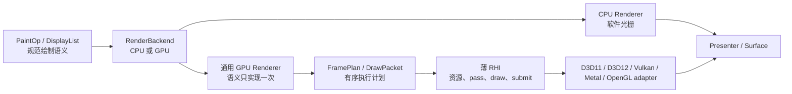

# backend 模块

[← 架构索引](../../架构.md)

> **接口**：声明 graphics 系统的目标 `backend` 模块及 CPU/GPU 执行契约，权威持有“通用 UI GPU Renderer + 薄原生 RHI”的分层。依赖：[painting](painting.md)、[platform/presentation](../platform/presentation.md)。导出：renderer 内部 `RenderBackend`。

> **设计状态**：🔄 迁移中（2026-08-04）。`FramePlan` / `RenderPassPlan` 与 platform 私有薄 RHI 契约已经落地并由记录型 adapter 验证；D3D11 与可选 `opengles` feature 下的 WGL/EGL OpenGL ES adapter 已能执行 solid mesh、SrcOver/Additive textured quad、gradient、仿射 R8 glyph coverage、RGBA8 MSDF glyph、轴对齐与变换圆角/描边矩形、原生扇形、共享仿射 box shadow、Picture texture 合成与两段 separable blur 的 RHI 子集，MSDF 已有带硬预算的多页 RGBA8 atlas、gutter 与子区域上传。现有生产 `IGraphicsContext` 和其余 UI pipeline 仍处于兼容迁移阶段；D3D11 与 OpenGL ES WGL 已通过首帧前显示窗口修复后的真实 1200×800 窗口截图，代表性首帧视觉验证已闭合；大字号旋转 Watermark 已在两个 Windows adapter 上通过真实组件翻页、目标可见性和最终 present，专用 WGC 像素快照与完整 resize/lost、图元视觉矩阵仍未闭合。

> **当前实现线索**：通用部分主要位于 `src/draw/backend/`，帧计划位于 `src/draw/backend/frame_plan.rs`，RHI lowering 位于 `src/draw/backend/rhi_renderer.rs`、`src/draw/backend/rhi_renderer_coverage.rs`、`src/draw/backend/rhi_renderer_msdf.rs`、`src/draw/backend/rhi_renderer_shape.rs`、`src/draw/backend/rhi_renderer_shadow.rs`、`src/draw/backend/rhi_renderer_blur.rs`、`src/draw/backend/rhi_renderer_mixed.rs` 与 `src/draw/backend/gpu/submit.rs`；薄 RHI 契约位于 `src/native/present/rhi.rs`，兼容接口位于 `src/native/present/`，D3D11 实现位于 `src/native/presentation/graphics/d3d11/`，OpenGL ES 实现位于 `src/native/presentation/graphics/opengl/raster/rhi*.rs`、`src/native/presentation/graphics/opengl/rhi_host.rs` 与 WGL/EGL platform context。

## 设计结论

后端采用**厚通用层、薄原生层**：矩形、路径、字形、图片、Picture、离屏、模糊、混合与批处理等 UI 图形语义只在通用 GPU Renderer 中实现一次；D3D11、D3D12、Vulkan、Metal、OpenGL 等原生 adapter 只实现资源、render pass、draw/copy、提交与呈现所需的最小 RHI。

这不是再造通用 GPU 框架。RHI 只服务 UIX 已定义的绘制语义，不导出任意 shader、任意资源状态图或原生 API handle，也不把 Vulkan barrier、D3D view 类型等 API 细节泄漏到 painting、scene 或 widget。

## 组件清单

| 组件 | 类型 | 职责 |
|---|---|---|
| `RenderBackend` | trait | CPU/GPU 的统一帧执行、能力与失败边界 |
| `BackendKind` / `BackendCapabilities` | enum/struct | backend 分类，以及 RHI 与 presentation 事实的聚合视图 |
| CPU backend / rasterizer | 子模块 | retained pixels、路径/字形/图像的软件光栅化 |
| `GpuRenderer` | 通用组件 | 将 canonical 绘制语义降级为有限 pipeline、资源更新和有序 pass |
| `FramePlan` / `RenderPassPlan` | value | 一帧内按 painter order 排列的 pass、copy 与最终提交计划 |
| `DrawPacket` | value | pipeline、binding、viewport/scissor 与 draw range 的不可变执行包 |
| GPU resource cache | 通用组件 | vertex/index buffer、纹理、字形 atlas、Picture/offscreen 与 pipeline 缓存 |
| thin RHI | platform interface | device、surface、资源、pass、draw/copy、submit/present 的最小原语 |
| native adapter | platform implementation | 把薄 RHI 映射到一个原生图形 API |
| backend factory | 子模块 | 在 bootstrap 阶段验证能力并选择可用实现 |

## 分层职责

| 层 | 必须拥有 | 明确不拥有 |
|---|---|---|
| painting / scene | `PaintOp`、`DisplayList`、Picture、painter order 与 UI 绘制语义 | GPU handle、pipeline、barrier、swapchain |
| 通用 GPU Renderer | 状态归一化、几何生成、批处理、atlas、图片上传、离屏、模糊、混合与缓存策略 | 原生窗口、swapchain 创建、API 专属同步 |
| thin RHI | buffer/texture/sampler/pipeline/render target、pass、draw/copy、submit 与 typed capability | `draw_glyphs`、`draw_rounded_rect`、`draw_picture` 等 UI 高层操作 |
| native adapter | adapter/device/surface 创建、资源映射、命令编码、同步、acquire/present 与原生错误翻译 | 字形布局、路径细分、Picture 策略、UI fallback |
| CPU backend | 与 canonical 语义等价的软件执行 | 假装 GPU present 已成功 |

任何原生 adapter 一旦需要理解“字形”“圆角矩形”“Picture”或“backdrop blur”，都说明边界抬得过高，公共实现正在重新分叉。

## 通用 GPU Renderer

`GpuRenderer` 消费 backend-neutral 的帧 IR，并在所有原生 API 之前统一完成：

- 保持 painter order，解析 transform、clip、opacity 与 blend；
- 将路径、圆角、描边和圆形转换为共享几何或有限的实例数据；
- 将相邻兼容操作合并为 batch，选择固定的 `PipelineId` 与 binding layout；
- 管理字形 atlas、图片纹理、Picture/offscreen render target 及其代际缓存；
- 把 blur、composite、copy 等多阶段效果展开为有序 `RenderPassPlan`；
- 把 hybrid 的复杂路径裁剪交给共享 CPU mask staging，并在 native/soft 边界保持同一 clip、opacity 与 painter order；
- 在不改变像素语义和顺序时执行受控优化或 fallback。

shader 语义、pipeline 标识和 binding layout 属于通用层。不同原生 API 可以消费各自的 shader 二进制或源码形式，但不得因此复制 UI 操作调度；是否引入统一 shader 源码生成属于后续实现选择，不是本契约的前置条件。

## FramePlan：有限而有序的帧计划

`FramePlan` 是 UI renderer 的顺序执行计划，不是通用 render graph。它只表达 UIX 实际需要的有限节点：surface/offscreen pass、clear、draw packet、texture/buffer upload、copy、resolve 与最终提交。

共同语义固定为：

- 坐标以左上角为原点，逻辑像素在通用层按当前 DPR 转换；
- 颜色使用项目统一的 premultiplied-alpha 约定；
- clip、opacity、blend 与 painter order 在进入 RHI 前已确定；
- 一帧可以包含多个内部 pass，但同一 surface 至多有一次最终 present；
- D3D11 可以立即执行同一计划，Vulkan/Metal/D3D12 可以录制命令缓冲，二者不改变上层语义。

## thin RHI 最小契约

RHI 只暴露实现上述 `FramePlan` 所需的概念：

- **对象**：`Device`、`Surface`、`Buffer`、`Texture`、`Sampler`、`Pipeline`、`RenderTarget` 及带代际的 opaque handle；
- **资源操作**：创建、更新、复制、销毁，以及纹理/缓冲上传；
- **pass 操作**：begin/end pass、clear、设置 pipeline、绑定资源、设置 viewport/scissor、draw/draw-indexed；
- **执行操作**：acquire、submit、present、resize 与显式维护；
- **结果**：统一 typed error、surface generation、提交结果和底层事实型 capabilities。

`Device` 与 `Surface` 在概念和生命周期上分离，以免把设备资源和窗口交换链绑成一个不可测试的大接口；首个实现可以在一个 owner-thread 对象中组合二者，也不强制跨窗口共享 device。

## 能力与构造门禁

能力必须描述底层事实，不能继续以“是否实现某个 UI 操作”代替 RHI 能力。至少区分：

- **GPU 基线**：动态 buffer、texture upload/copy、sampled texture、render-to-texture、scissor、premultiplied-alpha blend；
- **可选执行能力**：readback、timestamp、特定 texture format、独立 compute 等；
- **呈现能力**：retained framebuffer、partial present、occlusion、tracked swapchain、可恢复 surface。

factory 在 backend bootstrap 时验证 GPU 基线。未满足基线的候选不得进入正常 GPU 渲染流程；普通 UI 操作也不得在运行到一半时才以 `NotImplemented` 暴露 adapter 缺口。高层 `BackendCapabilities` 由这些事实和通用 renderer 的确定性实现共同推导，而不是由 adapter 手工逐项宣称 `draw_*` 支持。

## 所有权、生命周期与恢复

- 通用 GPU Renderer 拥有 UI 级缓存和 `FramePlan` 临时数据；RHI device 拥有 GPU 资源；surface 拥有 swapchain 与 surface generation；native adapter 独占原生 handle。
- 所有 GPU 对象在创建它们的 owner thread 上使用和检查式销毁；surface/device 替换会使对应代际 handle 失效，迟到 callback 不得访问新一代资源。
- surface lost/outdated 只重建 surface 作用域资源；device lost 重建 device 及其所有派生资源；OOM 保持独立 typed failure，不伪装成可重试 surface 错误。
- 只有最终 present 成功才消费 damage、推进已提交代际并记录成功帧；内部 pass 或 CPU buffer 完成均不代表交付成功。

## fallback 边界

CPU backend 继续作为完整、可验证的 renderer，而不是每个 native adapter 的补丁集合。帧内 GPU→CPU fallback 只有在像素语义、painter order、clip/opacity/blend 与最终提交协议均可保持时才允许；否则返回 typed failure，由 renderer 的恢复策略选择整后端重建或下一帧重试。

GPU 基线内的操作不能依赖常态 CPU fallback。可选效果可以显式声明等价降级，但不能静默改变视觉结果。

## 当前映射与目标差距

- ✅ 已有唯一 `RenderBackend` 抽象、通用 `GpuBackend`、有序批处理与 CPU backend，证明共享执行层可行。
- 🔄 当前 `IGraphicsContext` 同时承担 device/surface 生命周期和 `draw_solid_rects`、`draw_glyphs` 等逐 UI 操作；`NativeRasterCaps` 也以高层操作枚举能力。这是迁移期接口，不是目标 RHI。
- ✅ 迁移第一步已完成：`src/draw/backend/frame_plan.rs` 固化有限有序的 pass/copy/draw 计划，`src/native/present/rhi.rs` 固化资源、pass、draw/copy、submit/present、代际和事实 capability 契约；记录型 adapter 已验证顺序、一次最终 present、surface 代际隔离和失败帧不提交，D3D11 与 OpenGL ES host 已接入 `GraphicsSurface` 的 acquire/resize/present 生命周期。
- ✅ 迁移第二步已完成一个可执行子集：`RhiRenderer` 将无圆角 solid rect/solid mesh、SrcOver/Additive BGRA image blit、SrcOver/Additive shape rect、仿射线性/径向 gradient、仿射 R8 glyph coverage、RGBA8 MSDF glyph、轴对齐与变换圆角/描边矩形、原生扇形、仿射 box shadow、Picture texture 合成与两段 separable blur lowering 为 buffer update、texture upload、采样 draw、texture target pass 与一次最终 present；D3D11 与 OpenGL ES 资源、pass、viewport/scissor、solid/textured/gradient/coverage/MSDF/shape/sector/shadow/blur draw ABI 已接通，并在主 surface 使用物理 extent 与 DPR lowering；整条 `FrameEncoder` 的矩形、Additive 矩形、coverage glyph、CPU/Picture image blit 也已在可表达时复用同一 ordered RHI plan，最终 present 仍由外层持有。
- ✅ 2026-08-03 底层增量已补齐 `FramePlan` 的局部 `ClearRect` 与同纹理 `TextureMove`：D3D11 使用原生 clear/copy，OpenGL ES 使用状态恢复后的 scissor clear 与 scratch texture copy，并由薄 RHI capability/probe 门禁；主 surface retained texture 以 `SurfaceToken` 代际管理，`DrawSurface`、`FrameEncoder` 和原生 `Canvas2D::scroll_region` 共享整数裁剪、DPR 证明和 memmove 顺序。主 surface 的连续 native→透明 soft tile、Picture 离屏 target 的 native→soft tile，以及 Picture source 接在主 surface soft 前缀之后，都可在同一 retained texture 链上按明确 target extent 和 DPR 采样合成；destination-dependent soft、soft 后 scroll 和其它未验证 Picture 交错仍安全回退。当前能力仍保持 `retained_framebuffer=false`，未把这条尚未完成完整兼容队列闭环的路径宣称为生产 partial redraw。
- ✅ 2026-08-04 首帧可见性边界已补齐：隐藏窗口不再等待 GPU Present 成功后才显示；GPU backend-managed 路径在首个 `FramePlan` 绘制前显示窗口，首帧成功后只完成 `raise` 与状态消费，CPU external presenter 保持提交后显示。D3D11 与 OpenGL ES WGL 的正式 RHI surface present 均通过 1200×800 真窗截图，证明 backbuffer 已写入且最终交换链可见。
- ✅ 2026-08-04 resize 入口已收口：`GpuBackend::resize` 先把逻辑尺寸按 DPR 转为物理 `RhiExtent`，交给 `GraphicsSurface::resize` 推进 surface generation；D3D11 的 RHI surface 直接执行 `ResizeBuffers → RTV 重建`，OpenGL WGL/EGL 直接更新 native drawable 与 RHI pipeline，兼容 `IGraphicsContext::resize` 只复用各 adapter 的底层 helper；线程绑定包装器在成功后刷新 drawable 元数据，未接入 RHI 的旧 adapter 才明确回退到兼容 resize。
- ✅ 2026-08-04 RHI device/surface preflight 已接入：D3D11 在最终 present 状态机进入 lowering 前，于 owner thread 调用 `GetDeviceRemovedReason`，沿用 DXGI typed mapping 把移除/重置状态报告为 `GraphicsDeviceLost`；OpenGL ES 的共享 WGL/EGL RHI host 也接入同一 typed injection 边界；surface lost 同时覆盖薄 RHI acquire 与兼容 presenter 的共同 adapter present 边界。`test-harness` 的可控 DeviceLost/SurfaceLost lower injection 已分别通过 D3D11 与 Windows WGL OpenGL ES 的真实三轮 teardown/rebuild 后续交互验收，其中第三轮交错另一类故障；这不等同于物理设备拔除、窗口破坏或跨 GPU/OS 故障矩阵。
- ✅ 2026-08-04 OpenGL ES legacy queue 补齐 native 描边矩形与 box shadow：描边复用圆角 SDF shader，阴影复用已验证的仿射 shadow shader 与 straight-alpha blend；WGL/EGL 均不再因这两类当前生产 UI 操作落入 trait 默认 `NotImplemented`。
- ✅ OpenGL ES legacy queue 的 native compatibility owner 已继续补齐线性/径向渐变、扇形、solid mesh 与 BGRA 仿射 image blit；WGL/EGL 均转发到同一 raster owner，渐变 shader 统一把 straight-color 插值结果 premultiply 后写入目标，避免兼容路径与 RHI 路径的 alpha 语义分叉。
- ✅ D3D11 legacy queue 已补齐紧密 BGRA 图片 payload 的尺寸复用纹理、仿射四角 quad、组 opacity 与 SrcOver/Additive blend；图片资源 owner 与 RHI textured shader 共享 viewport/采样 ABI，FrameEncoder 的兼容图片入口不再依赖 trait 默认 `NotImplemented`。
- ✅ D3D11 legacy queue 的线性/径向 gradient 已接收真实 affine 四角：兼容 shader 由 TL、TR、BL 恢复两条设备空间边，同时保留逻辑宽高计算渐变参数；旋转/剪切不再被旧 AABB 几何吞掉。
- ✅ D3D11 与 OpenGL ES 的 legacy offscreen texture blit 已补齐组 opacity 与 Additive：采样 shader 同步缩放 premultiplied RGB/alpha，SrcOver 使用 premultiplied blend，Additive 使用显式 `ONE + ONE` blend；Picture 兼容门面不再把这两类语义静默降为 `NotImplemented`。
- ✅ 原生扇形 RHI 的 uniform ABI 已收口为共享的 64 字节四个 float4 常量块；D3D11 与 OpenGL ES 均按同一 `SECTOR_UNIFORM_BYTES` 校验，修复了扇形首次进入 mixed FramePlan 时 48/64 字节不一致的底层越界。
- ✅ 2026-08-04 OpenGL 交换错误已进入 typed recovery：WGL `SwapBuffers` 失败报告 `GraphicsSurfaceLost`；EGL `BAD_SURFACE`/`BAD_NATIVE_WINDOW` 报告 `GraphicsSurfaceLost`，`CONTEXT_LOST` 报告 `GraphicsDeviceLost`，其它 EGL 错误仍保持 `PlatformError`。
- ✅ 2026-08-04 代表性 resize 真窗验证已补齐：当前 D3D11 Upload 视觉用例通过 `1200×800 → 900×640 → 1200×800` 双向 resize，校验原生 adapter 选择、提交后的 presented revision 和恢复后的最终关闭。
- ✅ 大字号 MSDF 真窗语义验收已补齐：D3D11 与 OpenGL ES 的 Watermark 专项均通过真实组件 manifest 翻页、目标可见性和后续 present；专项输出明确保留 `pixel_capture=manual-WGC-required` 边界。
- 🔄 目标是把原生实现中的 UI 几何、batch、atlas、offscreen 与 effect 调度收回通用 GPU Renderer，仅保留本文的最小 RHI。其他未覆盖的仿射图元、专用大字号 WGC 像素快照、Picture 的完整语义 parity、surface/device lost 及多尺寸/多 DPI/GPU/OS 的完整运行矩阵仍未完成。交付状态由[交付方向](../../进度/交付方向.md)持有。

## 当前验证状态（2026-08-04）

- **D3D11**：正式 RHI surface `FramePlan → present` 验证通过，`1200×800` 完整 UI 已见。
- **OpenGL ES/WGL**：同一通用 `GpuRenderer` / `FramePlan` 与正式 RHI surface present 验证通过，结果与 D3D11 一致。
- **OpenGL ES/WGL legacy compatibility**：全页面真实窗口 traversal 用例已通过；Windows Graphics Capture 捕获到 `1200×800` 硬件窗口的非空完整 UI，证明 legacy queue 的实际窗口呈现链路可见。
- **生命周期结论**：此前隐藏窗口首帧截图为纯白，但 backbuffer 读回已包含侧栏与内容区像素；首个 GPU 绘制前显示窗口后两 adapter 均可见，故把窗口可见性作为 GPU Present 前置契约，而不是把失败归因到 lowering 或像素写入。
- **D3D11 resize**：代表性 RHI resize 入口和 drawable 元数据刷新验证通过（`1200×800 → 900×640 → 1200×800` 双向 resize）。
- **D3D11/WGL OpenGL ES recovery**：DeviceLost/SurfaceLost 真实窗口用例均完成三轮注入（前两轮同类、第三轮交错另一类故障），每轮 teardown/rebuild、重新 present 并完成恢复后交互；该验证属 test-harness lower injection，不代表物理拔除或跨环境故障矩阵。
- **大字号 MSDF**：Watermark 专项通过真实组件翻页、目标可见性和最终 present；尚未做专用 WGC 像素快照验证。
- **验证边界**：已验证代表性 Demo 首帧、正式 surface present、D3D11 双向 resize 和两个 Windows adapter；完整图元、surface/device lost、DPI、GPU/OS 矩阵尚未完成。

## 迁移约束与验收

迁移不绑定版本、日期或执行顺序；完成声明至少需要以下验证：

- D3D11 可作为参考 adapter 完整执行薄 RHI，且 adapter 内不再新增逐 UI 操作入口；
- 至少第二个原生 API 复用同一 `GpuRenderer`、`FramePlan`、atlas、offscreen 与 effect 调度，新增 adapter 不复制 UI raster 算法；当前 OpenGL ES 已达到 ABI/编译、bootstrap gate、WGL 首帧 probe 与实际 RHI submit 里程碑，仍需视觉/像素运行验证；
- bootstrap capability gate 能在首帧前拒绝缺失 GPU 基线的实现；
- 矩形、路径、字形、图片、Picture、opacity、additive、离屏、模糊、resize、surface lost 与 device lost 均有真实 adapter 的视觉或像素验证；
- mock RHI 能验证 pass 顺序、资源代际、一次最终 present 与失败帧不消费 damage。

## 模块不变量

- renderer、scene、painting 与 widget 不取得 raw GPU/native handle。
- UI 图形语义在通用 GPU Renderer 中只有一个生产实现；native adapter 不定义平行的 `draw_*` 语义层。
- capability 必须由实际可执行原语和 bootstrap probe 支撑，不能用编译成功代替运行契约。
- CPU 写入 retained buffer 或 GPU submit 成功均不等于 present 成功；最终提交结果由 platform surface/presenter 返回。
