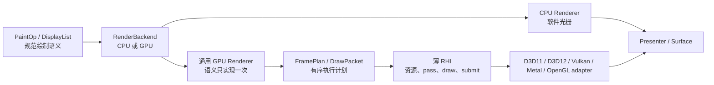

# backend 模块

[← 架构索引](../../架构.md)

> **接口**：声明 graphics 系统的目标 `backend` 模块及 CPU/GPU 执行契约，权威持有“通用 UI GPU Renderer + 薄原生 RHI”的分层。依赖：[painting](painting.md)、[platform/presentation](../platform/presentation.md)。导出：renderer 内部 `RenderBackend`。

> **设计状态**：🔄 迁移中（2026-08-04）。`FramePlan` / `RenderPassPlan` 与 platform 私有薄 RHI 契约已经落地，记录型 adapter 测试覆盖计划顺序与资源代际；D3D11 与可选 `opengles` feature 下的 WGL/EGL OpenGL ES adapter 已能执行 solid mesh、SrcOver/Additive textured quad、gradient、仿射 R8 glyph coverage、RGBA8 MSDF glyph、轴对齐与变换圆角/描边矩形、原生扇形、共享仿射 box shadow、Picture texture 合成与两段 separable blur 的 RHI 子集，MSDF 已有带硬预算的多页 RGBA8 atlas、gutter 与子区域上传。两个生产 adapter 已启用 retained framebuffer profile，由跨帧 RHI 颜色纹理承接局部更新并在唯一最终边界采样到 swapchain；嵌套 Picture 会在目标首次提交前收敛到同一 RHI/legacy 资源所有者，提交后出现不兼容所有权时返回 typed 错误。CPU soft fallback 会按连续 SrcOver/Additive 语义封为有序 sampled segments，使 retained 主表面与已提交 Picture texture 均可保持 destination-dependent 混合顺序。现有生产 `IGraphicsContext` 和其余 UI pipeline 仍处于兼容迁移阶段；完成状态只以下方自动测试为准。

> **当前实现线索**：通用部分主要位于 `src/draw/backend/`，帧计划位于 `src/draw/backend/frame_plan.rs`，RHI lowering 位于 `src/draw/backend/rhi_renderer.rs`、`src/draw/backend/rhi_renderer_coverage.rs`、`src/draw/backend/rhi_renderer_msdf.rs`、`src/draw/backend/rhi_renderer_shape.rs`、`src/draw/backend/rhi_renderer_shadow.rs`、`src/draw/backend/rhi_renderer_blur.rs`、`src/draw/backend/rhi_renderer_mixed.rs` 与 `src/draw/backend/gpu/submit.rs`；薄 RHI 契约位于 `src/native/present/rhi.rs`，兼容接口位于 `src/native/present/`，D3D11 实现位于 `src/native/presentation/graphics/d3d11/`，OpenGL ES 实现位于 `src/native/presentation/graphics/opengl/raster/rhi*.rs`、`src/native/presentation/graphics/opengl/rhi_host.rs` 与 WGL/EGL platform context。

## 设计结论

后端采用**厚通用层、薄原生层**：矩形、路径、字形、图片、Picture、离屏、模糊、混合与批处理等 UI 图形语义只在通用 GPU Renderer 中实现一次；D3D11、D3D12、Vulkan、Metal、OpenGL 等原生 adapter 只实现资源、render pass、draw/copy、提交与呈现所需的最小 RHI。

这不是再造通用 GPU 框架。RHI 只服务 UIX 已定义的绘制语义，不导出任意 shader、任意资源状态图或原生 API handle，也不把 Vulkan barrier、D3D view 类型等 API 细节泄漏到 painting、scene 或 widget。

## 组件清单

| 组件 | 类型 | 职责 |
|---|---|---|
| `RenderBackend` | trait | CPU/GPU 的统一帧执行、能力与失败边界 |
| `BackendKind` / `BackendCapabilities` | enum/struct | backend 分类，以及 RHI 与 presentation 事实的聚合视图 |
| CPU backend / rasterizer | 子模块 | retained pixels、路径/字形/图像的软件光栅化 |
| `GpuRenderer` | 通用组件 | 将 canonical 绘制语义降级为有限 pipeline、资源更新和有序 pass |
| `FramePlan` / `RenderPassPlan` | value | 一帧内按 painter order 排列的 pass、copy 与最终提交计划 |
| `DrawPacket` | value | pipeline、binding、viewport/scissor 与 draw range 的不可变执行包 |
| GPU resource cache | 通用组件 | vertex/index buffer、纹理、字形 atlas、Picture/offscreen 与 pipeline 缓存 |
| thin RHI | platform interface | device、surface、资源、pass、draw/copy、submit/present 的最小原语 |
| native adapter | platform implementation | 把薄 RHI 映射到一个原生图形 API |
| backend factory | 子模块 | 在 bootstrap 阶段验证能力并选择可用实现 |

## 分层职责

| 层 | 必须拥有 | 明确不拥有 |
|---|---|---|
| painting / scene | `PaintOp`、`DisplayList`、Picture、painter order 与 UI 绘制语义 | GPU handle、pipeline、barrier、swapchain |
| 通用 GPU Renderer | 状态归一化、几何生成、批处理、atlas、图片上传、离屏、模糊、混合与缓存策略 | 原生窗口、swapchain 创建、API 专属同步 |
| thin RHI | buffer/texture/sampler/pipeline/render target、pass、draw/copy、submit 与 typed capability | `draw_glyphs`、`draw_rounded_rect`、`draw_picture` 等 UI 高层操作 |
| native adapter | adapter/device/surface 创建、资源映射、命令编码、同步、acquire/present 与原生错误翻译 | 字形布局、路径细分、Picture 策略、UI fallback |
| CPU backend | 与 canonical 语义等价的软件执行 | 假装 GPU present 已成功 |

任何原生 adapter 一旦需要理解“字形”“圆角矩形”“Picture”或“backdrop blur”，都说明边界抬得过高，公共实现正在重新分叉。

## 通用 GPU Renderer

`GpuRenderer` 消费 backend-neutral 的帧 IR，并在所有原生 API 之前统一完成：

- 保持 painter order，解析 transform、clip、opacity 与 blend；
- 将路径、圆角、描边和圆形转换为共享几何或有限的实例数据；
- 将相邻兼容操作合并为 batch，选择固定的 `PipelineId` 与 binding layout；
- 管理字形 atlas、图片纹理、Picture/offscreen render target 及其代际缓存；
- 把 blur、composite、copy 等多阶段效果展开为有序 `RenderPassPlan`；
- 把 hybrid 的复杂路径裁剪交给共享 CPU mask staging，并在 native/soft 边界保持同一 clip、opacity 与 painter order；
- 在不改变像素语义和顺序时执行受控优化或 fallback。

shader 语义、pipeline 标识和 binding layout 属于通用层。不同原生 API 可以消费各自的 shader 二进制或源码形式，但不得因此复制 UI 操作调度；是否引入统一 shader 源码生成属于后续实现选择，不是本契约的前置条件。

## FramePlan：有限而有序的帧计划

`FramePlan` 是 UI renderer 的顺序执行计划，不是通用 render graph。它只表达 UIX 实际需要的有限节点：surface/offscreen pass、clear、draw packet、texture/buffer upload、copy、resolve 与最终提交。

共同语义固定为：

- 坐标以左上角为原点，逻辑像素在通用层按当前 DPR 转换；
- 颜色使用项目统一的 premultiplied-alpha 约定；
- clip、opacity、blend 与 painter order 在进入 RHI 前已确定；
- 一帧可以包含多个内部 pass，但同一 surface 至多有一次最终 present；
- D3D11 可以立即执行同一计划，Vulkan/Metal/D3D12 可以录制命令缓冲，二者不改变上层语义。

## thin RHI 最小契约

RHI 只暴露实现上述 `FramePlan` 所需的概念：

- **对象**：`Device`、`Surface`、`Buffer`、`Texture`、`Sampler`、`Pipeline`、`RenderTarget` 及带代际的 opaque handle；
- **资源操作**：创建、更新、复制、销毁，以及纹理/缓冲上传；
- **pass 操作**：begin/end pass、clear、设置 pipeline、绑定资源、设置 viewport/scissor、draw/draw-indexed；
- **执行操作**：acquire、submit、present、resize 与显式维护；
- **结果**：统一 typed error、surface generation、提交结果和底层事实型 capabilities。

`Device` 与 `Surface` 在概念和生命周期上分离，以免把设备资源和窗口交换链绑成一个不可测试的大接口；首个实现可以在一个 owner-thread 对象中组合二者，也不强制跨窗口共享 device。

## 能力与构造门禁

能力必须描述底层事实，不能继续以“是否实现某个 UI 操作”代替 RHI 能力。至少区分：

- **GPU 基线**：动态 buffer、texture upload/copy、sampled texture、render-to-texture、scissor、premultiplied-alpha blend；
- **可选执行能力**：readback、timestamp、特定 texture format、独立 compute 等；
- **呈现能力**：retained framebuffer、partial present、occlusion、tracked swapchain、可恢复 surface。

factory 在 backend bootstrap 时验证 GPU 基线。未满足基线的候选不得进入正常 GPU 渲染流程；普通 UI 操作也不得在运行到一半时才以 `NotImplemented` 暴露 adapter 缺口。高层 `BackendCapabilities` 由这些事实和通用 renderer 的确定性实现共同推导，而不是由 adapter 手工逐项宣称 `draw_*` 支持。

## 所有权、生命周期与恢复

- 通用 GPU Renderer 拥有 UI 级缓存和 `FramePlan` 临时数据；RHI device 拥有 GPU 资源；surface 拥有 swapchain 与 surface generation；native adapter 独占原生 handle。
- 所有 GPU 对象在创建它们的 owner thread 上使用和检查式销毁；surface/device 替换会使对应代际 handle 失效，迟到 callback 不得访问新一代资源。
- surface lost/outdated 只重建 surface 作用域资源；device lost 重建 device 及其所有派生资源；OOM 保持独立 typed failure，不伪装成可重试 surface 错误。
- 只有最终 present 成功才消费 damage、推进已提交代际并记录成功帧；内部 pass 或 CPU buffer 完成均不代表交付成功。

## fallback 边界

CPU backend 继续作为完整、可验证的 renderer，而不是每个 native adapter 的补丁集合。帧内 GPU→CPU fallback 只有在像素语义、painter order、clip/opacity/blend 与最终提交协议均可保持时才允许；否则返回 typed failure，由 renderer 的恢复策略选择整后端重建或下一帧重试。

GPU 基线内的操作不能依赖常态 CPU fallback。可选效果可以显式声明等价降级，但不能静默改变视觉结果。

## 当前映射与目标差距

- 已有唯一 `RenderBackend` 抽象、通用 `GpuBackend`、有序 `FramePlan`、薄 RHI 契约和 CPU backend。
- `IGraphicsContext` 与 `NativeRasterCaps` 仍保留迁移期的逐 UI 操作；目标是把几何、batch、atlas、offscreen 与 effect 调度收回通用 GPU Renderer。
- D3D11 与 OpenGL ES 已接入资源、pass、draw/copy、retained framebuffer、surface resize、submit/present、错误映射和恢复边界；未覆盖图元继续明确回退。
- 剩余差距包括更多仿射图元，以及跨 DPI、GPU 和操作系统的测试覆盖。

## 当前测试

- Windows 真窗测试覆盖 D3D11 与 OpenGL ES/WGL 的 RHI surface、`FramePlan`、present、resize 和兼容遍历。
- `test-harness` 测试覆盖 DeviceLost、SurfaceLost、teardown/rebuild 与恢复后交互。
- mock RHI 测试覆盖 pass 顺序、一次最终 present、受控 SurfaceLost，以及 resize 后旧代计划拒绝与新代计划恢复；失败帧不消费 damage。
- 通用 canvas 单元测试覆盖 soft fallback 在 SrcOver/Additive 交替时的分段顺序与成功提交后的 staging 消费。
- 缺少运行环境的组合记为未测试，不生成独立完成记录。

## 迁移约束与测试

迁移不绑定版本、日期或执行顺序；完成状态只以相应自动测试通过为准：

- D3D11 作为参考 adapter 完整执行薄 RHI，且 adapter 内不新增逐 UI 操作入口；
- 至少第二个原生 API 复用同一 `GpuRenderer`、`FramePlan`、atlas、offscreen 与 effect 调度，新增 adapter 不复制 UI raster 算法；
- bootstrap capability gate 测试覆盖首帧前拒绝缺失 GPU 基线的实现；
- 矩形、路径、字形、图片、Picture、opacity、additive、离屏、模糊、resize、surface lost 与 device lost 由对应测试覆盖；
- mock RHI 测试覆盖 pass 顺序、资源代际、一次最终 present 与失败帧不消费 damage。

## 模块不变量

- renderer、scene、painting 与 widget 不取得 raw GPU/native handle。
- UI 图形语义在通用 GPU Renderer 中只有一个生产实现；native adapter 不定义平行的 `draw_*` 语义层。
- capability 必须由实际可执行原语和 bootstrap probe 支撑，不能用编译成功代替运行契约。
- CPU 写入 retained buffer 或 GPU submit 成功均不等于 present 成功；最终提交结果由 platform surface/presenter 返回。
