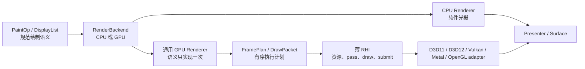

# backend 模块

[← 架构索引](../../架构.md)

> **接口**：声明 graphics 系统的目标 `backend` 模块及 CPU/GPU 执行契约，权威持有“通用 UI GPU Renderer + 薄原生 RHI”的分层。依赖：[painting](painting.md)、[platform/presentation](../platform/presentation.md)。导出：renderer 内部 `RenderBackend`。

> **设计状态**：🔄 迁移中（2026-08-09）。`FramePlan` / `RenderPassPlan` 与 platform 私有薄 RHI 契约已经落地，记录型 adapter 测试覆盖计划顺序与资源代际；D3D11 与可选 `opengles` feature 下的 WGL/EGL OpenGL ES adapter 已能执行 solid mesh、SrcOver/Additive textured quad、gradient、仿射 R8 glyph coverage、RGBA8 MSDF glyph、轴对齐 SrcOver/Additive 实心与圆角矩形、轴对齐 Additive 描边矩形与圆（含整数矩形裁剪、整数像素 offset、纯平移整数 transform、非统一圆角角位重排的单位正交 transform 与有限全局 opacity）、变换圆角/描边矩形、原生扇形、共享仿射 box shadow、Picture texture 合成与两段 separable blur 的 RHI 子集，MSDF 已有带硬预算的多页 RGBA8 atlas、gutter 与子区域上传。Picture/offscreen blur 现由记录型 RHI 测试锁定 source→scratch→source 的双 pass、同核正交方向、texture-space 裁剪、单次 submit、无 acquire/present 与失败清理；随后 sampled Picture 合成保留目标 opacity、drawable 比例和 SrcOver/Additive，CPU 主表面参考路径也使用相同的状态完整合成。两个生产 adapter 已启用 retained framebuffer profile，由跨帧 RHI 颜色纹理承接局部更新并在唯一最终边界采样到 swapchain；overlay 干净背景也由通用 `GpuBackend` 持有带 `SurfaceToken` 的 BGRA texture，通过薄 RHI 全幅 copy/submit 完成快照与恢复，不再由 `IGraphicsContext` 暴露 overlay 高层语义。Picture slot 现在只持有一份必需的 RHI texture，嵌套 Picture 复用同一 sampled pipeline；无法无损 lowering 的 encoder/native/soft 队列会在进入 adapter 高层前返回 typed failure，不再切换资源所有者。CPU soft fallback 会按连续 SrcOver/Additive 语义封为有序 sampled segments；`FrameRecordingCanvas` 对固定 Native shape 无法表达的 Additive 矩形、圆、椭圆、扇形与路径填充，矩形、圆、路径与直线描边，线性/径向渐变，任意仿射或部分裁剪的 raw image，glyph coverage，以及定向/环境 box shadow，会在透明 scratch 中烘焙仿射变换后封为 Additive sampled segment，使 retained 主表面与已提交 Picture texture 均可保持 destination-dependent 混合顺序；完整裁剪、identity transform 的 raw image 则直接复用 Additive textured quad。Additive source scratch 还可保真承载路径 coverage clip，并强制所有不携带 mask 的 Native/direct 分支退出。生产 `IGraphicsContext` 的逐 UI `draw_*` ABI、adapter wrapper、二阶段 `initialize`、`make_current` 与 `swap_buffers` 兼容入口已物理移除；每帧 owner-context 准备只通过 thin RHI `GraphicsDevice::maintain`。生产 `GpuBackend` 也已删除 dormant hybrid/unprepared 构造状态，主 surface 与 Picture 固定采用 GPU-only canvas；resize 只借用 recipe 专用 `RhiSurfaceLifecycle` 进入唯一 `GraphicsSurface::resize`，typed failure 不再降级到 `IGraphicsContext`。GPU backend 现在只持有构造期校验的 `GpuRecipeOwner`，组合 thin RHI、surface resize、原子元数据和 checked shutdown 均由该窄门面承接；兼容 trait 的可选视图不会再泄漏到 FramePlan/RHI 执行路径。CPU PixelUpload presentation 也只持有构造期校验的 `PixelUploadRecipeOwner`，专用 resize、最终 pixels 提交、原子元数据与 checked shutdown 均由同类 Result 门面承接。逐图元支持由固定 RHI probe 证明，每个 context 构造成功即就绪；`NativeRasterCaps` 不再由 `IGraphicsContext` 或 adapter 平行声明，而是从同一次 `GraphicsCapabilities` 快照派生 renderer 投影；`PresentFrame`、统一 `present`、`present_pixels` 与 `present_image` 已退出 `IGraphicsContext`，CPU PixelUpload 与生产 thin RHI 分别持有专用最终提交边界，未接线的 Wayland 平行 GPU presenter 与 `SwapchainPresentation` 视图也已删除。其余共享生命周期与图形装配兼容门面仍处于迁移阶段。完成状态只以下方自动测试为准。

> **会话装配收口**：通用 `RenderSession` 与 backend kind factory 已删除零生产调用的 staged `IGraphicsContext` 所有权。生产 GPU bootstrap 与恢复只能从 native recipe factory 取得已验证 `GraphicsRecipeOwner`，再经 `Renderer::from_recipe_owner` 注入会话；没有完整 recipe 的通用 GPU 构造或运行时切换返回稳定 typed error。

> **renderer 装配入口**：bootstrap 与 recovery 共用的 `assemble_renderer` 直接调用 `Renderer::from_recipe_owner`，并统一保留 create/initialize stage 与失败后的 checked cleanup。只做同名转发的 `draw::renderer::factory` 已删除，不再形成第二层 context factory。

> **GPU backend 装配入口**：只做 `GpuRecipeOwner::try_new` 与 `GpuBackend::new_gpu_only` 转发的 `draw::backend::factory` 已删除。native factory 先把 context 收敛为 recipe owner，`Renderer::from_recipe_owner` 再把唯一 GPU backend 注入会话；`draw/backend` 不再依赖 `IGraphicsContext`。

> **renderer recipe 输入**：native factory 在 context 离开平台层前把它收敛为 `GraphicsRecipeOwner::{Gpu, PixelUpload}`。`assemble_renderer` 与 `Renderer::from_recipe_owner` 只接收已验证 owner，`draw/renderer` 不再依赖 `IGraphicsContext`；非法 raster × present 组合在 native 边界 checked shutdown 并保留 typed 原因链。

> **recipe 静态事实**：`GpuRecipeOwner` 与 `PixelUploadRecipeOwner` 在构造门禁中一次捕获 `GraphicsContextCaps`，运行期 capability 投影与 owner-loss 诊断都使用该不可漂移快照，不再回读兼容 context。drawable extent、DPR、transform 与 generation 仍只从 live `PresentSurface` 原子读取。

> **GPU lifecycle 门禁**：`GpuRecipeOwner` 在进入 draw backend 前同时验证组合 thin RHI 与 `RhiSurfaceLifecycle`。有 RHI 但没有专用 resize owner 的 context 会先 checked shutdown，再返回 typed `InvalidState`；运行期 lifecycle 视图丢失仍作为可恢复的状态破坏传播。

> **当前实现线索**：通用部分主要位于 `src/draw/backend/`，帧计划位于 `src/draw/backend/frame_plan.rs`，RHI lowering 位于 `src/draw/backend/rhi_renderer.rs`、`src/draw/backend/rhi_renderer_coverage.rs`、`src/draw/backend/rhi_renderer_msdf.rs`、`src/draw/backend/rhi_renderer_shape.rs`、`src/draw/backend/rhi_renderer_shadow.rs`、`src/draw/backend/rhi_renderer_blur.rs`、`src/draw/backend/rhi_renderer_mixed.rs` 与 `src/draw/backend/gpu/submit.rs`；薄 RHI 契约位于 `src/native/present/rhi.rs`，兼容接口位于 `src/native/present/`，D3D11 实现位于 `src/native/presentation/graphics/d3d11/`，OpenGL ES 实现位于 `src/native/presentation/graphics/opengl/raster/rhi*.rs`、`src/native/presentation/graphics/opengl/rhi_host.rs` 与 WGL/EGL platform context。

> **离屏模糊收敛**：D3D11 adapter 的 `blur_offscreen_target`、专属 scratch texture、高斯核/region 换算和旧常量缓冲已经移除。Picture/offscreen blur 只接受通用 renderer 拥有的 RHI texture，由 `RhiRenderer` 展开双 pass；缺少该 owner 时在触碰 adapter 前返回 typed `NotImplemented`，不再回落到平行 UI 语义。

## 设计结论

后端采用**厚通用层、薄原生层**：矩形、路径、字形、图片、Picture、离屏、模糊、混合与批处理等 UI 图形语义只在通用 GPU Renderer 中实现一次；D3D11、D3D12、Vulkan、Metal、OpenGL 等原生 adapter 只实现资源、render pass、draw/copy、提交与呈现所需的最小 RHI。

这不是再造通用 GPU 框架。RHI 只服务 UIX 已定义的绘制语义，不导出任意 shader、任意资源状态图或原生 API handle，也不把 Vulkan barrier、D3D view 类型等 API 细节泄漏到 painting、scene 或 widget。

## 组件清单

| 组件 | 类型 | 职责 |
|---|---|---|
| `RenderBackend` | trait | CPU/GPU 的统一帧执行、能力与失败边界 |
| `BackendKind` / `BackendCapabilities` | enum/struct | backend 分类，以及 RHI 与 presentation 事实的聚合视图 |
| CPU backend / rasterizer | 子模块 | retained pixels、路径/字形/图像的软件光栅化 |
| `GpuRenderer` | 通用组件 | 将 canonical 绘制语义降级为有限 pipeline、资源更新和有序 pass |
| `FramePlan` / `RenderPassPlan` | value | 一帧内按 painter order 排列的 pass、copy 与最终提交计划 |
| `DrawPacket` | value | pipeline、binding、viewport/scissor 与 draw range 的不可变执行包 |
| GPU resource cache | 通用组件 | vertex/index buffer、纹理、字形 atlas、Picture/offscreen 与 pipeline 缓存 |
| thin RHI | platform interface | device、surface、资源、pass、draw/copy、submit/present 的最小原语 |
| native adapter | platform implementation | 把薄 RHI 映射到一个原生图形 API |
| backend factory | 子模块 | 在 bootstrap 阶段验证能力并选择可用实现 |

## 分层职责

| 层 | 必须拥有 | 明确不拥有 |
|---|---|---|
| painting / scene | `PaintOp`、`DisplayList`、Picture、painter order 与 UI 绘制语义 | GPU handle、pipeline、barrier、swapchain |
| 通用 GPU Renderer | 状态归一化、几何生成、批处理、atlas、图片上传、离屏、模糊、混合与缓存策略 | 原生窗口、swapchain 创建、API 专属同步 |
| thin RHI | buffer/texture/sampler/pipeline/render target、pass、draw/copy、submit 与 typed capability | `draw_glyphs`、`draw_rounded_rect`、`draw_picture` 等 UI 高层操作 |
| native adapter | adapter/device/surface 创建、资源映射、命令编码、同步、acquire/present 与原生错误翻译 | 字形布局、路径细分、Picture 策略、UI fallback |
| CPU backend | 与 canonical 语义等价的软件执行 | 假装 GPU present 已成功 |

任何原生 adapter 一旦需要理解“字形”“圆角矩形”“Picture”或“backdrop blur”，都说明边界抬得过高，公共实现正在重新分叉。

## 通用 GPU Renderer

`GpuRenderer` 消费 backend-neutral 的帧 IR，并在所有原生 API 之前统一完成：

- 保持 painter order，解析 transform、clip、opacity 与 blend；
- 将路径、圆角、描边和圆形转换为共享几何或有限的实例数据；
- 将相邻兼容操作合并为 batch，选择固定的 `PipelineId` 与 binding layout；
- 管理字形 atlas、图片纹理、Picture/offscreen render target 及其代际缓存；
- 把 blur、composite、copy 等多阶段效果展开为有序 `RenderPassPlan`；
- 把 hybrid 的复杂路径裁剪交给共享 CPU mask staging，并在 native/soft 边界保持同一 clip、opacity 与 painter order；
- 在不改变像素语义和顺序时执行受控优化或 fallback。

shader 语义、pipeline 标识和 binding layout 属于通用层。不同原生 API 可以消费各自的 shader 二进制或源码形式，但不得因此复制 UI 操作调度；是否引入统一 shader 源码生成属于后续实现选择，不是本契约的前置条件。

## FramePlan：有限而有序的帧计划

`FramePlan` 是 UI renderer 的顺序执行计划，不是通用 render graph。它只表达 UIX 实际需要的有限节点：surface/offscreen pass、clear、draw packet、texture/buffer upload、copy、resolve 与最终提交。

共同语义固定为：

- 坐标以左上角为原点，逻辑像素在通用层按当前 DPR 转换；
- 颜色使用项目统一的 premultiplied-alpha 约定；
- clip、opacity、blend 与 painter order 在进入 RHI 前已确定；
- 一帧可以包含多个内部 pass，但同一 surface 至多有一次最终 present；
- D3D11 可以立即执行同一计划，Vulkan/Metal/D3D12 可以录制命令缓冲，二者不改变上层语义。

## thin RHI 最小契约

RHI 只暴露实现上述 `FramePlan` 所需的概念：

- **对象**：`Device`、`Surface`、`Buffer`、`Texture`、`Sampler`、`Pipeline`、`RenderTarget` 及带代际的 opaque handle；
- **资源操作**：创建、更新、复制、销毁，以及纹理/缓冲上传；
- **pass 操作**：begin/end pass、clear、设置 pipeline、绑定资源、设置 viewport/scissor、draw/draw-indexed；
- **执行操作**：acquire、submit、present、resize 与显式维护；
- **结果**：统一 typed error、surface generation、提交结果和底层事实型 capabilities。

`Device` 与 `Surface` 在概念和生命周期上分离，以免把设备资源和窗口交换链绑成一个不可测试的大接口；首个实现可以在一个 owner-thread 对象中组合二者，也不强制跨窗口共享 device。

## 能力与构造门禁

能力必须描述底层事实，不能继续以“是否实现某个 UI 操作”代替 RHI 能力。至少区分：

- **GPU 基线**：动态 buffer、texture upload/copy、sampled texture、render-to-texture、scissor、premultiplied-alpha blend；
- **可选执行能力**：readback、timestamp、特定 texture format、独立 compute 等；
- **呈现能力**：retained framebuffer、partial present、occlusion、tracked swapchain、可恢复 surface。

factory 在 backend bootstrap 时验证 GPU 基线。未满足基线的候选不得进入正常 GPU 渲染流程；普通 UI 操作也不得在运行到一半时才以 `NotImplemented` 暴露 adapter 缺口。高层 `BackendCapabilities` 由这些事实和通用 renderer 的确定性实现共同推导，而不是由 adapter 手工逐项宣称 `draw_*` 支持。

底层 `retained framebuffer` 只证明 adapter 可以持有跨帧颜色纹理，不单独构成高层 `partial_redraw` 承诺。迁移期只要主 surface 仍可能回退到直接清空 swapchain 的兼容路径，`GpuBackend` 就必须向场景管线声明完整重绘；Picture/offscreen 能力则只在通用 RHI renderer owner 存在时独立开放。待所有主 surface 路径都能在 retained target 内完成有序合成后，才可重新启用局部重绘。

## 所有权、生命周期与恢复

- 通用 GPU Renderer 拥有 UI 级缓存和 `FramePlan` 临时数据；RHI device 拥有 GPU 资源；surface 拥有 swapchain 与 surface generation；native adapter 独占原生 handle。
- 所有 GPU 对象在创建它们的 owner thread 上使用和检查式销毁；surface/device 替换会使对应代际 handle 失效，迟到 callback 不得访问新一代资源。
- surface lost/outdated 只重建 surface 作用域资源；device lost 重建 device 及其所有派生资源；OOM 保持独立 typed failure，不伪装成可重试 surface 错误。
- 只有最终 present 成功才消费 damage、推进已提交代际并记录成功帧；内部 pass 或 CPU buffer 完成均不代表交付成功。

## fallback 边界

CPU backend 继续作为完整、可验证的 renderer，而不是每个 native adapter 的补丁集合。帧内 GPU→CPU fallback 只有在像素语义、painter order、clip/opacity/blend 与最终提交协议均可保持时才允许；否则返回 typed failure，由 renderer 的恢复策略选择整后端重建或下一帧重试。连续 Additive 填充、描边、渐变、raw image、glyph coverage 与 box shadow 可以利用逐通道饱和加法的结合律，在透明 scratch 中累积源贡献，再以不透明 opacity 封装为紧边界 Additive sampled tile；描边轮廓必须先在本地空间解析 width、cap、join 与 miter，再执行 offset 后的完整仿射；线性、径向渐变、raw image、glyph 与定向/环境阴影必须把设备像素中心逆映射到 offset 后的局部空间求值，图片与 coverage 保持 point sampling，字形颜色按 opacity 和 coverage 各调制一次，阴影 offset、corner radius、blur 与 coverage 曲线在 transform 前按局部语义解析。blend 切换与 `save`/`restore` 状态切换必须形成 painter barrier，变换、裁剪和 opacity 只能烘焙一次。路径 coverage clip 仅在可强制使用 source scratch 的 Additive 状态下准入。Picture/offscreen blur 在 Picture texture 空间裁剪 region，RHI 按 source→scratch→原 Picture 执行两个同核正交 pass；它不获取或呈现主 surface，scratch 在成功和提交失败后都检查式释放。blur 后的 Picture sampled quad 从当前目标继承有限 opacity 与 SrcOver/Additive；CPU 主表面合成会临时建立 identity/zero-offset 的 surface-space 几何，再恢复调用方状态。overlay 干净背景快照与恢复分别执行 retained→backdrop 和 backdrop→retained 的全幅 texture copy，二者只 submit device 命令、不 acquire/present；创建或 submit 失败不登记快照，resize、legacy 降级、shutdown 与显式 release 均检查式回收该纹理。快照、恢复或释放中的 create/copy/submit/destroy/device-maintenance 失败通过 `RenderBackend` 与 `RenderTarget` 保持 typed error，`ScenePipeline` 在继续 begin/paint/end/present 前返回失败帧，交由既有有界恢复接管；只有不支持、首帧无 retained 内容或代际不匹配保留 `Ok(false)` 的整树重绘语义。该资源生命周期只为浮层重绘保留干净背景，不等同于 backdrop blur；backdrop blur 等尚未证明等价的多阶段效果仍返回 typed failure。

Picture/offscreen 的 create/destroy/paint/blit/blur 全部围绕唯一 RHI texture owner 执行；公共 `OffscreenTargetId`、`IGraphicsContext` 的 create/destroy/bind/blit 入口，以及 D3D11/OpenGL ES 的平行 texture/FBO、绑定、采样和释放状态均已移除。这样两个生产 adapter 只执行同一个通用 Picture 计划、高斯核、区域裁剪、scratch 生命周期和 sampled 合成，adapter 仅保留薄 RHI 资源与底层 draw 编码。

`IGraphicsContext::blit_soft_fallback_tile` 及 D3D11、D3D12、OpenGL adapter 内对应的私有上传纹理、pipeline 和转发已经移除；紧边界 `SoftFallbackTile` 只作为 draw backend 的 staging 描述存在。`clear_render_target`、`clear_rects`、`bind_swapchain_target` legacy 门面和对应逐 UI capability 也已删除，局部与整面清理由通用 `FramePlan` 的 `Clear` / `ClearRect` 在 retained RHI target 上执行；adapter 内部仅保留 acquire、pass 和最终 present 所需的低层 target 恢复。solid/stroke rect、glyph、linear/radial gradient、sector、solid mesh、box shadow 与 image blit 的 `IGraphicsContext::draw_*` ABI、thread-bound 转发和原生 context wrapper 同样已经移除；`NativeRasterCaps` 是 graphics backend 从薄 RHI `GraphicsCapabilities` 投影出的 renderer 内部值，只陈述 retained framebuffer 与 RHI Additive 事实，逐图元 pipeline 由固定 RHI probe 验证。主 `FrameEncoder` 的 Additive、scroll、图片与 CPU segment 现在必须整条无损 lower 到 retained RHI，其中 CPU segment 作为 sampled texture 合成；前置 damage 先以同代纹理上的 `ClearRect` 提交，任何缺失能力都返回 typed failure，不再读回 CPU 后整面 replace。旧 `IGraphicsContext::blit_soft_fallback`、`IGraphicsContext::upload_surface_pixels`、逐命令 legacy frame 执行器及各 adapter 的整面上传实现也已经移除。主 surface 的最终 present 和 Picture/effect 前有序边界只接受 retained RHI 完整提交：空新帧以透明 dummy pass 初始化 retained texture，无新绘制时重新采样既有 retained 内容；未覆盖的非空队列返回 typed failure，不再销毁 retained texture 后调用逐 UI adapter 或 direct present swapchain。CPU presenter 的 `PixelBuffer` present 保持独立。

GPU 基线内的操作不能依赖常态 CPU fallback。可选效果可以显式声明等价降级，但不能静默改变视觉结果。

## 当前映射与目标差距

- 已有唯一 `RenderBackend` 抽象、通用 `GpuBackend`、有序 `FramePlan`、薄 RHI 契约和 CPU backend。
- `IGraphicsContext` 的逐 UI draw/clear/offscreen/upload 定义、adapter wrapper、二阶段 `initialize`、`make_current`、`swap_buffers`、通用 `resize`、RHI surface resize、分离 `width`/`height`/DPR 查询、readback、由 caps 重复派生的 backend/recipe 布尔查询、`native_raster_caps` 及默认 `present` 回退已移除；native factory 的构造成功即表示 context 已绑定 surface 并可用，RenderSession 每帧通过语义型 `prepare_frame` 进入 thin RHI 设备维护。零调用的单 backend 内部 raw-surface 工厂链、backend-only 候选投影和自动创建空故障队列的 platform/recipe 构造入口也已删除，生产 bootstrap 与恢复只按完整 `GraphicsRecipe` 精确选行并携带 runtime-scoped 故障队列。live drawable extent、DPR、transform 与 generation 只由显式 `PresentSurface` 原子快照提供，thread-bound wrapper 也只缓存并在成功生命周期变更后整体刷新该快照；`GraphicsContextCaps` 不再混入动态 DPR。生产 `GpuBackend` 从一次 `GraphicsCapabilities` 快照同时校验完整 GPU-only retained RHI baseline，并派生只含 retained framebuffer 和 RHI Additive 事实的 `NativeRasterCaps` renderer 投影；thread-bound wrapper 与 D3D11/OpenGL ES adapter 不再缓存或硬编码第二份能力。initialize 不再二次 resize，显式 GPU resize 只借用专用 `RhiSurfaceLifecycle` 并进入 `GraphicsSurface`；D3D11/WGL/EGL owner 复用同一 DPR/extent 校验，thread-bound wrapper 在成功后才整体刷新 `PresentSurface`。CPU × PixelUpload recipe 则在构造时验证独立 `PixelUploadSurface`，不再让 GPU adapter 包装同名生命周期入口。同步 surface readback 现在是 `GraphicsCapabilities::surface_readback` 声明的可选 `GraphicsSurface` 操作，仅 D3D11/OpenGL ES 生产 adapter 启用；Vulkan GFX-R5 与 D3D12 测试期内部诊断不构成通用能力。D3D11/OpenGL ES 无消费者的旧 rect/glyph/gradient/mesh/shadow/image pipeline 资源已经删除，D3D12 的测试期逐 UI raster pipeline 也已退出。draw backend 已无 direct swapchain legacy consumer；`PresentFrame` 与统一最终提交已退出 `IGraphicsContext`，PixelUpload 通过专用视图提交，生产 GPU 只通过 thin RHI 最终提交，未接线的 Wayland 平行 presenter 已删除。其余迁移工作是继续收窄 `IGraphicsContext` 的 recipe/lifecycle 视图，并把未闭合 effect 调度收回通用 GPU Renderer。
- 已遮挡 swapchain 的 idle present probe 也已退出 `IGraphicsContext`：`GpuBackend` 只借用组合 thin RHI 的 `GraphicsSurface::test_present`，D3D11 在该 surface 实现内执行 `DXGI_PRESENT_TEST`，PixelUpload 明确返回不适用。探测不提交帧数据，也不改变正常帧 present 的唯一所有者。
- D3D11 与 OpenGL ES 已接入资源、pass、draw/copy、retained framebuffer、surface resize、submit/present、错误映射和恢复边界；主 surface 未覆盖语义返回明确 typed failure。当前高层场景仍执行完整重绘，后续再在 retained target 与 damage 语义稳定后收紧重绘范围。
- 剩余差距包括 backdrop blur 等尚未闭合的多阶段效果、共享生命周期对 `IGraphicsContext` recipe 视图的剩余依赖，以及 Picture/offscreen blur 与 overlay backdrop 跨 DPI、真实 GPU 和操作系统的运行时矩阵覆盖；图形装配已经只传递已验证 `GraphicsRecipeOwner`。

## 当前测试

- Windows 真窗测试覆盖 D3D11 与 OpenGL ES/WGL 的 RHI surface、`FramePlan`、present、resize 和兼容遍历。
- `test-harness` 测试覆盖 DeviceLost、SurfaceLost、teardown/rebuild 与恢复后交互。
- mock RHI 测试覆盖 pass 顺序、一次最终 present、受控 SurfaceLost，以及 resize 后旧代计划拒绝与新代计划恢复；失败帧不消费 damage。
- Picture/offscreen blur 测试覆盖逻辑 region 不重复应用主 surface DPR、source→scratch→原 Picture 双 pass、同核水平/垂直 uniform、区域裁剪、单次 submit、无 acquire/present、失败清理与空区域无资源 no-op；sampled lowering 另覆盖目标 opacity、drawable 比例与 Additive 保真，CPU 参考覆盖真实 blur 后的目标相关 Additive 像素、clip 和状态恢复。
- Picture owner 测试覆盖缺失 RHI renderer、无效 extent 与有效单一 owner 门禁；D3D11 默认构建和源码门禁同时证明旧高层 blur、`OffscreenTargetId`、原生 texture/FBO、专属 scratch 与 legacy sampled blit 已退出生产依赖图。
- overlay backdrop recording 测试覆盖 retained→backdrop 快照与 backdrop→retained 恢复的方向、全幅物理 extent、唯一 device submit、无 acquire/present，以及创建失败无半成品和 submit 失败检查式销毁；场景管线测试另覆盖 snapshot DeviceLost、restore SurfaceLost 与 release OOM 的 typed 分类传播，并证明失败后不继续 begin/end/present。
- 通用 canvas 单元测试覆盖 soft fallback 在 SrcOver/Additive 交替时的分段顺序与成功提交后的 staging 消费。
- 通用 canvas 与 capability 单元测试覆盖 `GraphicsCapabilities` 到 `NativeRasterCaps` 的唯一投影、生产 retained RHI profile 的 Additive shape 直达入队、事实能力门禁及无 retained/Additive 能力时的 soft 回退；源码契约锁定 `IGraphicsContext`、thread-bound wrapper 与生产 adapter 不再恢复平行 raster capability 查询。
- FrameRecordingCanvas、FrameEncoder 与 NativeGpuCanvas2D 单元测试覆盖 Additive 矩形/圆的填充与描边命令事实、整数矩形裁剪、正负整数像素 offset、纯平移整数 transform、含非统一圆角角位重排的八种单位正交 transform、有限全局 opacity 的 premultiplied 颜色折叠、目标相关 CPU 参考像素、固定 Native shape 无法表达时矩形/圆/椭圆/扇形/路径填充、矩形/圆/路径/直线描边及线性/径向渐变的仿射 sampled soft 分段、raw image 的直接 Additive textured quad 与仿射 sampled soft 分段、glyph coverage 与定向/环境 box shadow 的仿射 sampled soft 分段、描边 width/cap/join/miter、渐变/图片/字形/阴影局部逆映射、图片源 crop、point sampling、字形与阴影 coverage、路径 clip mask、连续饱和累积、跨源图元合批、紧边界 tile、SrcOver 与 `restore` painter barrier、能力/轴对齐门禁、blend 批隔离，以及带物理 scissor 的 `AdditiveShape` lowering。
- 缺少运行环境的组合记为未测试，不生成独立完成记录。

## 迁移约束与测试

迁移不绑定版本、日期或执行顺序；完成状态只以相应自动测试通过为准：

- D3D11 作为参考 adapter 完整执行薄 RHI，且 adapter 内不新增逐 UI 操作入口；
- 至少第二个原生 API 复用同一 `GpuRenderer`、`FramePlan`、atlas、offscreen 与 effect 调度，新增 adapter 不复制 UI raster 算法；
- bootstrap capability gate 测试覆盖首帧前拒绝缺失 GPU 基线的实现；
- 矩形、路径、字形、图片、Picture、opacity、additive、离屏、模糊、resize、surface lost 与 device lost 由对应测试覆盖；
- mock RHI 测试覆盖 pass 顺序、资源代际、一次最终 present 与失败帧不消费 damage。

## 模块不变量

- renderer、scene、painting 与 widget 不取得 raw GPU/native handle。
- UI 图形语义在通用 GPU Renderer 中只有一个生产实现；native adapter 不定义平行的 `draw_*` 语义层。
- capability 必须由实际可执行原语和 bootstrap probe 支撑，不能用编译成功代替运行契约。
- CPU 写入 retained buffer 或 GPU submit 成功均不等于 present 成功；最终提交结果由 platform surface/presenter 返回。
