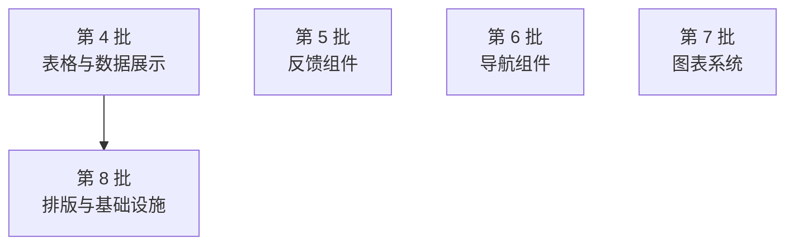

# 进度

> 这里只保留活跃差距。Windows P6 交付基线已闭合；产品范围见[产品](产品.md)，运行时与图形契约见[架构](架构.md)。
> 当前生产图形基线已切换为共享 wgpu renderer；旧每 API renderer 的视觉证据只作迁移回归参考。已验证 Windows/NVIDIA 上 `Auto` 真实选择 wgpu Vulkan，跨平台与完整组件视觉矩阵需按新基线重跑。

## 更小 · 更快 · 更稳

功能面已收敛。后续只围绕三个方向：

### 更小：缩小内存占用

- **wgpu 基线**：生产 module graph 不再编译 D3D11 / D3D12 / OpenGL / Vulkan 的平行 UI raster 实现；一套 WGSL、shape / clear / glyph（R8 coverage + RGBA8 MSDF）/ texture 四类 pipeline、一个按需扩容 vertex buffer、1024×1024 R8 与 RGBA8 字形 atlas 与 GPU offscreen RT 服务全部 adapter。严格 GPU canvas 不分配 CPU 主 framebuffer 或 PixelUpload staging；1:1 与缩放 image 走纹理 blit，轴对齐 / 网格化变换几何进共享 pipeline，脏区走 `clear_rects`
- **实测**：Windows/NVIDIA release、1200×800、中文 Demo 首屏稳定 5 秒后，Vulkan working set 约 142 MiB、private bytes 约 178 MiB；D3D12 working set 约 112 MiB、private bytes 约 166 MiB。Vulkan 优先是既定选择，当前 100 MiB 以上的主要差距来自 NVIDIA Vulkan userspace driver / shader compiler 映射、wgpu runtime 与中文字体，而不是 UIX 的 1200×800 CPU framebuffer

- **已做**：字形缓存收敛至 2048 项 / 8 MiB；Picture 候选按预计重绘像素 / BGRA 保留字节全局排序，每棵 LayerTree 32 MiB 硬预算，超预算旧缓存 rebuild 后 checked 释放；Native GPU Picture 成功提交 GPU RT 并恢复 swapchain 后立即释放可重建 CPU staging；`CpuSegment` / `PictureBlit` 直接构造可见目标 tile，不再分配透明整帧参考面；主画布 scratch 初始 1×1，recorder Picture 每槽 1×1 scratch；DisplayList 构建通过所有权转移消除双 clone，完整操作序列以 COW `Arc` 共享，Label/Input 直接移交单次绘制的新 glyph layout；IR command/image/coverage 保留量 ≤ 同尺寸 BGRA，超限物化后不双持；1920×1080 resize 不再分配未用 CPU 主表面（约 −7.91 MiB）
- **瓶颈**：GPU 驱动 / shader compiler 映射与中文字体常驻；wgpu 统一层本身有固定运行时开销。GPU 主路径已无 CPU framebuffer grace，旧 hybrid staging 只存在于 test-only 兼容实现
- **目标**：逼近同体量 GPU-only 框架内存水平

### 更快：降低每帧耗时

- **wgpu 已做**：LayerTree 在 GPU 模式下绕过 CPU FrameRecordingEngine，直接写入严格 Native GPU canvas；相邻同类 op 在 API 中立层合批，再由唯一 wgpu renderer 生成顶点并保持 painter order。主路径经帧间保留色缓冲绘制、present 全幅 blit（`FullOnly`）；`retained_framebuffer` 解锁绘制侧 partial dirty。全屏 overlay 可对保留色缓冲 GPU 快照/恢复（无 CPU readback）只绘浮层；多块脏区逐矩形 clear + clip 重绘。真实 Vulkan 首帧约 14.6 ms、稳定后采样帧约 4.7 ms；该数字是本机启动样本，不替代完整帧基准

- **已做**：
  - **Native IR**：identity transform + 整数 offset 的 SrcOver 矩形/圆角填充走 GPU SDF；fill opacity 录制边界量化为可精确恢复 straight Color
  - **字形直达 atlas**：主帧 identity/整数 offset/clip/SrcOver 字形按 alpha→premultiply→coverage 折叠 opacity，保留共享 coverage→batch IR；所有 adapter 复用同一 wgpu R8 atlas 与 WGSL glyph pipeline
  - **Picture 事务拼入**：透明底、1:1 整数映射 source Picture 在可见写区无覆盖或全被不透明并集（直角 / 圆角内区 / 不透明图像）覆盖时拼入父 encoder，不扩 scratch
  - **圆角/面板 seam**：相邻不透明分区 seam 上的透明度文字保留 glyph coverage `Arc` 直达 atlas
  - **父 opacity 物化**：opacity≠1 的有限整数 Picture 映射由单个 `PictureBlit` 携带 `FrameOpacity`；hybrid soft 路径仍逐通道量化上传，严格 GPU（wgpu）路径改为 `draw_image_blits` 纹理四边形并由 shader 乘 opacity，零 opacity→no-op，主 scratch 保持 1×1
  - **圆形直达**：identity/SrcOver 的整数 `fill_circle` 复用等价圆角正方形 GPU SDF
  - **矩形/圆形描边直达**：整数 surface 几何/clip、有限正宽度和合法圆角的 `stroke_rect` 及整数外接正方形的 `stroke_circle` 保留为同一 IR，并统一进入 wgpu shape pipeline
  - **GPU offscreen / Picture**：`NativeRasterCaps::wgpu_full()` 启用 `offscreen_targets`；共享 wgpu renderer 提供 RT create/bind/blit，Picture 可分配 GPU RT 并在 swapchain 目标上采样合成；`blit_offscreen_target` 已转发父画布 opacity
  - **整数尺寸 1:1 / 缩放 image blit**：严格 GPU 路径将 identity / SrcOver、整数源 crop 的 `blit_image` 上传为 BGRA 纹理四边形；目标可 1:1 或缩放，位置允许亚像素
  - **non-identity 变换几何（部分）**：轴对齐 scale/translate 的矩形 / 描边 / 线性渐变 / 均匀径向 / 轴对齐盒阴影（含各向异性 blur）、旋转 / 剪切盒阴影（仿射 corners + 逻辑 SDF）、轴对齐各向异性圆角（几何平均半径）与仿射字形 atlas 四边形（含旋转 / 剪切 corners）、任意仿射下的路径网格与直角矩形 mesh，以及对角线线段 stroke mesh，已进共享 wgpu pipeline
  - **GPU 可分离模糊**：共享 wgpu 两趟（水平→垂直）高斯模糊，大半径先 2× 降采样；`IGraphicsContext::blur_offscreen_target` / `RenderBackend::try_blur_offscreen` / `GraphicsEngine::try_blur_offscreen` / `compositor::blur_picture_region`，`sigma = radius / 3` 与 CPU 一致；禁止 PixelUpload 冒充
  - **真正 GPU glyph coverage**：字体后端提取轮廓并展平为 NonZero 边列表；严格 GPU `blit_glyph_outline` 在**近 1:1** 用解析 AA → R8，在**缩放/仿射**时走 `glyph_cover` **MSDF** → RGBA8 + `median`；tofu / 失败回退仍可走 CPU coverage → R8；soft 始终解析 AA
  - **MSDF 多通道字形**：Chlumsky `edgeColoringSimple` 真边着色（角点切换 CMY 双通道）；GPU cover 与 CPU `msdf_from_edges` / `colorize_edges` 同公式；专用于缩放/大字号保角，不再作为 1:1 UI 字默认路径；跨硬件视觉矩阵仍待补
  - **Picture 不透明图像 cover**：1:1 `CpuSegment` / 不透明 `PictureBlit` 源像素全 alpha=255 时可作 splice 重叠 cover，与直角 / 圆角不透明并集等价
  - **Picture 采样目标**：`FrameSampledRect` 支持亚像素 destination 与缩放映射（整数源 crop）；严格 GPU 走纹理四边形，主 scratch 不扩容；互不覆盖的 Additive 写区可参与 splice；Additive 父 blend 下采样 blit 走 One+One 纹理 pipeline
  - **脏区 clear_rects**：wgpu 以 replace-blend 透明四边形实现 `clear_rects`，`wgpu_full` 已启用该能力；主路径保留色缓冲 + `retained_framebuffer` 解锁绘制侧 partial redraw，present 仍 FullOnly 全幅 blit；多块脏区保留离散矩形（逐矩形 clear / clip / 父背景重绘），不再 AABB 并集
  - **GPU overlay backdrop**：`retained_framebuffer` 路径在浮层首帧前对保留色缓冲做 GPU 纹理快照，动画帧 restore 后只重放 root overlays（无 CPU readback）；普通树变脏或尺寸变化时失效
  - **严格边界**：GPU 模式不再用局部 CPU tile 冒充 GPU 实现；尚未进入共享 wgpu pipeline 的操作 typed 失败，由恢复状态机切换整套 CPU engine
  - **Table View 滚动**：View 单元格保持 content 坐标；虚拟窗口不变时不复制元数据、不重跑 factory 或布局，只对表体提交 composite-copy，窗口变化才重建并保守重绘
  - **热路径 scratch 复用**：Layout 收敛循环直接反向迭代同一遍历序列，并跨 pass 复用扩展签名、已调整子节点集合、父子可见性变更表、收缩操作与 child-id 缓冲；只读阶段直接借用 children slice，Table / VirtualScroll 的三次动态刷新快照复用 layout order 容量；Overlay 新旧签名流式比较并直接查询重建后 trap owners，动画 owner 一致性检查最多读取两个匹配项，不建派生列表；生命周期状态快照复用每树峰值容量 scratch，同轮 AppState 同步复用该快照、不再重扫全树；Timer discovery 取出并复用 route map 后直接借用 traversal cache，不复制整树 id；AppTimer deadline 快照复用每窗口缓冲，Timer / AppTimer registry 以交替代次标记原位同步、不重建 desired map。每帧动画工作同步直接把 ViewTransition 追加到 managed registration 缓冲，并由 registry 查询托管归属、不另建 transition / managed-id / affected-union 列表；WindowDriver 的开放动画快照复用每窗口峰值容量 scratch，组件动画 id 惰性送入 registry，树更新前的候选快照复用每树 animation-id scratch；不改变快照顺序、队列锁边界、Timer 路由、Overlay / trap 语义、生命周期回调 / AppState 顺序、收敛判定、动画发现、deadline / 优先级与可见性同步时机
  - **到期工作清退**：registry 在一次有序 retain 扫描中把 due work 写入 WindowDriver 峰值容量 scratch，并同时删除 entry 与 Timer 托管标记；不再逐轮分配 due 列表或逐项二次查树，派发顺序不变
  - **动画注册原位同步**：declarative registration 与开放组件动画集合使用持久有序 map 和交替代次标记，不再逐帧重建 desired map / set；来源重叠时仍由开放组件动画优先，移除后恢复另一来源 deadline
  - **AppTimer 变更驱动同步**：deadline 集合 mutation 递增队列 revision；WindowDriver 只在 revision 变化时刷新 scratch 并同步 registry，未变化轮次不复制/重扫，队列锁仍在 registry 同步前释放
- **瓶颈**：`ab_glyph` CPU shaping / 轮廓提取仍在 CPU；MSDF 多通道 atlas 已落地（Chlumsky 真边着色），大字号真机视觉矩阵未闭合；窄 present（TrackedSwapchain）因 wgpu 无 image index / present damage API 本会话不实施；首帧 layout 尖峰。严格模式下 shaping 不是帧内 CPU 中转
- **目标**：稳定 60Hz

### 更稳：跨平台真机矩阵闭环

- **已做**：Windows/NVIDIA release 真窗确认 wgpu Vulkan 被选择，连续提交无 panic / validation error；device lost 与 uncaptured wgpu error 已接入 typed 恢复 / 日志边界
- **未覆盖**：Wayland、macOS、AMD、Intel；88 组件视觉矩阵需在新 wgpu 基线上重跑
- **本机可跑 / 已阻塞**：
  | 矩阵项 | 本机（Windows/NVIDIA） | 阻塞原因 |
  |--------|------------------------|----------|
  | Windows + NVIDIA Vulkan/D3D12 冒烟 | 可跑 | — |
  | Windows + AMD / Intel | 阻塞 | 无对应 GPU |
  | Wayland fault / resize / occlusion | 阻塞 | 非 Linux/Wayland 主机 |
  | macOS Metal / Vulkan | 阻塞 | 非 macOS 主机 |
  | 全组件视觉矩阵（wgpu 基线重跑） | 可部分跑 | 需显式调度；本会话未重跑 |
- **Agent 安全**：Linux/macOS 缺异 uid 拒绝路径
- **目标**：四平台同等视觉/图形矩阵

## 活跃差距

| 分类 | 内容 |
|------|------|
| [组件稳定性](进度/组件稳定性.md) | 已闭环组件的修复、规格、回归与真窗证据 |
| [组件功能缺口](进度/组件功能缺口.md) | 使用文档中已描述的理想态功能，待实现 |
| [平台与硬件](进度/平台与硬件.md) | 跨平台、多硬件与 Agent 安全矩阵 |
| [性能与内存](进度/性能与内存.md) | 帧耗时、资源占用、已知瓶颈与暂缓项 |
| [已知缺陷](进度/已知缺陷.md) | 窗口布局、自定义标题栏与交互视觉缺陷 |

## 分批实施计划

> 使用文档中 `text` fence → `rust uix-compile` 的剩余落地批次。每批独立交付、可并行。
> 详细缺口规格见[组件功能缺口](进度/组件功能缺口.md)与对应使用文档。

### 第 4 批：表格与数据展示

| # | 文档 | 组件 | 功能 | `text` fence 位置 |
|---|------|------|------|-------------------|
| 4.4 | 数据展示 | Table | `.pagination(TablePagination{...})` — 远程分页 | L394-414 |
| 4.5 | 数据展示 | Table | `.on_row_click(\|row, idx\| ...)` — 行点击回调 | L421-428 |
| 4.6 | 数据展示 | Table | `.row_span(...)` / `.col_span(...)` — 单元格合并 | L435-445 |
| 4.7 | 数据展示 | Image | `.lazy(true)` — 懒加载 | L129-155 |
| 4.8 | 数据展示 | Image | `.placeholder(view)` — 加载占位 | L129-155 |
| 4.9 | 数据展示 | Image | `.on_error(\|e\| view)` — 错误重试 | L129-155 |
| 4.10 | 数据展示 | Image | `ImageGroup::new()` — 图片组画廊 | L129-155 |
| 4.11 | 数据展示 | Tree | `.searchable(true)` — 树搜索过滤 | L516-519 |
| 4.12 | 数据展示 | Tree | `.draggable(true)` + `.on_drop(...)` — 拖拽排序 | L516-519 |
| 4.13 | 数据展示 | Tree | `TreeNode::lazy(true)` + `.on_expand(...)` — 懒加载 | L516-519 |
| 4.14 | 数据展示 | Tree | `TreeNode::icon("star")` — 自定义图标 | L516-519 |
| 4.15 | 数据展示 | ProgressBar | `.gradient(start, end)` — 渐变填充 | L550-570 |
| 4.16 | 数据展示 | ProgressBar | `.steps(n)` — 分段进度 | L550-570 |
| 4.17 | 数据展示 | ProgressBar | `.dashboard()` — 仪表盘样式 | L550-570 |
| 4.18 | 数据展示 | ProgressBar | `.format(\|p\| ...)` — 文本模板 | L550-570 |
| 4.19 | 数据展示 | Carousel | `.autoplay(Duration)` — 自动播放 | L616-619 |
| 4.20 | 数据展示 | Carousel | `.effect(CarouselEffect::Fade)` — 淡入淡出 | L616-619 |
| 4.21 | 数据展示 | Carousel | `.pause_on_hover(true)` — 悬停暂停 | L616-619 |
| 4.22 | 数据展示 | Carousel | `.arrows(\|prev,next\| view)` — 自定义箭头 | L616-619 |
| 4.23 | 数据展示 | Calendar | `.date_cell(\|date,info\| view)` — 自定义日期格 | L596-598 |
| 4.24 | 数据展示 | Calendar | `.events(vec![CalendarEvent{...}])` — 事件标记 | L596-598 |

### 第 5 批：反馈组件

| # | 文档 | 组件 | 功能 | `text` fence 位置 |
|---|------|------|------|-------------------|
| 5.1 | 反馈 | Modal | `Modal::confirm(...)` — 快捷确认对话框 | L33-47 |
| 5.2 | 反馈 | Modal | `Modal::info/warning/error(...)` — 信息/警告/错误 | L33-47 |
| 5.3 | 反馈 | Modal | `.destroy_on_close(true)` — 关闭后移除 | L33-47 |
| 5.4 | 反馈 | Modal | `.closable(false)` — 隐藏关闭按钮 | L33-47 |
| 5.5 | 反馈 | Notification | `.action("label", \|\| fn)` — 操作按钮 | L86-109 |
| 5.6 | 反馈 | Notification | `.icon("star")` — 自定义状态图标 | L86-109 |
| 5.7 | 反馈 | Notification | `.close_text("忽略")` — 自定义关闭文字 | L86-109 |
| 5.8 | 反馈 | Notification | `.offset(x, y)` — 距边缘偏移 | L86-109 |
| 5.9 | 反馈 | Message | `.action("label", \|\| fn)` — 操作按钮 | L86-109 |
| 5.10 | 反馈 | Message | `.icon("icon")` — 自定义图标 | L86-109 |
| 5.11 | 反馈 | Popover | `.open(&state)` — 受控打开状态 | L133-155 |
| 5.12 | 反馈 | Popover | `.trigger_view(custom)` — 自定义触发 View | L133-155 |
| 5.13 | 反馈 | Popover | `.arrow(false)` — 隐藏箭头 | L133-155 |
| 5.14 | 反馈 | Popover | `.bg(Color)` — 自定义背景色 | L133-155 |
| 5.15 | 反馈 | Tooltip | `.bg(Color).color(Color)` — 自定义配色 | L148-155 |
| 5.16 | 反馈 | Tooltip | `.arrow(false)` — 隐藏箭头 | L148-155 |
| 5.17 | 反馈 | Spin | `.delay(Duration)` — 延迟显示 | L177-183 |
| 5.18 | 反馈 | Spin | `.size(SpinSize::Small)` — 行内尺寸 | L177-183 |
| 5.19 | 反馈 | Alert | `Alert::success/info/warning/error(...)` — 类型构造器 | L228-240 |
| 5.20 | 反馈 | Alert | `.action("label", \|\| fn)` — 操作链接 | L228-240 |
| 5.21 | 反馈 | Alert | `.banner(true)` — 通栏横幅 | L228-240 |
| 5.22 | 反馈 | FloatButton | `FloatButtonGroup::new().buttons(...)` — 按钮组 | L255-265 |
| 5.23 | 反馈 | FloatButton | `.trigger(TriggerMode::Hover)` — 悬浮触发 | L255-265 |

### 第 6 批：导航组件

| # | 文档 | 组件 | 功能 | `text` fence 位置 |
|---|------|------|------|-------------------|
| 6.1 | 导航 | Menu | `MenuItem::children(...)` — 嵌套子菜单 | L27-45 |
| 6.2 | 导航 | Menu | `.mode(MenuMode::Inline)` — 内联始终展开 | L27-45 |
| 6.3 | 导航 | Menu | `.selected_keys(&keys)` — 受控选中 | L27-45 |
| 6.4 | 导航 | Menu | `.open_keys(&keys)` — 受控展开 | L27-45 |
| 6.5 | 导航 | Menu | `MenuItem::icon("icon")` — 菜单项图标 | L27-45 |
| 6.6 | 导航 | Navigation | `.collapsed(&state)` — 受控折叠 | L67-75 |
| 6.7 | 导航 | Navigation | `.on_collapse(\|c\| ...)` — 折叠回调 | L67-75 |
| 6.8 | 导航 | Pagination | `.simple(true)` — 简洁模式 | L100-111 |
| 6.9 | 导航 | Pagination | `.show_jumper(true)` — 跳转输入框 | L100-111 |
| 6.10 | 导航 | Pagination | `.total_template(\|t,r\| ...)` — 总数模板 | L100-111 |
| 6.11 | 导航 | Steps | `Step::status(StepStatus::*)` — 步骤状态 | L140-160 |
| 6.12 | 导航 | Steps | `.clickable(true)` — 点击切换 | L140-160 |
| 6.13 | 导航 | Steps | `.dot(true)` — 圆点进度 | L140-160 |
| 6.14 | 导航 | Steps | `Step::icon("icon")` — 自定义图标 | L140-160 |
| 6.15 | 导航 | Steps | `.on_step(\|i,s\| ...)` — 切换回调 | L140-160 |
| 6.16 | 导航 | Breadcrumb | `BreadcrumbItem::icon("icon")` — 图标 | L164-170 |
| 6.17 | 导航 | Breadcrumb | `.max_items(n)` — 折叠溢出 | L164-170 |
| 6.18 | 导航 | Anchor | `.target_offset(f32)` — 锚点偏移 | L174-186 |
| 6.19 | 导航 | Anchor | `.show_ink(true)` — 墨球指示器 | L174-186 |
| 6.20 | 导航 | Anchor | `.bounds(f32)` — 滚动检测边界 | L174-186 |
| 6.21 | 导航 | Anchor | `.container(\|\| view)` — 自定义容器 | L174-186 |
| 6.22 | 导航 | Tabs | `.tab_position(TabPosition::*)` — 标签位置 | L201-216 |
| 6.23 | 导航 | Tabs | `Tabs::editable()` — 可编辑新增/关闭 | L201-216 |
| 6.24 | 导航 | Tabs | `.scrollable(true)` — 溢出滚动 | L201-216 |
| 6.25 | 导航 | Tabs | `Tab::icon("icon")` — 标签图标 | L201-216 |
| 6.26 | 导航 | Dropdown | `DropdownItem::divider()` — 分割线 | L227-247 |
| 6.27 | 导航 | Dropdown | `DropdownItem::children(...)` — 子菜单 | L227-247 |
| 6.28 | 导航 | Dropdown | `DropdownItem::disabled(true)` — 禁用项 | L227-247 |
| 6.29 | 导航 | Dropdown | `DropdownItem::icon("icon")` — 选项图标 | L227-247 |
| 6.30 | 导航 | Dropdown | `.trigger(TriggerMode::*)` — 触发模式 | L227-247 |

### 第 7 批：图表系统

| # | 文档 | 组件 | 功能 | `text` fence 位置 |
|---|------|------|------|-------------------|
| 7.1 | 图表 | BarChart | `.grouped(true)` + `.series(...)` — 分组柱状图 | L40-53 |
| 7.2 | 图表 | BarChart | `.stacked(true)` + `.series(...)` — 堆叠柱状图 | L57-63 |
| 7.3 | 图表 | BarChart | `.horizontal(true)` — 横向柱状图 | L65-70 |
| 7.4 | 图表 | BarChart | `.bar_gap(f32)` / `.category_gap(f32)` — 间距控制 | L75 |
| 7.5 | 图表 | LineChart | `.series(...)` + `.legend(...)` — 多系列 | L96-104 |
| 7.6 | 图表 | LineChart | `.smooth(true)` — 平滑曲线 | L118-123 |
| 7.7 | 图表 | LineChart | `.step(true)` — 阶梯线 | L128 |
| 7.8 | 图表 | PieChart | `.rose(true)` — 玫瑰图（南丁格尔） | L146-150 |
| 7.9 | 图表 | PieChart | `.start_angle(f32)` / `.total(f32)` — 圆弧控制 | L153-159 |
| 7.10 | 图表 | — | `AreaChart` — 新组件：面积图/堆叠面积 | L95-128 |
| 7.11 | 图表 | — | `ScatterChart` — 新组件：散点/气泡图 | L165-200 |
| 7.12 | 图表 | — | `RadarChart` — 新组件：雷达图 | L202-231 |
| 7.13 | 图表 | — | `Heatmap` — 新组件：热力图/日历热力图 | L233-263 |
| 7.14 | 图表 | — | `FunnelChart` — 新组件：漏斗图 | L264-289 |
| 7.15 | 图表 | — | `WaterfallChart` — 新组件：瀑布图 | L291-316 |
| 7.16 | 图表 | — | `ComboChart` — 新组件：组合图双轴 | L318-346 |
| 7.17 | 图表 | — | `Treemap` — 新组件：矩形树图 | L348-373 |
| 7.18 | 图表 | — | `Gauge` — 新组件：仪表盘 | L375-408 |
| 7.19 | 图表 | 通用 | `.responsive(true)` — 响应式尺寸 | L426-451 |
| 7.20 | 图表 | 通用 | `.interactive(InteractionConfig{...})` — 缩放/十字线 | L426-451 |
| 7.21 | 图表 | 通用 | `.brush(BrushConfig{...})` — 刷选区域 | L426-451 |
| 7.22 | 图表 | 通用 | `.title(...)` / `.subtitle(...)` — 标题/副标题 | L421 |
| 7.23 | 图表 | 通用 | `.legend(LegendPosition)` — 图例位置 | L419 |
| 7.24 | 图表 | 通用 | `.tooltip(TooltipConfig)` — tooltip 配置 | L420 |

### 第 8 批：排版与基础设施

| # | 文档 | 组件 | 功能 | `text` fence 位置 |
|---|------|------|------|-------------------|
| 8.1 | 数据展示 | Typography | `Typography::title(...).level(n)` — 标题 h1-h5 | L743-758 |
| 8.2 | 数据展示 | Typography | `.spacing(f32)` / `.indent(f32)` — 段落增强 | L743-758 |
| 8.3 | 数据展示 | Typography | `Typography::text(...)` — 行内文本 | L743-758 |
| 8.4 | 数据展示 | Collapse | `.borderless(true)` — 无边框模式 | L538-539 |
| 8.5 | 数据展示 | Collapse | `.destroy_on_hide(true)` — 折叠销毁 | L538-539 |
| 8.6 | 数据展示 | Skeleton | `.avatar(Size)` — 头像占位 | L766-783 |
| 8.7 | 数据展示 | Skeleton | `.paragraph(n)` — 段落占位 | L766-783 |
| 8.8 | 数据展示 | Skeleton | `.active(true)` — shimmer 动画 | L766-783 |
| 8.9 | 数据展示 | Watermark | `Watermark::new(text)` — 新组件 | L785-801 |
| 8.10 | 数据展示 | Transfer | `.titles(...)` / `.render_item(...)` — 增强 API | L821-839 |
| 8.11 | 数据展示 | Transfer | `.on_change(...)` — 变更回调 | L821-839 |
| 8.12 | 数据展示 | Transfer | `.searchable(true)` — 搜索过滤 | L821-839 |

### 批次依赖关系

> 实线表示批次间存在公开 API 或集成依赖。
> 第 7 批图表系统相对独立，可在任意批次间隙并行推进。
