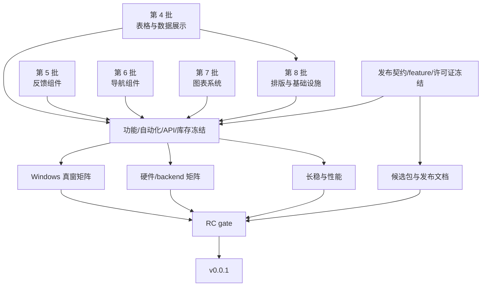

# 0.0.1 首发计划

[← 返回进度 索引](../进度.md)

> 分类：首发计划  
> 权威范围：0.0.1 候选契约、关闭口径、里程碑、发布门禁与功能范围

[← 返回进度 索引](../进度.md)

> 分类：首发计划  
> 权威范围：0.0.1 候选契约、关闭口径、里程碑、发布门禁与功能范围

## 0.0.1 首发计划

`0.0.1` 是 UIX 的首个正式版本号，发布目标是 **Windows x64 生产可用、版本范围内的公开功能真实可用**。当前状态仍是**未发布**：版本号、公开 API 和可编译示例已经进入工作树，110 项已完成定向实现与行为验证，但尚无条目绑定 clean 冻结候选、候选全量门禁和逐项真窗 / 等价证据；真窗、硬件、长稳、性能与正式打包 gate 也未闭合。

产品范围与非目标以[产品](产品.md)为准，公开写法以[使用](使用.md)及其分卷为准，运行时与图形机制以[架构](架构.md)为准；这里仅维护差距、gate、状态和证据。最终组件与适用状态分母在 beta 前从冻结提交的公开导出和组件声明生成，不沿用旧 wgpu 基线前的 88 组件 / 412 状态数字。P6 功能基线及 2026-07-17 旧渲染报告只作回归参考，不等于 `0.0.1` 发布通过。

移动端、macOS、Wayland、Windows ARM64、网络 / 同步、读屏桥与 Agent 开发预览不阻塞本版本。`0.0.1` 已确定为 `yangyanhui` 持有版权的闭源内部版本：保持 `publish = false`，不发布到 crates.io，不提供公开源码或对外二进制制品，仅限获授权的内部环境使用与分发。内部制品形式已按下节冻结；在其余 gate 闭合前不得宣称“已发布”。

### 已冻结的内部交付契约

- **载体**：唯一交付物为 `uix-0.0.1-internal-win-x64.zip`，内含 release `uix-demo.exe`、内部源码包 `uix-0.0.1.crate`、`LICENSE`、`THIRD_PARTY_NOTICES.md`、`CHANGELOG.md`、`README.md` 与 `SHA256SUMS.txt`。源码包只供获授权内部环境消费，禁止 `cargo publish`；不生成公开下载、安装器或公开符号包。候选由 [`scripts/build_internal_release.ps1`](../scripts/build_internal_release.ps1) 生成，脚本默认拒绝脏工作树；其显式 dirty 模式只验证打包路径并强制添加 `UNVERIFIED` 后缀。
- **平台**：最低 Windows 11 24H2 x64（build 26100）；Windows ARM64 与旧版 Windows 不在本候选支持范围。
- **release 配置**：`cargo build --release --locked --bin uix-demo`，只使用默认 `vulkan` feature；`d3d11`、`d3d12`、`opengles`、`metal`、`settings-serde`、`agent-control` 与 `test-harness` 均不进入交付构建。生产 `Auto` 因而只验收 Vulkan → Software 整体回退，OpenGL 不进入 `0.0.1`。
- **性能参考环境**：Windows 11 Pro build 26200、AMD Ryzen 7 7700（8C/16T）、32 GiB RAM、NVIDIA GeForce RTX 4070 Ti SUPER、驱动 `32.0.16.1062`、1200×800 logical、100% DPI、Vulkan、release；预热 30 秒后采集不少于 10,000 个真实 presented 动画帧，8 小时长稳按固定脚本运行，预热后首尾 5 分钟中位数的 working set 与 private bytes 增长均不得超过 64 MiB。
- **候选规则**：候选必须来自 clean worktree 的单一 commit；版本、lockfile、内部包、Demo、哈希清单、原始证据与汇总报告全部记录该 commit。候选后任何代码、公开 API、示例、组件库存或验收工具变化都递增候选号并重开受影响 gate，禁止把不同提交的结果拼成同一候选。

### 单项关闭口径

第 4～8 批的每个条目只有在全部适用项通过后才能关闭：

1. **公开契约**：类型 / 方法由公开入口导出，使用文档提供带唯一 `uix-compile` 的可编译示例；需要 opt-in feature 时显式声明。
2. **真实行为**：运行时确实消费配置并产生文档约定的绘制、布局、状态或回调结果；只保存字段、只进入快照、空类型占位或 builder-acceptance 测试均不算完成。
3. **交互与语义**：键鼠、焦点、禁用 / 受控状态、reconcile 保持、裁剪 / DPI、无障碍语义和空闲无轮询按条目适用性闭合；不适用项须在证据中说明理由。
4. **自动化证据**：至少有行为正例、关键反例与 reconcile / 边界回归，断言结果而不是只断言“可构造”。
5. **真窗证据**：可见或交互功能在 release Demo 中有真实 present 后的场景证据；纯数据 / 非视觉能力可用等价集成证据替代。

关闭记录必须绑定同一候选提交，并给出测试或报告路径。任何一项缺失都保持“未通过”。

### 里程碑

| 里程碑 | 范围 | 退出条件 | 当前状态 |
|------|------|----------|----------|
| `0.0.1-alpha.1` | 第 4 批数据展示 + 第 8 批排版与基础设施 | 每个条目按单项关闭口径闭合 | **未通过**：工作树定向行为已验证，仍缺冻结候选、候选全量门禁与逐项真窗 / 等价证据 |
| `0.0.1-alpha.2` | 第 5 批反馈 + 第 6 批导航 | 浮层、焦点陷阱、键鼠、受控状态与语义逐项闭合 | **未通过**：工作树定向行为已验证，仍缺冻结候选、候选全量门禁与逐项真窗 / 等价证据 |
| `0.0.1-alpha.3` | 第 7 批图表系统 | 各图表绘制、主题、空态、缩放、交互和行为测试逐项闭合 | **未通过**：工作树定向行为已验证，仍缺冻结候选、候选全量门禁与主题 / 交互真窗矩阵 |
| `0.0.1-beta.1` | 范围、公开 API、feature 组合与组件 / 状态库存冻结后的 Windows 加固 | G0～G4 通过；冻结库存的真窗矩阵及硬件 / backend gate 闭合 | 未进入 |
| `0.0.1-rc.1` | 只接受发布阻断修复 | G5～G7 通过；候选包、文档和证据包绑定同一提交 | 未进入 |
| `0.0.1` | 首次正式发布 | RC 无阻断回归；版本、发布物、报告与 `v0.0.1` 标签一致 | 未进入 |

`alpha` / `beta` / `rc` 只有在实际生成对应版本、标签或候选制品时才是公开预发布版本；否则只是内部质量 gate，不补造历史标签。冻结后发生公开 API、组件库存、渲染、布局或交互变化，必须递增候选编号并重开受影响 gate。

### 发布门禁

| Gate | 可观察退出条件 | 当前状态（2026-07-22） |
|------|----------------|------------------------|
| **G0 发布契约** | 冻结发布载体、许可证、最低 Windows 版本、release feature / backend 组合、性能参考环境及候选提交规则 | **已冻结**：`yangyanhui` 专有内部包及独立第三方声明、Windows 11 24H2 x64、默认 Vulkan + Software 回退、NVIDIA 参考环境与单提交候选规则见上；若改变任一项须重开本 gate |
| **G1 功能闭环** | 第 4～8 批 110 项全部满足单项关闭口径，不以 API 存在代替行为 | **未通过**：110 项已完成真实配置消费与定向行为 / 交互回归，并已建立可机检逐项账本；仍缺冻结候选 commit、候选全量门禁与真窗 / 等价证据，不能据定向测试宣告通过 |
| **G2 自动化与冻结** | 冻结公开导出和适用状态分母；格式、全 target / feature 编译测试、严格 Clippy、Markdown 清单、文档链接、图标单一管线与架构边界全部通过；ignored / 环境项逐项归类并在目标环境补跑 | **未通过**：Markdown 清单 214 / 214 通过（211 个基础、3 个 opt-in），图标策略门禁已建立并通过定向验证；其余结果未绑定冻结候选，仍须在实现收口后整体重跑 |
| **G3 Windows 真窗** | 冻结库存 × 适用状态在新 wgpu 基线 100% 通过；另以窗口主路径覆盖 100% / 150% / 200% DPI、resize、最大化 / 还原、最小化恢复、遮挡、多窗、主题切换和 DeviceLost | **未通过 / 工作树矩阵已过**：92 项（87 Widget、3 Composite、2 Provider）/ 663 个声明状态生成 847 / 847 PASS 证据行、329 张原始 PNG 与 22 张联系表，人工视觉 QA 未发现 P0 / P1；96 DPI 主窗的 `Auto` / 强制 Vulkan / Software 恢复路径也有 `UNVERIFIED` 证据。仍缺 144 / 192 DPI、真实 compositor occlusion、多窗 / DeviceLost 组合及 clean 候选重跑，详见[`UNVERIFIED` 报告](../test-reports/0.0.1-UNVERIFIED-20260722/component-visual/report.md) |
| **G4 硬件 / backend** | NVIDIA、AMD、Intel 分别通过 `Auto` 冒烟；release feature 包含的强制 backend 分别验证；Software 整体回退单独验证。完整组合见[平台与硬件](进度/平台与硬件.md) | **阻塞**：工作树已通过 NVIDIA `Auto → Vulkan`、强制 Vulkan，以及测试夹具以 Windows 不支持的 `metal` 请求强制耗尽 GPU probe 后的 Software 整体回退，均为 `UNVERIFIED`；AMD / Intel 无对应硬件，最低 build 26100 与 clean 冻结候选仍未验证 |
| **G5 稳定性 / 性能** | 冻结报告协议后，8 小时混合空闲与交互无崩溃、死锁、GPU validation error 或超阈值内存增长；窗口、Modal、Drawer、主题与 DPI 主路径各 1,000 次；常规动画帧 P95 ≤ 16.7 ms | **测量链已落地、候选未执行、gate 仍阻塞**：runner 已强制冻结环境与 DPI / logical / physical 尺寸、隔离默认 Vulkan release 构建、30 秒预热、10,000 个真实 presented 帧及 inter-present 节奏、48×10 分钟交互 / 空闲、idle CPU / 帧 oracle、1 秒内存采样和证据语义重算；五类 1,000 次闭环仍缺 post-present 最终态 / 资源基线生产者，均为 `blocked`，不得以场景 marker 代替 |
| **G6 打包 / 文档** | clean checkout 的 release Demo 与内部 `cargo package` 可复现性检查通过；README、使用、限制、变更记录、版本和闭源交付渠道一致 | **未通过**：专有 `LICENSE`、Lucide / Feather `THIRD_PARTY_NOTICES.md`、`CHANGELOG.md` 与内部 ZIP 内容已冻结；默认脚本已验证会拒绝脏树，显式验证模式已完成 release build、离线 `cargo package`、不含 `test-reports/` 的 `UNVERIFIED` ZIP 与载荷哈希核验。clean checkout 的正式 ZIP / 哈希、文档终检及冻结候选绑定仍未执行 |
| **G7 缺陷 / 发布** | 候选提交的 P0 / P1 为 0，Windows 主路径 P2 为 0；RC 后无阻断回归，版本、包、报告、发布物与标签指向同一提交 | **未执行**：当前没有绑定本候选提交的缺陷分级报告或 `v0.0.1` 标签 |

缺陷分级在本版本采用：P0 = 数据损坏、安全边界破坏、无法启动或普遍崩溃；P1 = Windows 主路径不可完成且无合理绕行；P2 = 主路径行为或视觉明显错误但存在绕行。主路径至少包括启动 / 关闭、窗口与 DPI、键鼠 / 焦点 / IME、状态更新、导航、浮层、多窗、主题、Settings、动画 / 定时、图形恢复与空闲休眠。

每份 gate 证据必须记录候选 commit、日期、OS、GPU / 驱动、backend、DPI、release 配置、执行命令或场景、ignored / 失败处置及报告路径。冻结后修改代码、公开文档示例、组件声明或验收工具时，重开所有受影响 gate；缺少目标硬件只能记为“阻塞”，不能记为“通过”或“不适用”。

## 0.0.1 功能范围

> 下列 110 项是版本范围。工作树已完成定向实现与行为验证，但所有条目仍保持“未通过”，直到它们绑定同一 clean 冻结候选、候选全量门禁及逐项真窗 / 等价证据。
> 详细契约见对应使用文档；逐项证据映射见[0.0.1 功能账本](进度/0.0.1功能账本.md)，批次级状态与已知代表性缺口见[组件功能缺口](进度/组件功能缺口.md)。

### 第 4 批：表格与数据展示

| # | 文档 | 组件 | 功能 | 使用文档位置 |
|---|------|------|------|-------------------|
| 4.4 | 数据展示 | Table | `.pagination(TablePagination{...})` — 远程分页 | L394-414 |
| 4.5 | 数据展示 | Table | `.on_row_click(\|row, idx\| ...)` — 行点击回调 | L421-428 |
| 4.6 | 数据展示 | Table | `.row_span(...)` / `.col_span(...)` — 单元格合并 | L435-445 |
| 4.7 | 数据展示 | Image | `.lazy(true)` — 懒加载 | L129-155 |
| 4.8 | 数据展示 | Image | `.placeholder(view)` — 加载占位 | L129-155 |
| 4.9 | 数据展示 | Image | `.on_error(\|e\| view)` — 错误重试 | L129-155 |
| 4.10 | 数据展示 | Image | `ImageGroup::new()` — 图片组画廊 | L129-155 |
| 4.11 | 数据展示 | Tree | `.searchable(true)` — 树搜索过滤 | L516-519 |
| 4.12 | 数据展示 | Tree | `.draggable(true)` + `.on_drop(...)` — 拖拽排序 | L516-519 |
| 4.13 | 数据展示 | Tree | `TreeNode::lazy(true)` + `.on_expand(...)` — 懒加载 | L516-519 |
| 4.14 | 数据展示 | Tree | `TreeNode::icon("star")` — 自定义图标 | L516-519 |
| 4.15 | 数据展示 | ProgressBar | `.gradient(start, end)` — 渐变填充 | L550-570 |
| 4.16 | 数据展示 | ProgressBar | `.steps(n)` — 分段进度 | L550-570 |
| 4.17 | 数据展示 | ProgressBar | `.dashboard()` — 仪表盘样式 | L550-570 |
| 4.18 | 数据展示 | ProgressBar | `.format(\|p\| ...)` — 文本模板 | L550-570 |
| 4.19 | 数据展示 | Carousel | `.autoplay(Duration)` — 自动播放 | L616-619 |
| 4.20 | 数据展示 | Carousel | `.effect(CarouselEffect::Fade)` — 淡入淡出 | L616-619 |
| 4.21 | 数据展示 | Carousel | `.pause_on_hover(true)` — 悬停暂停 | L616-619 |
| 4.22 | 数据展示 | Carousel | `.arrows(\|prev,next\| view)` — 自定义箭头 | L616-619 |
| 4.23 | 数据展示 | Calendar | `.date_cell(\|date,info\| view)` — 自定义日期格 | L596-598 |
| 4.24 | 数据展示 | Calendar | `.events(vec![CalendarEvent{...}])` — 事件标记 | L596-598 |

### 第 5 批：反馈组件

| # | 文档 | 组件 | 功能 | 使用文档位置 |
|---|------|------|------|-------------------|
| 5.1 | 反馈 | Modal | `Modal::confirm(...)` — 快捷确认对话框 | L33-47 |
| 5.2 | 反馈 | Modal | `Modal::info/warning/error(...)` — 信息/警告/错误 | L33-47 |
| 5.3 | 反馈 | Modal | `.destroy_on_close(true)` — 关闭后移除 | L33-47 |
| 5.4 | 反馈 | Modal | `.closable(false)` — 隐藏关闭按钮 | L33-47 |
| 5.5 | 反馈 | Notification | `.action("label", \|\| fn)` — 操作按钮 | L86-109 |
| 5.6 | 反馈 | Notification | `.icon("star")` — 自定义状态图标 | L86-109 |
| 5.7 | 反馈 | Notification | `.close_text("忽略")` — 自定义关闭文字 | L86-109 |
| 5.8 | 反馈 | Notification | `.offset(x, y)` — 距边缘偏移 | L86-109 |
| 5.9 | 反馈 | Message | `.action("label", \|\| fn)` — 操作按钮 | L86-109 |
| 5.10 | 反馈 | Message | `.icon("check-circle")` — 自定义图标 | L86-109 |
| 5.11 | 反馈 | Popover | `.controlled_open(&state)` — 受控打开状态 | L133-155 |
| 5.12 | 反馈 | Popover | `.trigger_view(custom)` — 自定义触发 View | L133-155 |
| 5.13 | 反馈 | Popover | `.arrow(false)` — 隐藏箭头 | L133-155 |
| 5.14 | 反馈 | Popover | `.bg(Color)` — 自定义背景色 | L133-155 |
| 5.15 | 反馈 | Tooltip | `.bg(Color).color(Color)` — 自定义配色 | L148-155 |
| 5.16 | 反馈 | Tooltip | `.arrow(false)` — 隐藏箭头 | L148-155 |
| 5.17 | 反馈 | Spin | `.delay(Duration)` — 延迟显示 | L177-183 |
| 5.18 | 反馈 | Spin | `.size(SpinSize::Small)` — 行内尺寸 | L177-183 |
| 5.19 | 反馈 | Alert | `Alert::success/info/warning/error(...)` — 类型构造器 | L228-240 |
| 5.20 | 反馈 | Alert | `.action("label", \|\| fn)` — 操作链接 | L228-240 |
| 5.21 | 反馈 | Alert | `.banner(true)` — 通栏横幅 | L228-240 |
| 5.22 | 反馈 | FloatButton | `FloatButtonGroup::new().buttons(...)` — 按钮组 | L255-265 |
| 5.23 | 反馈 | FloatButton | `.trigger(TriggerMode::Hover)` — 悬浮触发 | L255-265 |

### 第 6 批：导航组件

| # | 文档 | 组件 | 功能 | 使用文档位置 |
|---|------|------|------|-------------------|
| 6.1 | 导航 | Menu | `MenuItem::children(...)` — 嵌套子菜单 | L27-45 |
| 6.2 | 导航 | Menu | `.mode(MenuMode::Inline)` — 内联始终展开 | L27-45 |
| 6.3 | 导航 | Menu | `.selected_keys(&keys)` — 受控选中 | L27-45 |
| 6.4 | 导航 | Menu | `.open_keys(&keys)` — 受控展开 | L27-45 |
| 6.5 | 导航 | Menu | `MenuItem::icon("home")` — 菜单项图标 | L27-45 |
| 6.6 | 导航 | Navigation | `.collapsed(&state)` — 受控折叠 | L67-75 |
| 6.7 | 导航 | Navigation | `.on_collapse(\|c\| ...)` — 折叠回调 | L67-75 |
| 6.8 | 导航 | Pagination | `.simple(true)` — 简洁模式 | L100-111 |
| 6.9 | 导航 | Pagination | `.show_jumper(true)` — 跳转输入框 | L100-111 |
| 6.10 | 导航 | Pagination | `.total_template(\|t,r\| ...)` — 总数模板 | L100-111 |
| 6.11 | 导航 | Steps | `Step::status(StepStatus::*)` — 步骤状态 | L140-160 |
| 6.12 | 导航 | Steps | `.clickable(true)` — 点击切换 | L140-160 |
| 6.13 | 导航 | Steps | `.dot(true)` — 圆点进度 | L140-160 |
| 6.14 | 导航 | Steps | `Step::icon("credit-card")` — 自定义图标 | L140-160 |
| 6.15 | 导航 | Steps | `.on_step(\|i,s\| ...)` — 切换回调 | L140-160 |
| 6.16 | 导航 | Breadcrumb | `BreadcrumbItem::icon("home")` — 图标 | L164-170 |
| 6.17 | 导航 | Breadcrumb | `.max_items(n)` — 折叠溢出 | L164-170 |
| 6.18 | 导航 | Anchor | `.target_offset(f32)` — 锚点偏移 | L174-186 |
| 6.19 | 导航 | Anchor | `.show_ink(true)` — 墨球指示器 | L174-186 |
| 6.20 | 导航 | Anchor | `.bounds(f32)` — 滚动检测边界 | L174-186 |
| 6.21 | 导航 | Anchor | `.container(\|\| view)` — 自定义容器 | L174-186 |
| 6.22 | 导航 | Tabs | `.tab_position(TabPosition::*)` — 标签位置 | L201-216 |
| 6.23 | 导航 | Tabs | `Tabs::editable()` — 可编辑新增/关闭 | L201-216 |
| 6.24 | 导航 | Tabs | `.scrollable(true)` — 溢出滚动 | L201-216 |
| 6.25 | 导航 | Tabs | `Tab::icon("star")` — 标签图标 | L201-216 |
| 6.26 | 导航 | Dropdown | `DropdownItem::divider()` — 分割线 | L227-247 |
| 6.27 | 导航 | Dropdown | `DropdownItem::children(...)` — 子菜单 | L227-247 |
| 6.28 | 导航 | Dropdown | `DropdownItem::disabled(true)` — 禁用项 | L227-247 |
| 6.29 | 导航 | Dropdown | `DropdownItem::icon("download")` — 选项图标 | L227-247 |
| 6.30 | 导航 | Dropdown | `.trigger(TriggerMode::*)` — 触发模式 | L227-247 |

### 第 7 批：图表系统

| # | 文档 | 组件 | 功能 | 使用文档位置 |
|---|------|------|------|-------------------|
| 7.1 | 图表 | BarChart | `.grouped(true)` + `.series(...)` — 分组柱状图 | L40-53 |
| 7.2 | 图表 | BarChart | `.stacked(true)` + `.series(...)` — 堆叠柱状图 | L57-63 |
| 7.3 | 图表 | BarChart | `.horizontal(true)` — 横向柱状图 | L65-70 |
| 7.4 | 图表 | BarChart | `.bar_gap(f32)` / `.category_gap(f32)` — 间距控制 | L75 |
| 7.5 | 图表 | LineChart | `.series(...)` + `.legend(...)` — 多系列 | L96-104 |
| 7.6 | 图表 | LineChart | `.smooth(true)` — 平滑曲线 | L118-123 |
| 7.7 | 图表 | LineChart | `.step(true)` — 阶梯线 | L128 |
| 7.8 | 图表 | PieChart | `.rose(true)` — 玫瑰图（南丁格尔） | L146-150 |
| 7.9 | 图表 | PieChart | `.start_angle(f32)` / `.total(f32)` — 圆弧控制 | L153-159 |
| 7.10 | 图表 | — | `AreaChart` — 新组件：面积图/堆叠面积 | L95-128 |
| 7.11 | 图表 | — | `ScatterChart` — 新组件：散点/气泡图 | L165-200 |
| 7.12 | 图表 | — | `RadarChart` — 新组件：雷达图 | L202-231 |
| 7.13 | 图表 | — | `Heatmap` — 新组件：热力图/日历热力图 | L233-263 |
| 7.14 | 图表 | — | `FunnelChart` — 新组件：漏斗图 | L264-289 |
| 7.15 | 图表 | — | `WaterfallChart` — 新组件：瀑布图 | L291-316 |
| 7.16 | 图表 | — | `ComboChart` — 新组件：组合图双轴 | L318-346 |
| 7.17 | 图表 | — | `Treemap` — 新组件：矩形树图 | L348-373 |
| 7.18 | 图表 | — | `Gauge` — 新组件：仪表盘 | L375-408 |
| 7.19 | 图表 | 通用 | `.responsive(true)` — 响应式尺寸 | L426-451 |
| 7.20 | 图表 | 通用 | `.interactive(InteractionConfig{...})` — 缩放/十字线 | L426-451 |
| 7.21 | 图表 | 通用 | `.brush(BrushConfig{...})` — 刷选区域 | L426-451 |
| 7.22 | 图表 | 通用 | `.title(...)` / `.subtitle(...)` — 标题/副标题 | L421 |
| 7.23 | 图表 | 通用 | `.legend(LegendPosition)` — 图例位置 | L419 |
| 7.24 | 图表 | 通用 | `.tooltip(TooltipConfig)` — tooltip 配置 | L420 |

### 第 8 批：排版与基础设施

| # | 文档 | 组件 | 功能 | 使用文档位置 |
|---|------|------|------|-------------------|
| 8.1 | 数据展示 | Typography | `Typography::title(...).level(n)` — 标题 h1-h5 | L743-758 |
| 8.2 | 数据展示 | Typography | `.spacing(f32)` / `.indent(f32)` — 段落增强 | L743-758 |
| 8.3 | 数据展示 | Typography | `Typography::text(...)` — 行内文本 | L743-758 |
| 8.4 | 数据展示 | Collapse | `.borderless(true)` — 无边框模式 | L538-539 |
| 8.5 | 数据展示 | Collapse | `.destroy_on_hide(true)` — 折叠销毁 | L538-539 |
| 8.6 | 数据展示 | Skeleton | `.avatar(Size)` — 头像占位 | L766-783 |
| 8.7 | 数据展示 | Skeleton | `.paragraph(n)` — 段落占位 | L766-783 |
| 8.8 | 数据展示 | Skeleton | `.active(true)` — shimmer 动画 | L766-783 |
| 8.9 | 数据展示 | Watermark | `Watermark::new(text)` — 新组件 | L785-801 |
| 8.10 | 数据展示 | Transfer | `.titles(...)` / `.render_item(...)` — 增强 API | L821-839 |
| 8.11 | 数据展示 | Transfer | `.on_change(...)` — 变更回调 | L821-839 |
| 8.12 | 数据展示 | Transfer | `.searchable(true)` — 搜索过滤 | L821-839 |

### Gate 依赖关系

> 第 4 批与第 8 批存在公开 API / 集成依赖；其余功能批次可并行，但都必须在冻结前闭合。真窗、硬件和长稳 / 性能只接受冻结候选；专有许可证与闭源交付渠道独立阻塞候选包，四条分支全部通过后才能进入 RC。
